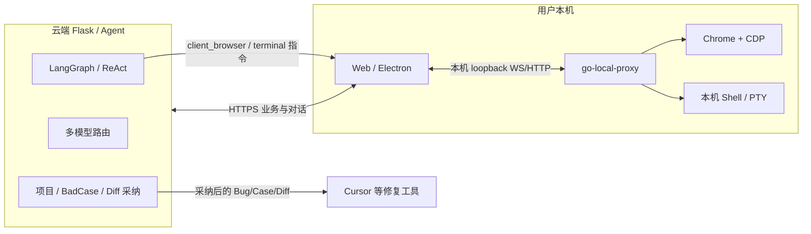

# BadCase Doctor

**用 AI 自动探测真实界面，发现并起草 Bug / BadCase / TestCase；人审采纳后，交给 Cursor 等工具继续修。**

云端负责「想清楚、写清楚」；本机 Go 代理负责「看得见、点得着、跑得动」——尤其是内网页面和本机终端。

## 解决什么问题

传统提测/提 Bug 依赖人工点页面、写复现、补用例。本项目把链路收成：

1. **自动探测界面**：Agent 驱动浏览器巡检页面结构与关键路径（CDP / Midscene 等）
2. **AI 自动落库草稿**：在界面上下文中生成 Bug、BadCase、TestCase（含步骤与预期）
3. **人审采纳**：Diff Review —— 采纳或拒绝；未采纳可继续对话合并为最新 Diff
4. **交给修复工具**：采纳结果可导出 / 对接 Cursor、本地终端等，进入改代码与验证闭环

人机分工：**AI 负责发现与起草，人负责拍板，IDE/Agent 负责落地修复。**

## 整体架构



- **云端**：会话、权限、额度、LLM、草稿与 Diff 生命周期  
- **本机 Go**：不把内网浏览器和本地 shell 暴露到公网，只在 `127.0.0.1` 上为前端/Agent 提供能力  
- **Cursor 等**：消费已采纳的问题描述与复现信息，完成修复

## Go 本机代理（核心能力）

仓库目录：`go-local-proxy/`。预编译产物在 `client_binaries/`（可由 Web/Electron 拉取或随客户端分发）。

### 为什么必须有 Go

云端 Agent **不能直接**：

- 打开你司内网/登录态页面  
- 在你电脑上执行命令、看真实终端输出  
- 安全地持有带 Cookie 的本机 Chrome  

因此用 **Go 写的轻量本机守护进程** 做「最后一公里」：只监听本机 loopback，与云端 HTTPS 业务面分离。

### Go 具体干什么

| 能力 | 说明 |
| --- | --- |
| **拉起本机 Chrome + CDP** | `browser_start`：有头调试、remote-debugging；Agent 才能对真实 UI 做 snapshot / click / fill |
| **CDP HTTP 反代** | `/browser/cdp/*` → 本机 DevTools，供 Playwright `connect_over_cdp` 等同机连接 |
| **Shell 执行与流式回传** | WebSocket：`run` / `chunk` / `done`；支持超时、取消、cwd/env |
| **交互式 PTY** | 类终端会话（Windows ConPTY 等），方便长任务与交互命令 |
| **权限与确认** | 高风险命令可要求前端二次确认（`confirm_required`） |
| **单实例 / 协议唤起** | `badcase-local-proxy://` 唤醒；已有实例则不再重复拉起 |

协议要点（与前端约定）：

- 客户端 → 代理：`ping` / `run` / `cancel` / `session` / `browser_start|stop|status`  
- 代理 → 客户端：`chunk`（stdout/stderr）/ `done` / `browser_ok` / `error` …

Agent 侧不会在云端「假开浏览器」，而是下发 `client_browser` / 终端类动作，由 **Electron/Web → Go 代理** 在本机落地，再把结果续跑回云端对话。

### 和探测 / 提 Case 的关系

```text
Go 起 Chrome ──► CDP 探测/操作界面 ──► Agent 归纳问题
                                      │
                                      ▼
                         生成 Bug / BadCase / TestCase 草稿
                                      │
                                      ▼
                         用户 Diff 采纳 / 拒绝
                                      │
                                      ▼
                         导出给 Cursor 等继续修，必要时再用 Go 跑本地验证命令
```

没有 Go，内网探测与「本机复现验证」这两环会断；有了 Go，云端 AI 才能安全地「看见并操作」用户真实环境。

## 产品主路径（推荐理解顺序）

1. 安装并运行本机代理（或 Electron 自动拉起）  
2. 在项目里发起探测 / 对话，指向待测站点  
3. Agent 巡检界面，自动起草 BadCase / Bug / TestCase  
4. 在 UI 里审 Diff：**采纳**写入正式记录，或**拒绝**丢弃  
5. 把已采纳内容交给 Cursor（或本地终端）修复，再回归验证  

相关设计文档（仓库内）：

- `docs/需求文档_CDP浏览器工具与元素精准操控.md`  
- `docs/需求文档_diff_review闭环处理.md`  
- `agents/cdp/OPENCLAW_BROWSER_PORT.md`

## 技术栈

| 层 | 技术 |
| --- | --- |
| 云端业务 | Flask + SQLAlchemy，MySQL / Redis；可选 ES、MinIO |
| Agent | LangGraph（默认）/ ReAct，多模型路由 |
| 浏览器自动化 | CDP（OpenClaw 风格闭环）+ 可选 Midscene |
| 本机执行面 | **Go `go-local-proxy`**（Chrome/CDP、Shell、PTY） |
| 客户端 | Vue 3 + Electron（`electron-vue3/`） |

## 安全须知

- **真实密钥只放本地 `.env`，禁止提交到 Git。**  
- `cp .env.example .env` 后自行填写；模板可提交，`.env` 已在 `.gitignore`。  
- 若密钥曾进入公开仓库历史，请立即轮换，并考虑清理 Git 历史。  
- Go 代理默认只绑本机；不要把 CDP/代理端口映射到公网。

## 快速开始

### 1. Python 后端

```bash
python -m venv .venv
# Windows: .venv\Scripts\activate
pip install -r requirements.txt
cp .env.example .env   # 填写 DATABASE_URL、SECRET_KEY、模型 Key 等
python app.py          # 默认 http://127.0.0.1:5000
```

可选：`docker compose up -d mysql redis`

### 2. 本机 Go 代理

```bash
cd go-local-proxy
go build -ldflags="-s -w" -o ../client_binaries/badcase-local-proxy.exe .
# 运行后本机提供 WS/HTTP（含 /browser/*）
```

跨平台构建说明见 `go-local-proxy/main.go` 文件头注释。Electron/Web 也可下载 `client_binaries/` 中预置二进制。

### 3. 桌面端（可选）

```bash
cd electron-vue3
npm install
npm run electron:dev
```

## 目录结构（简）

```
app.py / routers/      云端 API 与业务
agents/                探测、CDP、LangGraph、工具
agents/cdp/            界面 snapshot / act / explore
go-local-proxy/        ★ 本机 Chrome·CDP·Shell·PTY
client_binaries/       Go 代理分发产物
electron-vue3/         桌面/前端
llm/                   模型工厂与路由
docs/                  需求与闭环说明
.env.example           环境变量模板（无真实密钥）
```

## 许可证

MIT
