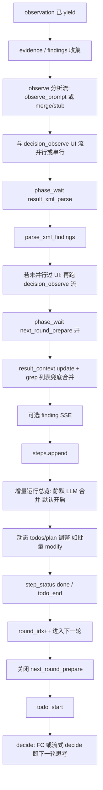

# ReAct：「观察/决策与观察」结束 → 下一轮「思考」之间的步骤说明

## 1. 文档目的

便于对照界面上的时间感（例如 grep 工具结果与【观察】文案已出之后，到下一步「思考」块出现前仍有约 **10s 级**空档），梳理 **后端主循环**里这一段实际执行了哪些子步骤、哪些是 **同步阻塞**、哪些会再打 **大模型**，为后续优化（并行、裁剪、开关、合并调用等）提供锚点。

**代码主路径**：`agents/react_simplified.py` 中 `_run_stream_raw` 的 `while not task_state["finished"]` 主循环。

**前端对应（概念）**：

- 工具结束、结构化结果：多对应 SSE `observation`（v1 映射为 `type=tool`）及随后的 `evidence` / `finding`。
- 「决策与观察」面向用户的说明：多对应 `react_ui_stream` + `channel=decision_observe`（以及同轮的 observe 正文流里的 `reasoning_step` / `llm_text_stream` 等，视实现而定）。
- 下一轮「思考」：多对应**下一轮**的 `todo_start` 之后，**decide** 阶段的 `agent_thought`、`reasoning_timing`（展示「思考 X 秒」）、或流式 `decide` / Function Calling 等待等。

下文按 **时间顺序**描述：从 **`yield observation` 之后** 到 **下一轮 `yield todo_start` 之前**（含之间发生的阻塞工作）。

---

## 2. 总览流程图（逻辑顺序）

用户感知的「观察结束」通常落在 **C～D 结束**（decision_observe 与 observe 流都吐完）附近；「下一轮思考」从 **Q～R** 开始。之间的 **L** 与 **R 的 API 等待** 往往是秒级大头。

---

## 3. 逐步说明（与代码位置）

以下序号与主循环内执行顺序一致（同一轮索引 `i` / `round_idx`）。

### 3.1 工具结果已下发之后

| 步骤 | 行为 | 是否典型耗时 | 说明 |
|------|------|--------------|------|
| S1 | `yield observation` + 日志 | 否 | 工具结果与 `summary_nl` 已给前端。 |
| S2 | `EvidenceExtractor` → `yield evidence` | 一般否 | 本地结构化提取。 |
| S3 | 将证据并入 `findings` | 否 | 内存列表。 |

### 3.2 Observe 分析（大模型，通常是大头之一）

| 步骤 | 行为 | 是否典型耗时 | 说明 |
|------|------|--------------|------|
| S4a | 构造 `observe_prompt` 或 `observe_prompt_merge_next_decide` | 否 | `use_react_merge_observe_decide()` 当前语义为**固定关闭**时走标准 `observe_prompt`。 |
| S4b | `_stream_agent_observe_with_narrative` 或 fast stub | **是** | grep **一般走完整 observe LLM**；modify 在预览/批量等场景可走 `REACT_OBSERVE_FAST_STUB` 跳过整条 observe LLM。 |
| S4c | 与 **decision_observe** UI 流的关系 | 视配置 | `REACT_OBSERVE_UI_PARALLEL=1`（默认）时：`merge_observe_parallel_ui_first` 让 **observe 与 UI 总结交错**；grep 在 `prefer_nl_observe_summary` 为真时常 **不再调用** `ui_observe_summary` 专用 LLM，UI 侧多为 **`summary_nl` 分块**（`REACT_OBSERVE_UI_LLM` 等仍影响其它工具）。 |

**相关环境变量（节选）**：`REACT_OBSERVE_UI_PARALLEL`、`REACT_OBSERVE_UI_LLM`、`REACT_OBSERVE_FAST_STUB`、`REACT_OBSERVE_MAX_TOKENS`、`PERF_LOG=1`（打印 `[PERF][observe]`）。

### 3.3 XML 解析与合并决策缓存

| 步骤 | 行为 | 是否典型耗时 | 说明 |
|------|------|--------------|------|
| S5 | `phase_wait` `result_xml_parse` | 否（UI 态） | 提示解析中。 |
| S6 | `parse_xml_findings(analyze_response)` | 一般否 | 本地解析；极端大文本时略增。 |
| S7 | 若响应中含 `<decision>`：`pending_next_decision` | 否 | 下一轮可省一次 decide（若命中）。 |

### 3.4 串行补 UI（仅当未走「并行 observe+UI」分支）

| 步骤 | 行为 | 是否典型耗时 | 说明 |
|------|------|--------------|------|
| S8 | `react_ui_stream` decision_observe | 视配置 | `_merged_observe_ui` 为 false 时才会再走一轮 UI 流（含可能的 `ui_observe_summary` LLM）。 |

### 3.5 进入「准备下一步」与上下文写回

| 步骤 | 行为 | 是否典型耗时 | 说明 |
|------|------|--------------|------|
| S9 | `phase_wait` `next_round_prepare` **active: true** | 否（UI 态） | 注释写明：避免 observe 结束后、decide 构造前长时间无可见状态。 |
| S10 | `result_context.update(analysis['context_update'])` | 一般否 | |
| S11 | grep 的 `badcase_list` / `bug_list` / `testcase_list` 兜底合并 | **可能** | 列表很大时 Python 侧循环与匹配仍有成本，通常远小于 LLM。 |
| S12 | `yield finding`（若有） | 否 | |

### 3.6 步进归档与「增量运行总览」（当前默认再占一轮 LLM）

| 步骤 | 行为 | 是否典型耗时 | 说明 |
|------|------|--------------|------|
| S13 | `steps.append(...)` | 否 | |
| S14 | `await _merge_running_summary_incremental_silent(...)` | **是** | **默认 `REACT_INCREMENTAL_SUMMARY` 开启**：每步结束后 **再调用一次** `chat_stream`（content_only）合并运行总览；**不向 SSE 推流**，但会 **阻塞主循环**直到该次调用结束。 |

这是「观察 UI 已结束」到「下一轮 todo_start」之间 **最容易被忽略的一段整段 LLM 等待**。

### 3.7 本轮收尾与轮次递增

| 步骤 | 行为 | 是否典型耗时 | 说明 |
|------|------|--------------|------|
| S15 | 动态追加批量 modify 等 → `todos` / `plan_update` | 一般否 | 满足条件才触发。 |
| S16 | `yield step_status(done)`、`yield todo_end` | 否 | |
| S17 | 技能分支 `_decide_next_step` / `_adjust_plan_skill` | 可能 | 技能路径额外逻辑。 |
| S18 | `round_idx += 1` | 否 | |

### 3.8 下一轮开始：「思考」对应 decide

| 步骤 | 行为 | 是否典型耗时 | 说明 |
|------|------|--------------|------|
| S19 | 关闭上一轮 `next_round_prepare` | 否 | |
| S20 | `yield todo_start` | 否 | 前端可视为新一步开始。 |
| S21 | **decide** | **是** | `REACT_DECIDE_FUNCTION_CALL=1` 且支持 FC 时：`chat_completion_with_tools` **整包等待**；可与 `REACT_DECIDE_FC_STREAM_HINT` 触发的 **并行「行动前说明」流**（映射为 `agent_thought`）叠加，界面上的「思考 X 秒」常与 **该轮 API 往返 + 首 token** 相关。流式 decide 时则为 `_stream_agent_decide_with_narrative` 的流式输出与解析。 |

**相关环境变量（节选）**：`REACT_DECIDE_FUNCTION_CALL`、`REACT_DECIDE_FC_INSTANT_HINT`、`REACT_DECIDE_FC_STREAM_HINT`、`REACT_DECIDE_MAX_TOKENS` / `REACT_DECIDE_FC_MAX_TOKENS`、`PERF_LOG=1`（含 `[PERF][round-bridge]`、`fc_decide_roundtrip_ms`）。

---

## 4. 与「约 10 秒」现象的对应关系（排查建议）

1. **observe 流结束 ≠ 主循环已空闲**  
   其后仍有 **XML 解析、上下文合并、（默认）增量运行总览 LLM、todo_end**，再进入下一轮 **decide**。

2. **grep 场景**  
   - 通常仍会跑 **完整 observe_prompt LLM**（除非未来为 grep 加 stub/缩短策略）。  
   - `decision_observe` 对 grep 常走 **summary_nl**，observe 与 UI 并行时，**尾部耗时**仍受 **observe LLM** 拖尾影响。

3. **增量运行总览（默认开）**  
   在 **`todo_end` 之前** `await` 一整次合并 LLM，**无前端流式反馈**，容易被感知为「观察已经说完了，但下一步思考迟迟不来」。若需验证，可临时设 **`REACT_INCREMENTAL_SUMMARY=0`** 对比端到端间隔。

4. **下一轮「思考 9.x 秒」**  
   多为 **decide 阶段** FC 或流式 decide 的 **模型时延**；若启用了 **FC 并行 hint**，前几秒可能有 `agent_thought` 流，但 **真正 tool 决策**仍要等 FC 返回。

5. **建议观测手段**  
   - 服务端：`PERF_LOG=1` 看 `[PERF][observe]` 与 `[PERF][round-bridge]`、`fc_decide_roundtrip_ms`。  
   - 在 S14 前后加临时计时日志（若尚未有单独字段），可量化 **增量总览** 占比。

---

## 5. 可选优化方向（仅列方向，不实施）

供产品/技术评审时勾选：

| 方向 | 思路 |
|------|------|
| 削弱 S14 | 默认关闭增量总览、或改为异步队列不阻塞主循环、或降低频率（每 N 步）。 |
| 削弱 S4 | 为 grep 提供 **短 observe** / **结构化输出不用长叙事** / 限制 `REACT_OBSERVE_MAX_TOKENS`。 |
| 合并调用 | 在合规前提下探索 observe 与「下一步决策」或「运行总览」的 **单次 LLM**（需协议与回滚策略）。 |
| 并行化 | 将非依赖 `analysis` 的工作与 LLM 重叠（注意 `result_context` 与 `pending_next_decision` 的一致性）。 |
| 前端感知 | 在 S14 阻塞期间延续 **phase_wait** 文案（例如「正在生成运行总览」），减少「假死」感。 |

---

## 6. 修订记录

| 日期 | 版本 | 说明 |
|------|------|------|
| 2026-03-28 | v0.1 | 初稿：observation 后至下一轮 decide 的步骤拆解与耗时因子 |
