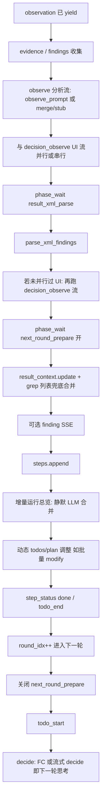

# ReAct：「观察/决策与观察」结束 → 下一轮「思考」之间的步骤说明

> **归属**：性能优化体系中的**间隙拆解**文档。总纲与排期见  
> [`需求文档_下一轮性能优化_推理执行分离总结与响应形态.md`](./需求文档_下一轮性能优化_推理执行分离总结与响应形态.md)（**推理/执行分离为 P0**）。

## 1. 文档目的

便于对照界面上的时间感（例如 grep 工具结果与【观察】文案已出之后，到下一步「思考」块出现前仍有约 **10s 级**空档），梳理 **后端主循环**里这一段实际执行了哪些子步骤、哪些是 **同步阻塞**、哪些会再打 **大模型**，为**推理/执行分离**（跳过 grep 后 observe + inter-decide）提供锚点。

**代码主路径**：`agents/react_simplified.py` 中 `_run_stream_raw` 的 `while not task_state["finished"]` 主循环。

**前端对应（概念）**：

- 工具结束、结构化结果：多对应 SSE `observation`（v1 映射为 `type=tool`）及随后的 `evidence` / `finding`。
- 「决策与观察」面向用户的说明：多对应 `react_ui_stream` + `channel=decision_observe`（以及同轮的 observe 正文流里的 `reasoning_step` / `llm_text_stream` 等，视实现而定）。
- 下一轮「思考」：多对应**下一轮**的 `todo_start` 之后，**decide** 阶段的 `agent_thought`、`reasoning_timing`（展示「思考 X 秒」）、或流式 `decide` / Function Calling 等待等。

下文按 **时间顺序**描述：从 **`yield observation` 之后** 到 **下一轮 `yield todo_start` 之前**（含之间发生的阻塞工作）。

### 1.1 宏路径目标态（P0，尚未默认开启）

当 `REACT_MACRO_GREP_MODIFY=1` 且 `frozen_macro` 命中时，**grep 工具 `observation` 之后**应：

- **跳过** 下文 S4b 完整 observe LLM、S21 inter-decide；
- **保留** S1–S3、本地 S5–S13（可合并 phase_wait 文案）；
- **直接进入** modify 执行（执行阶段），而非「再思考一轮」。

未命中宏路径时，仍按本文逐步路径运行（便于回滚与复杂任务）。

---

## 2. 总览流程图（逻辑顺序）

用户感知的「观察结束」通常落在 **C～D 结束**（decision_observe 与 observe 流都吐完）附近；「下一轮思考」从 **Q～R** 开始。  
**宏路径 P0 目标**：grep 后 **C→R 整段对 modify 裁撤**，仅保留工具链执行。

---

## 3. 逐步说明（与代码位置）

以下序号与主循环内执行顺序一致（同一轮索引 `i` / `round_idx`）。

### 3.1 工具结果已下发之后

| 步骤 | 行为 | 是否典型耗时 | 说明 |
|------|------|--------------|------|
| S1 | `yield observation` + 日志 | 否 | 工具结果与 `summary_nl` 已给前端。 |
| S2 | `EvidenceExtractor` → `yield evidence` | 一般否 | 本地结构化提取。 |
| S3 | 将证据并入 `findings` | 否 | 内存列表。 |

### 3.2 Observe 分析（大模型，通常是大头之一）

| 步骤 | 行为 | 是否典型耗时 | 说明 |
|------|------|--------------|------|
| S4a | 构造 `observe_prompt` 或 `observe_prompt_merge_next_decide` | 否 | `use_react_merge_observe_decide()` 当前语义为**固定关闭**时走标准 `observe_prompt`。 |
| S4b | `_stream_agent_observe_with_narrative` 或 fast stub | **是** | grep **一般走完整 observe LLM**（**宏路径 P0：应跳过**）；modify 在预览/批量等场景可走 `REACT_OBSERVE_FAST_STUB` 跳过整条 observe LLM。 |
| S4c | 与 **decision_observe** UI 流的关系 | 视配置 | `REACT_OBSERVE_UI_PARALLEL=1`（默认）时：observe 与 UI 总结交错；grep 在 `prefer_nl_observe_summary` 为真时常 **不再调用** `ui_observe_summary` 专用 LLM，UI 侧多为 **`summary_nl` 分块**。 |

**相关环境变量（节选）**：`REACT_OBSERVE_UI_PARALLEL`、`REACT_OBSERVE_UI_LLM`、`REACT_OBSERVE_FAST_STUB`、`REACT_OBSERVE_MAX_TOKENS`、`REACT_MACRO_SKIP_GREP_OBSERVE`（规划）、`PERF_LOG=1`（`[PERF][observe]`）。

### 3.3 XML 解析与合并决策缓存

| 步骤 | 行为 | 是否典型耗时 | 说明 |
|------|------|--------------|------|
| S5 | `phase_wait` `result_xml_parse` | 否（UI 态） | 提示解析中。 |
| S6 | `parse_xml_findings(analyze_response)` | 一般否 | 本地解析；极端大文本时略增。 |
| S7 | 若响应中含 `<decision>`：`pending_next_decision` | 否 | 下一轮可省一次 decide（若命中）；**宏路径应直接消费计划，不依赖二次 decide**。 |

### 3.4 串行补 UI（仅当未走「并行 observe+UI」分支）

| 步骤 | 行为 | 是否典型耗时 | 说明 |
|------|------|--------------|------|
| S8 | `react_ui_stream` decision_observe | 视配置 | `_merged_observe_ui` 为 false 时才会再走一轮 UI 流（含可能的 `ui_observe_summary` LLM）。 |

### 3.5 进入「准备下一步」与上下文写回

| 步骤 | 行为 | 是否典型耗时 | 说明 |
|------|------|--------------|------|
| S9 | `phase_wait` `next_round_prepare` **active: true** | 否（UI 态） | 避免 observe 结束后、decide 构造前长时间无可见状态。 |
| S10 | `result_context.update(analysis['context_update'])` | 一般否 | grep 列表以工具写入为准，防 observe 臆造（见 `react_simplified` 注释）。 |
| S11 | grep 的 `badcase_list` / `bug_list` / `testcase_list` 兜底合并 | **可能** | 列表很大时仍有 Python 成本，通常远小于 LLM。 |
| S12 | `yield finding`（若有） | 否 | |

### 3.6 步进归档与「增量运行总览」

| 步骤 | 行为 | 是否典型耗时 | 说明 |
|------|------|--------------|------|
| S13 | `steps.append(...)` | 否 | |
| S14 | `_merge_running_summary_incremental_silent(...)` | **视配置** | **统一流默认 `background=True`，不阻塞主循环**（`REACT_INCREMENTAL_SUMMARY_BLOCK_LOOP=0`）。仅当 `BLOCK_LOOP=1` 或旧路径时，才在 `todo_end` 前 **await** 整次合并 LLM。宏路径可 **关闭** 或仅最后一跳合并。 |

### 3.7 本轮收尾与轮次递增

| 步骤 | 行为 | 是否典型耗时 | 说明 |
|------|------|--------------|------|
| S15 | 动态追加批量 modify 等 → `todos` / `plan_update` | 一般否 | 满足条件才触发。 |
| S16 | `yield step_status(done)`、`yield todo_end` | 否 | |
| S17 | 技能分支 `_decide_next_step` / `_adjust_plan_skill` | 可能 | 技能路径额外逻辑。 |
| S18 | `round_idx += 1` | 否 | |

### 3.8 下一轮开始：「思考」对应 decide

| 步骤 | 行为 | 是否典型耗时 | 说明 |
|------|------|--------------|------|
| S19 | 关闭上一轮 `next_round_prepare` | 否 | |
| S20 | `yield todo_start` | 否 | 前端可视为新一步开始。 |
| S21 | **decide** | **是** | FC 或流式 decide；**宏路径 P0：grep 后若下一步为 modify，应跳过（`REACT_MACRO_SKIP_INTER_DECIDE`）**。 |

**相关环境变量（节选）**：`REACT_DECIDE_FUNCTION_CALL`、`REACT_DECIDE_FC_STREAM_HINT`、`PERF_LOG=1`（`[PERF][round-bridge]`、`fc_decide_roundtrip_ms`）。

---

## 4. 与「约 10 秒」现象的对应关系（排查建议）

1. **observe 流结束 ≠ 主循环已空闲**  
   其后仍有 XML 解析、上下文合并、（可选）增量总览、todo_end，再进入下一轮 **decide**。

2. **grep 场景（当前默认）**  
   - 仍跑 **完整 observe_prompt LLM**。  
   - **P0 目标**：宏路径裁撤 S4b + S21。

3. **增量运行总览**  
   - **默认不阻塞**（后台 worker）；若仍卡顿，查 `REACT_INCREMENTAL_SUMMARY_BLOCK_LOOP` 是否为 `1`。

4. **下一轮「思考 9.x 秒」**  
   - 多为 **decide** FC 往返；宏路径应在 grep→modify 间消除。

5. **建议观测**  
   - `PERF_LOG=1`：`[PERF][observe]`、`[PERF][round-bridge]`、`fc_decide_roundtrip_ms`。  
   - 总纲文档基准用例 + `request_id` 对齐 `[GREP-PERF]` / `[MODIFY-PERF]`。

---

## 5. 优化方向与总纲优先级对照

| 方向 | 思路 | 总纲优先级 |
|------|------|------------|
| **裁撤 S4b+S21（grep→modify）** | `frozen_macro` + template observe | **P0** |
| 削弱 S14 | 宏路径关闭增量总览或仅终局合并 | P1 |
| 削弱 S4（非宏） | grep 短 observe / `REACT_OBSERVE_MAX_TOKENS` | P1 |
| 合并调用 | observe 与 decide 合并（协议成本高） | P2 |
| 前端感知 | `phase_wait` 文案覆盖后台合并 | P1 |

---

## 6. 修订记录

| 日期 | 版本 | 说明 |
|------|------|------|
| 2026-03-28 | v0.1 | 初稿：observation 后至下一轮 decide 的步骤拆解 |
| 2026-05-26 | v0.2 | 对齐总纲：宏路径目标态；S14 默认后台不阻塞；链回推理/执行分离 P0 |
