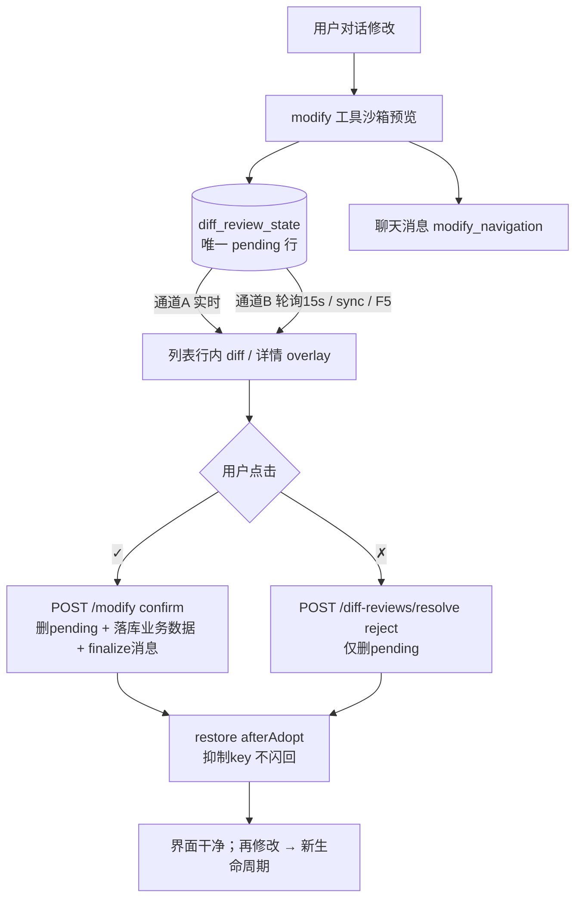

# Diff 逻辑总览（当前实现）

> 定位：本文件描述 **代码里真实跑着的逻辑**（截至 2026-09-19 核对）。
> 与 `需求文档_diff_review闭环处理.md`（设计目标）冲突时，**以本文件为准**；
> 两者之间的偏差见 §9，读完能解释历史上所有"奇怪现象"。

---

## 0. 一句话主线

```
对话修改 → Agent 产出沙箱预览 → pending 落库(diff_review_state) → 列表/详情行内 old→new + ✓/✗
   ✓ 采纳：真落库业务数据 + 物理删 pending + finalize 消息（记录"消失"是设计行为）
   ✗ 拒绝：只物理删 pending，不碰业务数据
```

**数据库 `diff_review_state` 表是唯一权威（L0）**；前端内存（`pendingModifications`）、
会话缓存（`bcd:ss`）、详情桥接缓存全部只是"加速层"，任何时刻都可被 DB 状态重建或否决。

---

## 1. 数据模型（权威源）

### 1.1 表 `diff_review_state`

模型定义：`app.py` L2062 `class DiffReviewState`（`models/orm.py` L1314 为镜像副本）。

| 字段 | 含义 |
|---|---|
| `project_id + target + target_id` | 语义键（target ∈ badcase / bug / testcase / card / plan） |
| `lifecycle_id` | 生命周期：同一记录重新修改 +1 轮 |
| `diff_fingerprint` | 规范化 modifications 的指纹（幂等用） |
| `status` | **正常只存 `pending`**；`adopted/rejected/superseded` 仅历史遗留行存在 |
| `diff_payload` / `modifications_payload` | JSON：行级 diff / `{field:{old,new}}` |
| `source_message_id` / `source_session_id` | 溯源：哪条聊天消息生成的 |
| `operator_id` | 生成者；仅本人可见/可操作（NULL=历史数据兼容） |
| `created_at` / `updated_at` | UTC 时间（本地展示需 -8h） |

**核心语义：同一语义键在任意时刻最多一条记录，且正常情况下只有 pending。**
采纳/拒绝后在业务路径上**物理删除**（模型 docstring 明确写了这一点）。

### 1.2 聊天消息字段

- `chat_messages.modify_navigation`：聊天区"沙箱预览"卡片的跳转数据。采纳成功后
  由 `_finalize_chat_message_after_modify_adopt` 置 NULL —— 卡片退化为**只读回看**入口。

### 1.3 前端本地缓存（加速层，永不权威）

| 缓存 | 位置 | 说明 |
|---|---|---|
| `pendingModifications` | ProjectDetail.vue 内存 | 当前列表行内 diff 数据 |
| `_upsertDiffLastPayloadHash` | 内存 Map | upsert 前比对，相同 payload 跳过 |
| 详情桥接缓存 | `pendingModifyDiff`（sessionStorage） | 详情 overlay 数据 |
| Tab 文档缓存 | `bcd:ss` | Tab 恢复用，恢复时必须二次校准 DB |

---

## 2. 写入链路（谁把 pending 写进 DB）——三条路径防丢

```
路径① 工具线程（主渠道，不依赖浏览器）
  modify_tool.py 预览成功(confirm 前)
    → persist_modify_preview_observation()      agents/tools/modify_tool.py L2632(单条) / L4945(批量)
    → persist_modify_sandbox_diff_review()      memory/diff_review_store.py
    → _upsert_diff_review_state()               app.py
    → _broadcast_diff_review()  (SSE 广播)

路径② 前端列表通道（兜底）
  ProjectDetail.handleShowModifyInList
    → persistPendingDiffReview()                ProjectDetail.vue L2628
      （650ms 防抖 + payloadHash 幂等，失败仅 warn 不阻断）
    → POST /api/projects/<id>/diff-reviews/upsert   routers/diff_reviews_api.py L24

路径③ 历史回灌/沙箱跳转
  同路径②，但带 __skipDbUpsert / restoreHydrateOnly 标记时**跳过 upsert**
  （GET 灌回的数据库中已有，重复 upsert 会导致界面秒级刷屏）
```

### 2.1 upsert 语义（`_upsert_diff_review_state`, app.py）

| 当前行状态 | 行为 |
|---|---|
| 无行 | 插入，`lifecycle_id = 1` |
| 有 pending | 覆盖 payload / updated_at；operator 为空则填当前用户；顺带清理重复行 |
| 有遗留非 pending | 删除全部旧行，重建 pending，`lifecycle_id = 旧值 + 1` |

- `operator_id`：接口层写当前登录用户；`GET` 对 pending/rejected 仅返回本人或 NULL 行；
  采纳接口（/modify confirm、/resolve）遇到他人 pending 返回 **403**。

### 2.2 关键修复（防回归）

> `memory/diff_review_store.py` L195-202：modify 工具跑在 react_tool 工作线程（无 Flask
> app_context），旧代码 `DiffReviewState.query` 直接抛异常 → pending **静默不落库**。
> 现在 `has_app_context()` 判定，缺失时用 `flask_app.app_context()` 包裹。

---

## 3. 读取链路（前端如何拿到 pending 并渲染）——两条通道

### 通道 A｜实时（当次对话，毫秒级）

```
React 工具结果
  → SimpleChatPanel.handleShowModifyInList(modifyData, messageId)     SimpleChatPanel.vue L3041
      先 refreshPersistedPendingDiffKeys() 校准 DB 集合
      再 resolveAlreadyProcessedByPersisted() 判定是否仍待确认（§7）
      合并历史 pending（getMergedPendingForTarget）
  → window.dispatchEvent('show-modify-in-list')
  → ProjectDetail.handleShowModifyInList                              ProjectDetail.vue L10824
      写 pendingModifications（内存）→ 列表行内 diff / 详情 overlay
      同时走写入路径② 落库
```

### 通道 B｜持久化（刷新 / 新开页 / 另一个浏览器 / 多窗口）

```
useDiffReviewPush（composables/useDiffReviewPush.js）
  15s 轮询 GET /diff-reviews?status=pending
  （ETag 304 短路；页面隐藏 60s；失败指数退避至 120s）
  version 变化 → dispatch('diff-review-push', {type:'snapshot', items})
  → ProjectDetail.handleDiffReviewPush                            ProjectDetail.vue L2900
  → applyPendingDiffFromServerItems(items)                        ProjectDetail.vue L2785
      → handleShowModifyInList({__modifyListBatch, __skipDbUpsert, restoreHydrateOnly})
```

### 通道 B 的 4 个触发源

| 触发源 | 入口 | 特点 |
|---|---|---|
| ① 轮询快照 | `handleDiffReviewPush` → `applyPendingDiffFromServerItems` | 15s 兜底，跨浏览器唯一来源 |
| ② `diff-review-sync` 事件 | 聊天侧 `refreshPersistedPendingDiffKeys` 派发 → `handleDiffReviewSync`（1400ms 防抖）→ `restorePendingDiffReviews` | 聊天拿到新数据时校准列表 |
| ③ 页面加载 / 切项目 | `restorePendingDiffReviews`（force 节流 5s） | F5 恢复 |
| ④ 采纳/拒绝后 | `restorePendingDiffReviews({ afterAdopt: true })` | 不受 push 新鲜度限制；抑制刚处理的 key 防闪回 |

### 恢复约束（restoreHydrateOnly / suppressAutoOpenDetail）

- **禁止**新开/激活工作台 Tab（否则 F5 会莫名跳进迭代列表）
- **禁止**自动打开详情编辑器（纯详情字段变更除外，且仅实时链路允许）
- **以 GET 集合为权威**：内存中不在返回集合里的 pending key 全部删除；
  但**绝不反向物理删除 DB 记录**——

> P0 修复（ProjectDetail.vue L10891-10901 注释）：
> 旧逻辑"本地列表找不到实体 → 自动 reject 物理删除"会把
> 跨迭代/跨卡片/不在当前视图的合法 pending 误删 →
> 刷新/换浏览器后跳转看不到 diff。现在只跳过导航，不删库。

---

## 4. 展示与判定（列表 or 详情）

```
getModifyFieldImpact(modifications, target) 判定字段落点：
  ├─ 仅列表字段（LIST_FIELDS：title/status/assignee 等）
  │    → 左侧列表行内 old→new 黄色 pending 行 + ✓/✗
  ├─ 含详情字段（DETAIL_FIELDS）
  │    → 详情页 overlay 显示 diff；若"只有详情字段"且非 hydrate → 自动打开详情
  └─ 混合 → 行内 + 详情双展示
```

- 列表行 / 详情 overlay 的 ✓✗ 都是**组件内点击**（用户唯一手动入口），另有：
  - 历史消息沙箱预览卡片点击 → 只导航（激活/新建目标 Tab），见 §7
- 聊天区"已采纳"卡片仍可回看，但**不得再次出现待确认 diff**（不高亮、无 ✓✗）。

---

## 5. 采纳 / 拒绝闭环

### 5.1 ✓ 采纳（confirmModify L5872 / confirmModifyBatch L6149）

```
1) 前端乐观更新：列表行直接改值 → 清 pendingModifications → suppress restore（防闪回）
   dispatch 'modify-confirmed'
2) POST /api/projects/<id>/modify  {confirm:true, target, items[], message_id, session_id}
   （后端：routers/legacy_browser_agent.py，confirm 分支）
   a. operator 校验（他人 pending → 403）
   b. _delete_diff_review_state_rows()   ← 先物理删 pending + broadcast 'resolve'
   c. 落库业务修改（默认同步；MODIFY_ADOPT_ASYNC=1 走后台线程）
   d. _finalize_chat_message_after_modify_adopt()
        → 标题同步 + msg.modify_* 清空（modify_navigation = NULL）
3) 前端收尾：restore(afterAdopt, suppressTargetIds) → applyPatchRecordAfterAdopt
   → commitAdoptVersionAfterSuccess → 必要时 refreshActiveWorkbenchList
```

### 5.2 ✗ 拒绝（cancelModify L6338）

```
1) 清内存 pending + suppress restore + dispatch 'modify-cancelled'
2) POST /diff-reviews/resolve {action:'reject'}
   后端：物理删 pending + broadcast 'resolve'（routers/diff_reviews_api.py L154）
3) 不触碰业务数据；restore(suppressTargetIds) 防闪回
```

> **设计行为提醒**：采纳与拒绝都是**物理删除** pending 行，所以你会在 DB 里看到
> "记录消失"——这是设计（避免状态双写与膨胀），不是数据丢失。
> 想区分"采纳 vs 拒绝"只能看业务数据是否真的变了（如 bug.status 变 reopened）。

### 5.3 特例：待删行（`_pendingDelete`）

- ✓ = 真删实体（`confirmDelete` → 删除 API → `resolve confirm`）
- ✗ = 仅取消预览（清 pending，不删）

---

## 6. 幂等与防重

| 层 | 机制 |
|---|---|
| 前端 upsert | 650ms 防抖 + payloadHash 相同跳过 |
| 前端 restore | 2800ms 常规节流 / 5s force 节流 / 1400ms sync 防抖 / 单飞行（inFlight） |
| 后端 upsert | 同语义键只保留一条 pending；重复 upsert=更新 |
| 后端 GET | ETag + 304 + `Cache-Control: private, max-age=3` |
| 跨会话重复 diff | 语义键命中 → 更新同一行，不新增第二份 |
| 并发保护 | operator 403；采纳幂等（resolve 无行返回"幂等"成功） |

---

## 7. 历史消息沙箱预览（点击跳转）三态判定

`resolveAlreadyProcessedByPersisted`（SimpleChatPanel.vue L2876）：

| 场景 | 判定 | 效果 |
|---|---|---|
| pending 集合未加载完 | 用工具 JSON 的 `initialProcessed` | 不冒进 |
| 表中存在该 key | 未采纳 | 显示待确认（行内 diff + ✓✗） |
| 历史消息 && 表无 key | 已处理（采纳/拒绝） | 只导航回看，不显示待确认 |
| 实时流 && 表无 key | 以 `initialProcessed` 为准 | 防"刚生成还没落库"误判为已处理 |

导航统一规则：目标 plan-list / type-list / detail Tab **优先激活已存在，不存在才新建**
（`upsertWorkbenchTab`，见 `需求文档_工具导航_Tab复用与层级闭环.md`）。

---

## 8. 一张全景图



---

## 9. 与旧设计文档的偏差（读旧文前必看）

| 旧文档（`需求文档_diff_review闭环处理.md` §8） | 当前实现 |
|---|---|
| 必须持久化 adopted/rejected/superseded 状态 | **物理删除**，只保留 pending |
| 生命周期靠 status 迁移表达 | 靠删除 + 重建（lifecycle_id+1）表达 |
| `pending_fingerprint` 冲突码 409 | 未启用；指纹仅用于幂等跳过 |
| 批准/拒绝保留审计记录 | 无审计行；审计靠业务数据 + 聊天消息 finalize |

> 结论：把旧文档当"设计意图"读可以，但**判断当前行为一律以本文件为准**。

---

## 10. 关键文件索引

| 层 | 文件 | 关键函数 / 端点 |
|---|---|---|
| 模型 | `app.py` L2062 / `models/orm.py` L1314 | `DiffReviewState` |
| 落库核心 | `memory/diff_review_store.py` | `persist_modify_sandbox_diff_review` / `persist_modify_preview_observation` / `build_modifications_payload` |
| 工具落库点 | `agents/tools/modify_tool.py` | L2632（单条）/ L4945（批量） |
| 后端 API | `routers/diff_reviews_api.py` | POST `/diff-reviews/upsert` L24；POST `/resolve` L154；GET `/stream` L262；GET 列表 L386 |
| 后端核心 | `app.py` | `_upsert_diff_review_state` / `_delete_diff_review_state_rows` / `_broadcast_diff_review` / `_diff_review_row_to_item` / `_diff_review_version_token` |
| 采纳后端 | `routers/legacy_browser_agent.py` | POST `/modify` confirm 分支（L2185+）；`_finalize_chat_message_after_modify_adopt`（L1885+） |
| 前端轮询 | `electron-vue3/src/composables/useDiffReviewPush.js` | 15s 轮询 + `snapshot` 事件 |
| 前端主处理 | `electron-vue3/src/components/ProjectDetail.vue` | `handleShowModifyInList` L10824 / `persistPendingDiffReview` L2628 / `resolveDiffReviewState` L2710 / `applyPendingDiffFromServerItems` L2785 / `handleDiffReviewPush` L2900 / `restorePendingDiffReviews` L2935 / `confirmModify` L5872 / `confirmModifyBatch` L6149 / `cancelModify` L6338 |
| 前端聊天 | `electron-vue3/src/components/SimpleChatPanel.vue` | `handleShowModifyInList` L3041 / `resolveAlreadyProcessedByPersisted` L2876 / `refreshPersistedPendingDiffKeys` L2894 |

> 行号会随迭代漂移，检索时以**函数名**为准。

---

## 11. 已修复问题（防回归清单）

1. **pending 静默不落库**：工具线程无 app_context → `has_app_context()` 兜底
   （`memory/diff_review_store.py`）。
2. **孤立 pending 误删**：前端"本地找不到实体 → 自动物理删"已移除，
   改为仅跳过导航（ProjectDetail L10891 注释）。
3. **采纳后 F5 复现/跳转**：`restoreHydrateOnly` 不抢工作台 Tab、不自动开详情。
4. **重复 upsert 刷屏**：GET 灌回强制 `__skipDbUpsert`（库中已有）。
5. **`isQueryResultWorkbenchTab` 未注册**（ProjectDetail setup return 遗漏）：
   QueryResultPanel v-if 恒假、面板永不显示；已补进 return。
6. **ProjectDetail 新增 setup 函数必须加入底部 return 列表**（Options API 模式），
   否则模板渲染直接中断（`_ctx.xxx is not a function`）。

---

## 12. "看起来像 bug、其实是设计"的行为速查

| 现象 | 真相 |
|---|---|
| DB 里 pending 记录点完 ✓ 直接消失 | 设计：采纳即物理删（§5.2 提醒） |
| 点完 ✗ 记录也消失 | 设计：拒绝同删除 |
| 刷新后历史消息沙箱预览点击不显示待确认 | 设计：已处理 → 只导航（§7） |
| F5 后不自动跳到记录所在列表 | 设计：hydrate 不抢 Tab（§3 恢复约束） |
| 另一个浏览器 15s 内才看到 diff | 设计：跨浏览器靠轮询兜底；同页实时靠推送/事件 |
| 刚生成的 diff 一出现就"已采纳" | 修复过的 bug（§11.1），现已兜底 |
| 列表高亮闪几次 | 多个 restore 触发源防抖生效中的正常收敛（2800ms 窗口） |
| `updated_at` 比本地时间早 8 小时 | DB 存 UTC |
