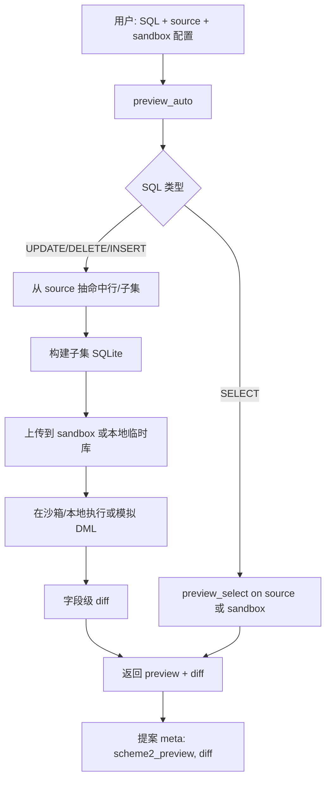

# 沙箱方案与流程图

## 一、方案概览

沙箱在本项目里承担两件事：

1. **安全执行**：在隔离环境里执行只读 SQL（text2sql 等），不直接动生产库。
2. **方案2 预览**：用「源库 + 沙箱」做通用预览（按命中行抽子集 → 在沙箱里执行/模拟 → 做 diff），用于提案创建等。

沙箱可以跑在两种位置，**职责分离、互不冲突**：

| 位置 | 说明 | 入口 | 用途 |
|------|------|------|------|
| **本地沙箱** | 本机起与云端同接口的服务，按平台选实现（见下） | `python sandbox/run_local_sandbox.py` | 桌面/内网、轻量短时执行（如 SQL 预览、text2sql） |
| **云端沙箱** | 独立服务器（如 117.72.33.38:5000），Docker 或直接进程 | `server_sandbox.py` + `cloud_deploy_sandbox.sh` | 同一套 API，**后续用于执行长时间任务**；与本地实现方案不冲突 |

主应用通过 **HTTP 客户端** 调沙箱的 REST 接口；可配置走本地或云端。**本地沙箱实现方案**（NsJail 等）仅影响「本机/内网」执行后端；云端后续扩展长时间任务时仍用同一套 API，不依赖本地的 NsJail 实现。

---

## 二、核心组件

### 2.1 沙箱服务（被调方）

- **代码**：`routers/sandbox.py`（Flask Blueprint）+ `sandbox/server_sandbox.py`（仅注册该 Blueprint 的最小 Flask 应用）。
- **接口**：
  - `GET /healthz`：健康与配置（鉴权开关、限流 backend、max_db_mb 等）。
  - `POST /api/v1/execute`：提交任务（当前仅 `task_type=sql_readonly`），返回 `job_id`。
  - `GET /api/v1/jobs/<job_id>`：查询任务状态与结果。
  - `POST /api/v1/db/sync`：上传 SQLite 文件并切换为当前库（按租户）。
  - `GET /api/v1/db/versions`：列出版本。
  - `POST /api/v1/db/cleanup`：按策略清理旧版本。

- **执行方式**（同一套接口，按部署位置选后端；**本地沙箱**与**云端**不冲突）：
  - **本地沙箱**（跑在本机/内网时）：
    - **Linux**：**NsJail**（`SANDBOX_USE_NSJAIL=1`）——维持不变，轻量进程隔离跑 sqlite3，适合桌面/内网，无需 Docker。
    - **direct_sqlite**（`SANDBOX_USE_DIRECT_SQLITE=1`）：进程内 sqlite3，无隔离，无 Docker。
    - **llm_sandbox**：Docker 内执行（需 llm-sandbox）；失败可回退到 direct_sqlite。
  - **云端沙箱**：同一套 API，当前同样支持上述后端；**后续用于长时间任务**时可在云端扩展任务类型与超时，与本地 NsJail 等实现无关。
  - `GET /healthz` 返回 `execution_backend`：当前实际后端（wsl2 | nsjail | direct_sqlite | llm_sandbox）。

- **安全与运维**：
  - 鉴权：`SANDBOX_AUTH_REQUIRED=true` 且 `SANDBOX_SERVER_TOKEN` 非空时，请求需 `Authorization: Bearer <token>`。
  - 限流：按租户 + 动作，令牌桶；有 `SANDBOX_REDIS_URL` 时用 **Redis**，否则 **内存**（多实例需 Redis）。
  - 上传限制：`SANDBOX_MAX_DB_MB` 限制单次 DB 大小。

### 2.2 本地调用沙箱的客户端

- **代码**：`sandbox/utils/cloud_sandbox_client.py`。
- **配置**：`CloudSandboxHttpConfig.from_env()`，环境变量：
  - `SANDBOX_REMOTE_URL`：沙箱 base URL（默认 http://117.72.33.38:5000）。
  - `SANDBOX_REMOTE_TOKEN`：鉴权 Bearer（云端开鉴权时必填）。
  - `SANDBOX_TENANT_ID`：租户 ID（限流/多租户隔离）。
- **能力**：
  - `healthz(cfg)`：GET /healthz。
  - `upload_sqlite_db_and_switch(cfg, db_path)`：上传 DB 并切换。
  - `execute_sql(cfg, sql)`：POST /api/v1/execute → 轮询 /api/v1/jobs/<id> 直到完成，返回 `{ success, data, columns, error, ... }`。
  - `cleanup_remote(cfg, keep_last=10, max_age_hours=72, all_tenants=False)`：POST /api/v1/db/cleanup，按策略清理历史 DB 版本。

### 2.3 执行器中的沙箱（text2sql）

- **代码**：`agents/tools/text2sql/sandbox_executor.py`。
- **逻辑**：`UnifiedSandboxExecutor` 根据是否配置「云端」决定走本地 Docker 沙箱（llm-sandbox）还是 **HTTP 云端**：
  - 若配置了云端（通过环境变量或传入的 base_url），则用 `CloudSandboxExecutor.execute_sql()` 调云端 `/api/v1/execute` 与 db/sync。
  - 否则用本地 `LocalSandboxExecutor`（Docker + llm-sandbox，若未装则回退到本地执行）。

### 2.4 SQL 预览与方案2

- **预览**：`agents/tools/sql_preview/preview.py`。
  - `preview_select(sql, data_source=...)`：当 `data_source.type == "sandbox"` 时，通过 `cloud_sandbox_client.execute_sql` 在沙箱内执行（使用沙箱内已同步的 DB）。
  - `preview_auto(sql, source=..., sandbox=...)`：方案2——从 **source**（mysql/sqlite/oracle）按命中行抽子集，生成子集 SQLite，上传到 **sandbox** 或本地临时库，再执行/模拟 DML 并做字段级 diff。DML 必须在 source 侧算命中行，执行与 diff 可在 sandbox 或本地。

- **提案**：`routers/proposal.py` 创建提案时若 `use_scheme2` 或传了 `source`/`sandbox`，则调用 `preview_auto`，把 `scheme2_preview`、`diff` 写入 meta，snapshot 可从 diff 生成。

---

## 三、部署与本地脚本

### 3.1 云端部署（同步脚本与代码）

- **一键（推荐）**：
  - Windows/跨平台：`python scripts/oneclick_ssh.py`
  - Linux/macOS：`bash scripts/oneclick_ssh.sh`
- **流程**：在本地打包「沙箱部署包」（含 `Dockerfile.sandbox`、`server_sandbox.py`、`requirements-sandbox.txt`、`routers/sandbox.py`、`agents/tools/text2sql` 相关、`scripts/cloud_deploy_sandbox.sh`、以及由本地环境变量生成的 `scripts/sandbox_env.sh`）→ scp 到云端 → ssh 执行 `bash scripts/cloud_deploy_sandbox.sh`。
- **云端脚本**：`scripts/cloud_deploy_sandbox.sh` 会：
  - `docker build -f Dockerfile.sandbox -t badcase-sandbox:latest .`
  - 停/删占用 5000 的旧容器，创建数据目录，`docker run ... -e SANDBOX_* ... badcase-sandbox:latest`
  - 若存在 `scripts/sandbox_env.sh` 会 source，从而注入 `SANDBOX_SERVER_TOKEN`、`SANDBOX_REDIS_URL`、`SANDBOX_RATE_RPM` 等（一键时从本机环境变量写入）。

因此：**云端沙箱的脚本与代码是通过 oneclick_ssh 每次打包上传并执行的，保证与当前仓库一致。**

### 3.2 本地沙箱（不部署到远程）

- **启动**：`python sandbox/run_local_sandbox.py`
- **行为**：在本机起 `server_sandbox`，默认端口 5000，数据目录 `.local_sandbox_db`。接口与云端一致，便于本机联调。
- **本地默认「用完即清理」**：`run_local_sandbox.py` 会设置 `SANDBOX_JOB_RETENTION_FINISHED_S=60`（已结束 job 约 1 分钟后从内存移除）、`SANDBOX_CLEANUP_AFTER_SYNC=1`（每次 db/sync 成功后立即清理该租户旧版本，仅保留最近 2 个）。云端不设这些则按需定时调用 cleanup。
- **本地沙箱实现（Linux 维持 NsJail 不变）**：仅影响本机/内网执行，与云端不冲突；云端后续用于长时间任务。
  - **Linux**：启用 **NsJail**（`SANDBOX_USE_NSJAIL=1`），不依赖 Docker、资源占用小。安装例：`apt install nsjail`；可选 `SANDBOX_NSJAIL_BIN`、`SANDBOX_NSJAIL_TIMEOUT_S`。
  - **Windows**：WSL2 跑 Linux 沙箱。设置 `SANDBOX_USE_WSL2=1`，需 WSL2 及 WSL 内安装 nsjail、sqlite3；可选 `SANDBOX_WSL2_TIMEOUT_S`。
  - **macOS**：可扩展 sandbox-exec/Seatbelt；未配置时用 direct_sqlite。

### 3.3 本地自检（不部署，只测已有沙箱）

- **脚本**：`python sandbox/sandbox_oneclick.py`
- **行为**：先请求云端 `/healthz`；若失败则提示用 `oneclick_ssh` 部署后再试；若成功则：上传本地 `instance/badcase_doctor.db`（若有）→ 调云端执行一条 SQL → 用 `preview_select(..., data_source={"type": "sandbox"})` 做一次预览。用于确认「当前仓库的客户端 + 当前云端服务」是否打通。

### 3.4 沙箱清理（历史 DB 版本）

- **接口**：`POST /api/v1/db/cleanup`，JSON 可选 `keep_last`（保留最近 N 个版本，默认 10）、`max_age_hours`（删除超过 N 小时的版本，默认 72）、`all_tenants`（true 时清理所有租户，需开启鉴权）。按租户隔离，只删 `versions/` 下旧文件，不删当前使用的 `current.db`。
- **客户端**：`sandbox.utils.cloud_sandbox_client.cleanup_remote(cfg, keep_last=10, max_age_hours=72, all_tenants=False)`。
- **定时任务**：可配置 cron 定期调用，例如每天凌晨执行：
  - `python sandbox/sandbox_cleanup.py`（依赖环境变量 `SANDBOX_REMOTE_URL`、`SANDBOX_REMOTE_TOKEN`，可选 `SANDBOX_CLEANUP_KEEP_LAST`、`SANDBOX_CLEANUP_MAX_AGE_HOURS`、`SANDBOX_CLEANUP_ALL_TENANTS=1`）。
  - 或直接 `curl -X POST -H "Authorization: Bearer $TOKEN" -H "Content-Type: application/json" -d '{"keep_last":10,"max_age_hours":72}' $BASE_URL/api/v1/db/cleanup`。

---

## 四、流程图

### 4.1 云端沙箱部署与调用关系

```mermaid
flowchart TB
    subgraph 本地
        A[开发者] --> B[oneclick_ssh.py / oneclick_ssh.sh]
        B --> C[打包: Dockerfile.sandbox, server_sandbox, routers/sandbox, text2sql, cloud_deploy_sandbox.sh, sandbox_env.sh]
        C --> D[scp → 云端]
        D --> E[ssh: bash scripts/cloud_deploy_sandbox.sh]
    end

    subgraph 云端服务器
        E --> F[docker build & run]
        F --> G[沙箱服务 :5000]
        G --> H[/healthz, /api/v1/execute, /api/v1/jobs, /api/v1/db/sync, ...]
    end

    subgraph 主应用或脚本
        I[cloud_sandbox_client / sandbox_executor / sql_preview]
        I -->|HTTP + Bearer/租户| H
    end
```

### 4.2 主应用使用沙箱的两种典型路径

```mermaid
flowchart LR
    subgraph 主应用
        T[Text2SQL / 执行器]
        P[SQL 预览 / 提案方案2]
    end

    subgraph 沙箱可选位置
        L[本地沙箱 run_local_sandbox :5000]
        R[云端沙箱 117.72.33.38:5000]
    end

    T --> P
    T -->|SANDBOX_REMOTE_URL 或 未配置| L
    T -->|SANDBOX_REMOTE_URL 配置| R
    P -->|data_source=sandbox 或 preview_auto(sandbox=...)| L
    P -->|同上| R
```

### 4.3 方案2 预览（source + sandbox）数据流



---

## 五、环境变量速查

| 变量 | 作用端 | 说明 |
|------|--------|------|
| `SANDBOX_REMOTE_URL` | 主应用/客户端 | 沙箱 base URL，默认 http://117.72.33.38:5000 |
| `SANDBOX_REMOTE_TOKEN` | 主应用/客户端 | 调用沙箱时的 Bearer 鉴权（云端开鉴权时必填） |
| `SANDBOX_TENANT_ID` | 主应用/客户端 | 租户 ID |
| `SANDBOX_SERVER_TOKEN` | 沙箱服务 | 服务端鉴权密钥；设置则开启鉴权 |
| `SANDBOX_AUTH_REQUIRED` | 沙箱服务 | 显式开关鉴权 |
| `SANDBOX_REDIS_URL` | 沙箱服务 | 限流用 Redis；无则内存限流 |
| `SANDBOX_RATE_RPM` / `SANDBOX_RATE_BURST` | 沙箱服务 | 每租户每分钟请求数 / 突发桶大小 |
| `SANDBOX_MAX_DB_MB` | 沙箱服务 | 单次上传 DB 大小上限 |
| `SANDBOX_USE_DIRECT_SQLITE` | 沙箱服务 | 1 表示进程内 sqlite 执行，不依赖 Docker |
| `SANDBOX_USE_WSL2` | 沙箱服务 | 1 表示 Windows 上用 WSL2 跑 Linux 沙箱（NsJail+sqlite3） |
| `SANDBOX_WSL2_TIMEOUT_S` | 沙箱服务 | WSL2 单次执行超时秒数，默认 10 |
| `SANDBOX_USE_NSJAIL` | 沙箱服务 | 1 表示用 NsJail 轻量沙箱执行（仅 Linux，适合桌面/内网） |
| `SANDBOX_NSJAIL_BIN` | 沙箱服务 | NsJail 可执行文件路径，不设则从 PATH 找 |
| `SANDBOX_NSJAIL_TIMEOUT_S` | 沙箱服务 | NsJail 单次执行超时秒数，默认 10 |
| `SANDBOX_DB_DIR` | 沙箱服务 | 租户 DB 根目录，如 /opt/sandbox_db |
| `SANDBOX_JOB_RETENTION_FINISHED_S` | 沙箱服务 | 已结束 job 保留秒数，默认 3600；本地可设 60 实现用完即清理 |
| `SANDBOX_CLEANUP_AFTER_SYNC` | 沙箱服务 | 1 时每次 db/sync 成功后立即清理该租户旧版本（本地建议 1） |
| `SANDBOX_CLEANUP_KEEP_AFTER_SYNC` | 沙箱服务 | sync 后立即清理时保留的版本数，默认 2 |
| `SANDBOX_SSH` | 一键部署 | 如 root@117.72.33.38 |

---

以上即当前沙箱方案与流程的完整说明；部署脚本通过 oneclick_ssh 与云端 `cloud_deploy_sandbox.sh` 保持同步，本地沙箱通过 `run_local_sandbox.py` 提供与云端一致的接口便于调试。
