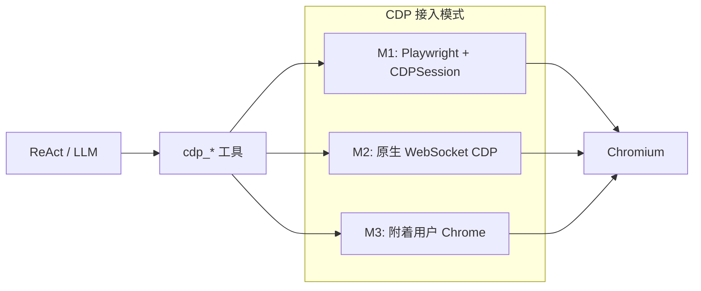
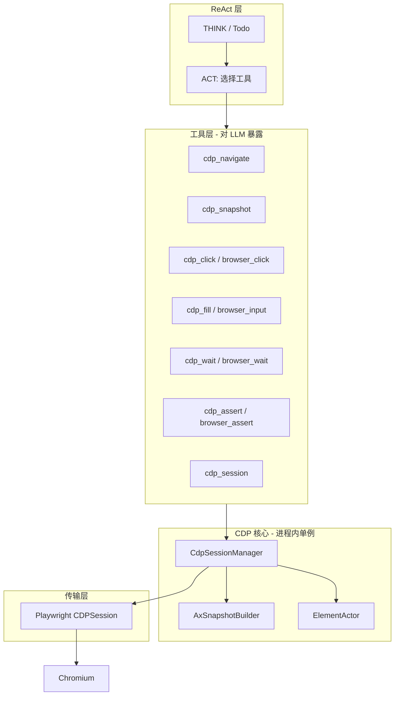
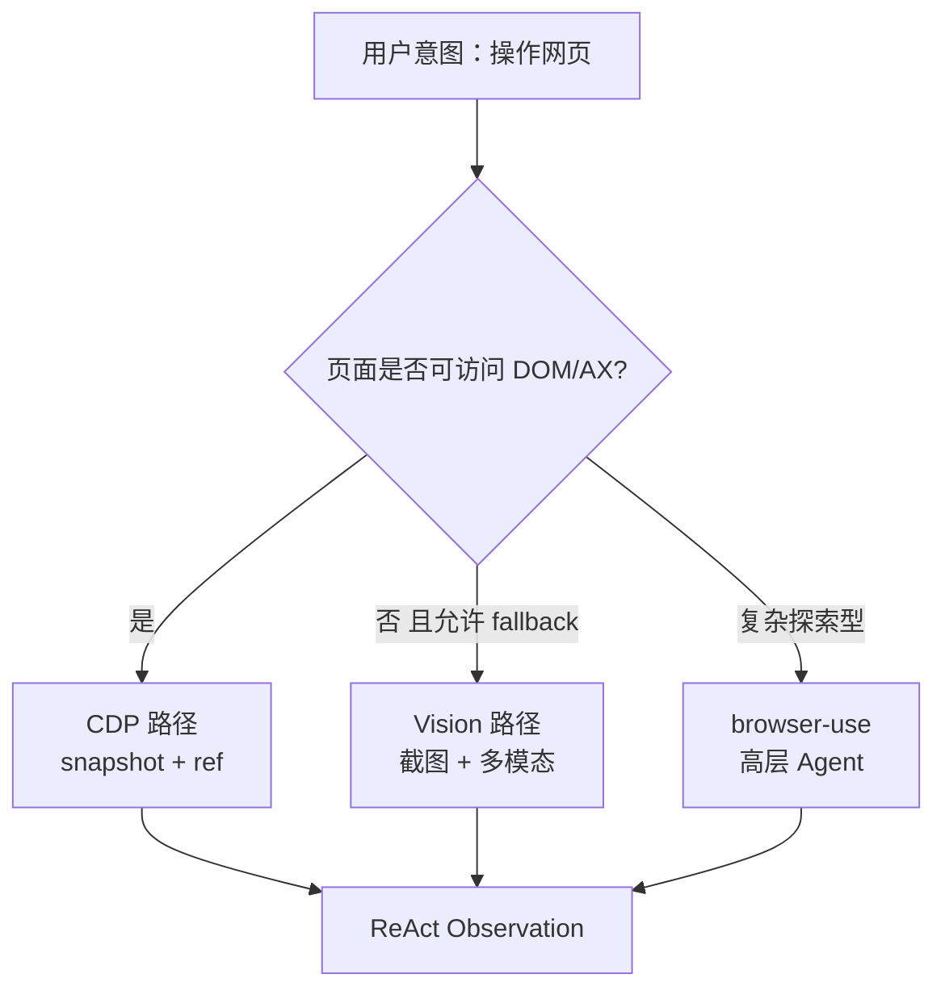

# 需求文档：CDP 浏览器工具与元素精准操控

> **定位**：用 **Chrome DevTools Protocol（CDP）** 实现 LLM 可编排的浏览器工具链，以 **DOM / 无障碍树 / 稳定元素引用** 为主路径，**默认不走**「截图 → 多模态识图 → 再猜坐标/选择器」的高延迟链路。  
> **关联文档**：[Agent 执行流程](./需求文档_agent执行流程现状与优化需求_20260324.md)、[图片识别与实体 CRUD](./需求文档_图片识别与实体增删改查.md)（vision 与 CDP 职责分离）、[沙箱方案](./沙箱方案与流程.md)、[需求三 OpenClaw 沙箱](./需求文档_20260227.md) §需求三。

---

## 1. 背景与动机

### 1.1 业务诉求

BadCaseDoctor 需要 Agent 能 **稳定复现 Web 缺陷、执行测试步骤、验证 UI 行为**，并把结果写回 Bug / TestCase。当前常见两条路：

| 路径 | 做法 | 问题 |
|------|------|------|
| **Vision 路径** | `page.screenshot()` → 多模态模型看图 → 输出点击区域或模糊描述 | 慢（截图编码 + 大模型推理）、贵、坐标/元素易漂移、动态 DOM 难对齐 |
| **高层封装路径** | `browser-use` / 自然语言一步 `browser_test` | 黑盒步骤多、难以与项目内 **L1/L2/L3 分层工具**（`tool_levels.py`）对齐，观测结果不利于 ReAct 纠错 |

用户明确要求：**先完善 CDP，用谷歌 CDP 协议做工具，LLM 通过元素引用精准操作浏览器**，截图+LLM 分析仅作 **兜底**（无障碍树不可用、Canvas/WebGL 等）。

### 1.2 项目现状（代码盘点）

| 模块 | 状态 | 说明 |
|------|------|------|
| `agents/tools/tool_levels.py` | ⚠️ 桩实现 | `L1_BrowserActions.click/input/wait` 仅 `asyncio.sleep` 模拟 |
| `agents/tools/layered_tool_factory.py` | ✅ 已注册名 | `browser_click` / `browser_input` / `browser_wait` / `browser_assert` 包装 L1，但未接真实浏览器 |
| `agents/tools/browser_test_tool.py` | ⚠️ 混合 | 部分 Playwright/`browser-use`；`_simulate_real_execution` 仅打印「建立 CDP 连接」无真实 CDP |
| `agents/tools/login_state_tool.py` | ✅ Playwright | `storage_state` 保存 cookies，可复用到 CDP 会话 |
| `tools/permission.py` | ✅ Playwright | 同步抓包 + selector 动作，证明本仓库已有 Playwright 基建 |
| `agents/browser_use_agent.py` | ⚠️ 独立 API | `/api/agent/browser-use/*`，与 ReAct `browser_test` 并行，非 CDP 主线 |
| ReAct 路由 `react_simplified.py` | ✅ 已有映射 | `browser_click` 等子工具会 **折叠** 进 `browser_test`，设计 CDP 后需避免误折叠 |

**结论**：分层工具 **命名与 ReAct 集成已就绪**，缺的是 **CDP 会话层 + 元素快照协议 + L1 真实实现**。

### 1.3 设计原则

1. **元素优先**：每次 ACT 前优先 `snapshot`（无障碍树或精简 DOM），LLM 只选 `ref` / `backendNodeId`，不猜像素。
2. **CDP 为真源**：对元素的点击、输入、滚动、等待，走 CDP 域（`DOM` / `Input` / `Runtime` / `Accessibility`），Playwright 仅作 **可选传输层**（`newCDPSession`），不强制绑定 Playwright Locator 语义。
3. **可观测**：每次工具返回 `steps[]`、`ref`、`method`、`duration_ms`，供 Observation 与 Bug 证据链使用（对齐 `evidence_extractor`）。
4. **与 vision 解耦**：请求级 `images` 走现有 vision 管线；**浏览器工具默认不读图**。
5. **最小可用增量**：P0 单页单 Tab + navigate/snapshot/click/fill/wait；P1 再扩展网络断言、多 Tab、连接用户已有 Chrome。

---

## 2. 目标与非目标

### 2.1 目标

1. 提供 **`cdp_*` 工具族**（或逐步替换现有 `browser_*` L1 实现），注册进 `ToolRegistry`，纳入 ReAct THINK→ACT 循环。
2. **元素定位协议**：会话内稳定 `ref`（基于 AXNode 或 DOM snapshot 序号），支持 `role+name`、`selector`（经唯一性校验）作为备选。
3. **会话管理**：按 `session_id`（或 `project_id + url`）复用 BrowserContext，自动加载 `login_state_tool` 的 `storage_state`。
4. **替换 L1 桩**：`L1_BrowserActions` 委托 `CdpSessionManager`，`layered_tool_factory` 无需改名即可变真。
5. **延迟**：本机 Chromium、快照已缓存时，click/fill **常见** 在百毫秒级；**不作为 SLA**——高延迟/远程/重页面须靠 `timeout_ms`（见 §5.4、§6.1），实测写入 `duration_ms` 供调优。

### 2.2 非目标（本期不做）

- 不以 CDP 实现完整 **录制回放** 产品（仅 Agent 逐步驱动）。
- 不替代 **grep/modify** 等业务库工具。
- 不默认实现 **移动端 WebView** / **iOS Safari**（仅 Chromium 系；后续可单列 WebKit）。
- 不把 **Desktop Electron 内嵌页** 一次做完（P3 用 `remote-debugging-port` 附着）。

---

## 3. 技术选型：CDP 接入方式

### 3.1 三种接入模式



| 模式 | 说明 | 优点 | 缺点 | 建议阶段 |
|------|------|------|------|----------|
| **M1** Playwright 启动浏览器 + `context.new_cdp_session(page)` | 与现有 `login_state_tool` 一致 | 上下文/导航/下载成熟；易加载 `storage_state` | 多一层抽象；部分 CDP 事件需自己订阅 | **P0 默认** |
| **M2** `websockets` 直连 `ws://127.0.0.1:9222/devtools/browser/...` | 最贴近「谷歌 CDP 协议」 | 依赖少、易单测 | 需自管 Target、Session、Cookie | P1 可选（服务端无 Playwright 时） |
| **M3** `--remote-debugging-port=9222` 附着用户 Chrome | 真实扩展/登录态 | 环境一致 | 安全与多用户隔离复杂 | P3（Electron/本机专家模式） |

**推荐**：P0 用 **M1** 快速落地；内部 `CdpClient` 接口与传输解耦，便于 P1 换 M2。

### 3.2 核心 CDP 域（P0 必用）

| CDP Domain | 方法（示例） | 用途 |
|------------|--------------|------|
| `Page` | `navigate`, `getNavigationHistory`, `captureScreenshot`（仅调试） | 导航、页面生命周期 |
| `DOM` | `getDocument`, `querySelector`, `getBoxModel`, `resolveNode` | 节点解析、几何（兜底坐标点击） |
| `Accessibility` | `enable`, `getFullAXTree`, `queryAXTree` | **主快照**：role、name、value、可交互性 |
| `Input` | `dispatchMouseEvent`, `dispatchKeyEvent` | 对 `backendNodeId` 对应坐标点击/输入 |
| `Network` | `enable`, `getResponseBody`（P1） | 断言接口 404/500 |
| `Target` | `getTargets`, `attachToTarget` | 多 Tab（P1） |

**P0 不使用 `Runtime.evaluate` / `cdp_eval`**：白名单难以穷举，存在注入与侧信道风险；读文本用 **`cdp_get_text`**（`DOM` + AX 属性，或 `DOM.getOuterHTML` 限定节点），改页面状态仅允许 **`cdp_fill` / `cdp_click` / `cdp_press`**。

协议参考：[Chrome DevTools Protocol](https://chromedevtools.github.io/devtools-protocol/)。

### 3.3 为何不用「截图 + LLM」作为主路径

| 维度 | CDP 元素路径 | Vision 路径 |
|------|----------------|-------------|
| 延迟 | 毫秒～百毫秒级 DOM/AX | 秒级（图+推理） |
| 成本 | 无额外视觉 token | 高 |
| 精确度 | `backendNodeId` / 唯一 `ref` | 布局变化易失效 |
| 可复现 | 可记录 ref + selector 审计 | 难以回归 |
| 适用 | 标准 DOM、表单、按钮 | Canvas、无 AX 的自定义控件 |

Vision 保留场景：用户 **主动上传截图** 要求识图建 Bug（已有管线），或 CDP `snapshot` 返回空交互节点时的 **fallback**（需显式开关 `allow_vision_fallback`）。

---

## 4. 架构设计

### 4.1 分层结构



- **工具层**：薄包装，参数校验、Observation JSON 格式化。
- **CdpSessionManager**：`session_id → { browser, context, page, cdp_session, last_snapshot }`。
- **AxSnapshotBuilder**：`Accessibility.getFullAXTree` → 剪枝 → 分配 `ref`（如 `@e1`…`@e42`）。
- **ElementActor**：`ref → backendNodeId → getBoxModel → Input.dispatch*`。

### 4.2 建议目录与模块

```
agents/
  cdp/
    __init__.py
    session_manager.py      # 会话生命周期、storage_state 注入
    cdp_client.py           # 抽象：send(method, params) / on(event)
    playwright_transport.py # M1 实现
    snapshot.py             # AX/DOM 快照、ref 分配、剪枝
    element_actor.py        # click、fill、scroll、hover
    errors.py               # 元素未找到、ref 过期、超时
  tools/
    cdp_tool.py             # 聚合工具或拆分为多个 BaseTool
    tool_levels.py          # L1 改为调用 element_actor
```

配置项（`config.py` / `.env`）建议：

| 变量 | 含义 | 默认 |
|------|------|------|
| `CDP_ENABLED` | 是否注册 CDP 工具 | `0` → 上线改 `1` |
| `CDP_HEADLESS` | 无头模式 | `true` |
| `CDP_DEFAULT_TIMEOUT_MS` | 默认等待 | `30000` |
| `CDP_SNAPSHOT_MAX_NODES` | 快照最大节点数 | `200` |
| `CDP_ALLOW_VISION_FALLBACK` | AX 失败是否允许截图 LLM | `false` |
| `CDP_DEBUG_PORT` | M3 调试端口 | `9222` |
| `BROWSER_BACKEND` | `browser_test` 执行后端：`mock` \| `playwright` \| `cdp` | `mock`（过渡默认，上线改 `cdp`） |
| `CDP_SESSION_TTL_SEC` | 会话闲置超过此时长自动关闭 | `1800` |
| `CDP_MAX_SESSIONS` | 进程内最大并发会话数，超出 LRU 驱逐 | `8` |
| `CDP_STALE_REF_AUTO_SNAPSHOT` | `stale_ref` 时是否自动轻量快照 | `true` |

### 4.3 与 `browser_test` 切换策略（`BROWSER_BACKEND`）

过渡期 **禁止** 在 `browser_test_tool.py` 内混写三套分支逻辑散落各处；统一入口：

```python
def run_browser_test(...):
    backend = os.getenv("BROWSER_BACKEND", "mock").lower()
    if backend == "cdp":
        return await _run_via_cdp_steps(...)      # 解析用例 → 逐步 cdp_*
    if backend == "playwright":
        return await _run_via_playwright_legacy(...)  # 现有 browser-use / locator 路径（如有）
    return await _run_mock(...)                 # 当前模拟，便于 CI/无浏览器环境
```

| 取值 | 行为 | 适用 |
|------|------|------|
| `mock` | 不启 Chromium，返回结构化占位结果 | 默认开发、单测 |
| `playwright` | 旧路径（Locator / browser-use），与 CDP 互斥 | 回滚、对比 |
| `cdp` | 用例编排仍走 `browser_test`，**执行层** 只调 `CdpSessionManager` / `cdp_*` | 目标生产 |

- ReAct 对外工具名可仍为 `browser_test`；**L1 子工具**（`browser_click` 等）在 `BROWSER_BACKEND=cdp` 时同样走 CDP。
- `CDP_ENABLED=1` 控制是否向 Registry **注册** `cdp_*` 独立工具；两者可组合：`CDP_ENABLED=1` + `BROWSER_BACKEND=cdp` 为完整形态。

### 4.4 与现有模块关系

| 现有模块 | 关系 |
|----------|------|
| `login_state_tool` | `CdpSessionManager.create_context(storage_state=path)` |
| `browser_test_tool` | 逐步改为：**解析用例 → 逐步调用 `cdp_*`**，废弃 `_simulate_real_execution` |
| `layered_tool_factory` | L1 工具名可保留，内部转调 `ElementActor` |
| `prompts.py` | 新增 `cdp_*` 工具说明；`browser_test` 与 `cdp_snapshot` 组合策略 |
| `react_simplified.py` | 避免把 `cdp_click` 误映射为 `browser_test`；维护 `_browser_subtools` 白名单 |
| `client_local_bridge` / OpenClaw | P3：本机 Chrome 9222，经 WebSocket 转发 CDP 命令（与 terminal 代理类似） |

---

## 5. 元素模型与快照协议

### 5.1 元素引用（LLM 可见）

快照每次 `cdp_snapshot` 后生成 **新一版** `snapshot_id`；`ref` 仅在该 `snapshot_id` 内有效。

```json
{
  "snapshot_id": "snap_20260604_abc123",
  "url": "https://app.example.com/login",
  "title": "登录",
  "nodes": [
    {
      "ref": "@e12",
      "role": "textbox",
      "name": "用户名",
      "value": "",
      "focusable": true,
      "disabled": false,
      "backendNodeId": 42,
      "selector_hint": "#username"
    },
    {
      "ref": "@e15",
      "role": "button",
      "name": "登录",
      "focusable": true,
      "backendNodeId": 58,
      "selector_hint": "button[type=submit]"
    }
  ],
  "truncated": false,
  "stats": { "total_ax_nodes": 312, "exported": 48 }
}
```

**剪枝规则**（控制 token）：

- 丢弃不可见、`ignored`、`generic` 且无 name 的节点；
- 合并仅结构性的 `StaticText`；
- 优先保留 `focusable`、`editable`、`button`、`link`、`textbox`、`combobox`、`checkbox`；
- 超出 `CDP_SNAPSHOT_MAX_NODES` 时 `truncated: true`，提示 LLM 用 `selector` 或滚动后再 snapshot。

### 5.2 定位优先级（ElementActor 内部）

1. **`ref` + `snapshot_id`**（必选校验 snapshot 版本）
2. **`backendNodeId`**（直连，用于脚本回放；不单独暴露给 LLM 除非 debug）
3. **`selector`**：仅当 `document.querySelectorAll(selector).length === 1` 时接受
4. **`role` + `name`**：在最新 AX 树中唯一匹配
5. **禁止**：未校验的 XPath、坐标（除非 `allow_coordinate_fallback=true` 调试）

### 5.3 ref 过期处理

用户操作、**页面跳转**、SPA 重渲染后，旧 `snapshot_id` / `ref` 对应的 `backendNodeId` 可能失效。

**基础返回**（`CDP_STALE_REF_AUTO_SNAPSHOT=false` 时）：

```json
{
  "success": false,
  "error_code": "stale_ref",
  "message": "ref @e12 已失效，请重新调用 cdp_snapshot",
  "suggest_tool": "cdp_snapshot"
}
```

**自动恢复（推荐，默认开启）**：`cdp_click` / `cdp_fill` / `cdp_assert` 解析 ref 失败且 `error_code=stale_ref` 时，由 **ElementActor 内部**（非 LLM）触发一次 **轻量快照**：

| 项 | 说明 |
|----|------|
| 范围 | 仅当前页 **可交互 + 当前焦点链**（`document.activeElement` 及 AX 祖先），节点上限如 `32`，不替代全页 `cdp_snapshot` |
| 目的 | 把「忘记重新 snapshot」从 **额外一轮 LLM** 降为 **同一次工具调用的 Observation 扩展** |
| 返回 | `stale_ref_recovered: true/false`；若 `false` 仍带 `suggest_tool: cdp_snapshot` |
| 不重试点击 | 自动快照 **只刷新 ref 映射**，不自动二次 click（避免误点）；LLM 下一轮用新 `ref` 再 ACT |

```json
{
  "success": false,
  "error_code": "stale_ref",
  "stale_ref_recovered": true,
  "new_snapshot_id": "snap_20260604_def456",
  "focus_hints": [
    { "ref": "@e3", "role": "button", "name": "提交" }
  ],
  "message": "原 ref 已失效；已生成轻量快照，请根据 focus_hints 选择 ref 后重试",
  "suggest_tool": "cdp_click"
}
```

全页结构变化大（如登录→首页）时，轻量快照往往不够，Observation 应提示：**再调一次完整 `cdp_snapshot`**。

### 5.4 超时与重试

| 工具 | 参数 | 默认 | 说明 |
|------|------|------|------|
| `cdp_click` | `timeout_ms` | `CDP_DEFAULT_TIMEOUT_MS` | 解析节点 + 点击 + 可选短稳态 |
| `cdp_fill` | `timeout_ms` | 同上 | 含聚焦与输入完成 |
| `cdp_wait` | `timeout_ms` | 同上 | 等待 ref 可见 / 文本 / URL |
| `cdp_navigate` | `timeout_ms` | 同上 | 导航与 `wait_until` |
| `cdp_assert` | `timeout_ms` | 同上 | 断言轮询间隔建议 100～200ms |

- **不默认自动重试 click**（避免双击）；`timeout` 耗尽返回 `error_code: timeout`，`duration_ms` 如实记录。
- 运维侧：Prometheus 按 `tool`、`error_code` 分桶，**不以 200ms 作为告警阈值**。

---

## 6. 工具 API 设计（对 LLM）

### 6.1 工具一览

| 工具名 | 级别 | 描述 | 关键参数 |
|--------|------|------|----------|
| `cdp_session` | 会话 | 创建/关闭/列出会话 | `action`: create\|close\|list；`url`；`session_id`；`headless` |
| `cdp_navigate` | L0 | 打开 URL | `session_id`, `url`, `wait_until`: load\|domcontentloaded\|networkidle |
| `cdp_snapshot` | L0 | 获取可交互元素树 | `session_id`, `scope`: interactive\|all |
| `cdp_click` | L1 | 点击 | `session_id`, `ref` 或 `selector`, `snapshot_id`, **`timeout_ms`** |
| `cdp_fill` | L1 | 清空并输入 | `session_id`, `ref`, `text`, `snapshot_id`, **`timeout_ms`** |
| `cdp_press` | L1 | 按键 | `session_id`, `key`: Enter\|Tab\|..., **`timeout_ms`** |
| `cdp_wait` | L1 | 等待 | `session_id`, `ref` 可见 / `text` / `url_matches`, **`timeout_ms`**（必填语义） |
| `cdp_assert` | L1 | 断言 | `session_id`, `ref` 可见, `text_contains`, `url_matches`, **`timeout_ms`** |
| `cdp_get_text` | L1 只读 | 读元素文本/值 | `session_id`, `ref` 或 `selector`；**禁止**执行任意 JS |
| `cdp_scroll` | L1 | 滚动 | `session_id`, `ref` 或 `direction`, `timeout_ms` |

**明确不做（P0～P1）**：`cdp_eval` / 通用 `Runtime.evaluate`。若未来确有只读需求，新增 **专用** 工具（如 `cdp_get_attribute`），参数枚举化，仍不走表达式字符串。

**兼容策略**：`browser_click` 等别名 **参数增加** `ref`、`snapshot_id`；内部转发 `cdp_click`，观测 JSON 统一。

### 6.2 典型 ReAct 工具链（登录示例）

```text
Todo: 打开登录页并登录
1. cdp_session   action=create, url=https://app/login
2. cdp_snapshot  → 得到 @e12 用户名、@e15 密码、@e18 登录按钮
3. cdp_fill      ref=@e12, text=demo_user
4. cdp_fill      ref=@e15, text=***
5. cdp_click     ref=@e18
6. cdp_wait      text=首页 或 url_matches=/dashboard
7. cdp_assert    ref 或 url
```

对比旧路径：~~screenshot → vision 描述 → 猜 selector~~（3～5 次 LLM 调用）。

### 6.3 统一返回格式

```json
{
  "success": true,
  "tool": "cdp_click",
  "session_id": "sess_7f3a",
  "snapshot_id": "snap_20260604_abc123",
  "ref": "@e18",
  "steps": [
    { "cdp_method": "DOM.resolveNode", "ok": true, "ms": 12 },
    { "cdp_method": "DOM.getBoxModel", "ok": true, "ms": 8 },
    { "cdp_method": "Input.dispatchMouseEvent", "ok": true, "ms": 5 }
  ],
  "duration_ms": 41,
  "page": { "url": "https://app/dashboard", "title": "首页" }
}
```

失败时附带 `error_code`：`stale_ref` | `ambiguous_selector` | `timeout` | `navigation_failed` | `session_not_found`。

---

## 7. CDP 操作实现要点（开发参考）

### 7.1 快照：Accessibility.getFullAXTree

```text
1. Accessibility.enable
2. ax_tree = Accessibility.getFullAXTree
3. 遍历节点：role, name, properties (disabled, focused, ...)
4. DOM.describeNode(backendNodeId) 补 selector_hint（可选）
5. 分配 ref，构建 nodes[]
6. 缓存到 session.last_snapshot
```

### 7.2 点击：ref → 坐标 → Input

```text
1. 从 last_snapshot 解析 ref → backendNodeId
2. DOM.getBoxModel(backendNodeId) → quad → 中心点 (x, y)
3. Input.dispatchMouseEvent(type=mousePressed/Released, x, y, button=left)
4. 可选：等待 Network.loadingFinished 或短 wait
```

### 7.3 输入：focus + key events

优先：

```text
1. click 目标（聚焦）
2. Input.dispatchKeyEvent(type=keyDown/keyUp, key=Backspace 循环或 selectAll+Delete) 清空
3. Input.insertText 或逐字符 dispatchKeyEvent
```

**禁止** `Runtime.evaluate` 改 `input.value`（React 受控组件不触发 onChange）。`cdp_fill` 仅走聚焦 + 键盘/ `Input.insertText`；读值用 `cdp_get_text`（AX `value` / DOM 文本节点）。

### 7.4 与 Playwright 分工

| 能力 | Playwright | CDP |
|------|------------|-----|
| 启动浏览器、Context、storage_state | ✅ | — |
| 导航 `goto` | ✅ 可封装 | `Page.navigate` |
| 元素树给 LLM | — | ✅ AX 快照 |
| 点击/输入 | Locator（内部也是 CDP） | ✅ 显式 CDP 便于审计 |
| 截图 | ✅ | 仅 debug |

---

## 8. ReAct / Prompt / 前端集成

### 8.1 工具注册

在 `agents/intelligent_devops_agent.py`（或统一注册点）：

```python
# CDP_ENABLED=1 时
from agents.tools.cdp_tool import CdpSessionTool, CdpNavigateTool, ...  # 或 CdpBrowserTool 聚合
registry.register(CdpNavigateTool())
# L1 工厂注册前注入 CdpSessionManager 单例
```

`agents/tools/__init__.py` 可选导入，避免未装 Playwright 时阻塞启动（与 `BrowserTestTool` 相同模式）。

### 8.2 Prompt 规则（`prompts.py` 增补要点）

- **浏览器任务默认流程**：`cdp_session` → `cdp_snapshot` → 若干 `cdp_click/fill` → `cdp_assert`；**禁止**未 snapshot 就连续 click。
- **与 browser_test 关系**：对外仍可一步 `browser_test`，内部由 **`BROWSER_BACKEND=cdp`** 拆成 CDP 逐步；细粒度 Todo 优先「`cdp_snapshot` + `cdp_click`」。
- **与 grep 关系**：查库用 `grep`；查页面用 `cdp_snapshot`，勿混用。
- **子工具白名单**：`react_simplified` 中 `_browser_subtools` 扩展为包含 `cdp_*` 前缀，且 **不要** 折叠进 `browser_test`。

### 8.3 SSE / 前端（P1）

| 事件字段 | 用途 |
|----------|------|
| `browser_snapshot` | 折叠展示可交互元素列表（ref、role、name） |
| `browser_step` | 单步 click/fill 高亮 |
| `browser_session_id` | 多轮对话复用会话 |

前端可参考 `executionResults` 结构，不必首版做实时浏览器画面（可选调试页）。

### 8.4 证据与 Bug 写入

`evidence_extractor` 增加 `cdp_*` 工具解析：把 `steps`、`url`、`ref` 写入 Bug 复现步骤或 `actual_result` 附件说明。

---

## 9. 安全与运维

| 风险 | 对策 |
|------|------|
| 任意 URL 导航（SSRF） | 允许列表：`CDP_ALLOWED_HOSTS` 或仅 `project.login_configs` 中域名 |
| 任意 JS 执行 | **不提供 `cdp_eval`**；只读走 `cdp_get_text` 等固定 CDP 方法 |
| 凭证泄露 | `cdp_fill` 返回中掩码 password；日志不打全文 |
| 资源泄漏 / 多用户 | 见 §9.1 |
| 并发 | 单 worker：`session_id` 互斥；`CDP_MAX_SESSIONS` 上限；多 worker 会话路由（P2 Redis） |

### 9.1 会话生命周期（TTL 与闲置上限）

`CdpSessionManager` 维护 `session_id → { created_at, last_used_at, browser, ... }`：

```text
1. 每次工具调用刷新 last_used_at
2. 后台任务（如每 60s）扫描：
   - last_used_at 超过 CDP_SESSION_TTL_SEC → close(session)
   - 会话总数 > CDP_MAX_SESSIONS → LRU 关闭最久未用
3. 进程退出 / worker 回收 → 关闭全部 browser
4. cdp_session action=close 显式释放（LLM 结束任务时应优先调用）
```

| 指标 | 建议 |
|------|------|
| `CDP_SESSION_TTL_SEC` | 30min 默认；调试可缩短 |
| `CDP_MAX_SESSIONS` | 8（按机器内存调整） |
| 观测 | `cdp_sessions_active`、`cdp_sessions_evicted_total` |

长时间运行的 `app.py` 若不清理，会积累 Chromium 进程；**P0 必须实现** 扫描关闭，不单靠「请求结束」。

---

## 10. 实施阶段

### P0（MVP，1～2 周）

- [ ] `CdpSessionManager` + Playwright `CDPSession` 传输
- [ ] `cdp_session` / `cdp_navigate` / `cdp_snapshot` / `cdp_click` / `cdp_fill` / `cdp_wait` / **`cdp_get_text`**
- [ ] 全部 ACT 工具支持 **`timeout_ms`**；Observation 带 `duration_ms`
- [ ] **`stale_ref` 轻量快照自动恢复**（`CDP_STALE_REF_AUTO_SNAPSHOT`）
- [ ] **会话 TTL + `CDP_MAX_SESSIONS` + 后台扫描关闭**
- [ ] **`BROWSER_BACKEND`** 三分支（`mock` / `playwright` / `cdp`）接入 `browser_test_tool.py`
- [ ] `L1_BrowserActions` 接真实 CDP；删除 L1 内 `asyncio.sleep` 模拟
- [ ] 加载 `login_state` storage_state
- [ ] `CDP_ENABLED` 开关 + 单测（本地 HTML fixture）
- [ ] `prompts.py` + `react_simplified` 白名单更新
- [ ] **不实现 `cdp_eval`**

### P1（增强，2～3 周）

- [ ] `cdp_assert` + `Network` 响应断言
- [ ] `browser_test_tool` 改为 CDP 逐步执行 + 结构化 Bug 输出
- [ ] SSE `browser_snapshot` 前端展示
- [ ] 快照剪枝与 token 预算调优
- [ ] Prometheus：`cdp_step_duration_ms`、`cdp_snapshot_nodes`

### P2（架构）

- [ ] 原生 WebSocket CDP 传输（M2）
- [ ] 多 Tab、`cdp_switch_target`
- [ ] 多 worker 会话粘性（Redis）

### P3（本机/Electron）

- [ ] 附着用户 Chrome（M3）+ `client_local_bridge` 协同
- [ ] OpenClaw 沙箱仅转发 CDP JSON（与 [需求三](./需求文档_20260227.md) 对齐）

---

## 11. 测试策略

| 类型 | 内容 |
|------|------|
| 单元 | `AxSnapshotBuilder` 剪枝、ref 分配、ref 过期检测 |
| 集成 | 本地 `file://` 或 `http://127.0.0.1:fixture/login.html` 走通 navigate→snapshot→fill→click |
| 回归 | 同一 snapshot 重复 click 成功率；React 受控 input 场景 |
| 非功能 | 100 次 click 平均耗时；会话泄漏检测 |

**不依赖** LLM 的自动化断言：给定 `ref` 执行后期望 URL/text。

---

## 12. 与 Vision / browser-use 的边界



- **默认**：`CDP_ALLOW_VISION_FALLBACK=false`。
- **用户上传图片**仍走 [图片识别文档](./需求文档_图片识别与实体增删改查.md)，不经过 CDP。
- **browser-use** 保留为可选实验路径，不与 `cdp_*` 同时抢同一 `session_id`。

---

## 13. 潜在风险与改进建议（评审纪要）

| 主题 | 风险 | 采纳结论 |
|------|------|----------|
| **`cdp_eval` 安全性** | 白名单难穷举，任意 JS 有注入面 | **P0 不做**；改 **`cdp_get_text`** 等只读专用工具；改页面仅用 fill/click/press |
| **ref 过期** | 跳转后 LLM 忘记 snapshot | **`stale_ref` 时自动轻量快照**（§5.3），不全页重试点击 |
| **延迟目标** | 「&lt;200ms」在真实环境常达不到 | 改为 **观测 `duration_ms`** + 各工具 **`timeout_ms`**（§5.4），不作硬 SLA |
| **`browser_test` 过渡** | 两套逻辑并存混乱 | **`BROWSER_BACKEND`** 单入口三分支（§4.3） |
| **资源泄漏 / 多用户** | 长驻进程堆积 Browser | **`CDP_SESSION_TTL_SEC` + `CDP_MAX_SESSIONS` + 定期扫描**（§9.1） |

---

## 14. 附录

### 14.1 参考实现线索

- Playwright CDP：`page.context.new_cdp_session(page)` → `session.send("DOM.getDocument")`
- 类似产品：Puppeteer **aria snapshot**、Chrome MCP 的 accessibility tree、Browserbase `stagehand` 的 `observe`+`act` 分离（observe≈snapshot，act≈click by ref）

### 14.2 现有代码改造清单（实施时勾选）

| 文件 | 改造 |
|------|------|
| `agents/tools/tool_levels.py` | L1 委托 `ElementActor` |
| `agents/tools/layered_tool_factory.py` | 注入 session_manager |
| `agents/tools/browser_test_tool.py` | **`BROWSER_BACKEND` 三分支**；`cdp` 路径逐步 `cdp_*` |
| `agents/cdp/session_manager.py` | TTL / max sessions / 后台扫描 |
| `agents/intelligent_devops_agent.py` | 注册 CDP 工具 |
| `agents/prompts.py` | 工具说明与 Todo 示例 |
| `agents/react_simplified.py` | `cdp_*` 路由白名单 |
| `config.py` | `CDP_*`、`BROWSER_BACKEND` 环境变量 |
| `electron-vue3/.../SimpleChatPanel.vue` | P1 展示 snapshot（可选） |

### 14.3 术语

| 术语 | 含义 |
|------|------|
| CDP | Chrome DevTools Protocol |
| ref | 快照内稳定的元素引用，如 `@e12` |
| backendNodeId | CDP DOM 域节点 ID，会话内用于解析几何 |
| AX Tree | 无障碍树，Accessibility domain |
| snapshot_id | 一次 `cdp_snapshot` 的版本号 |

---

**文档版本**：v0.2（2026-06-04，并入风险评审建议）  
**下一步**：按 P0 清单实现 `agents/cdp/` → `BROWSER_BACKEND=cdp` 联调 `browser_test` → 开启 `CDP_ENABLED=1`。
