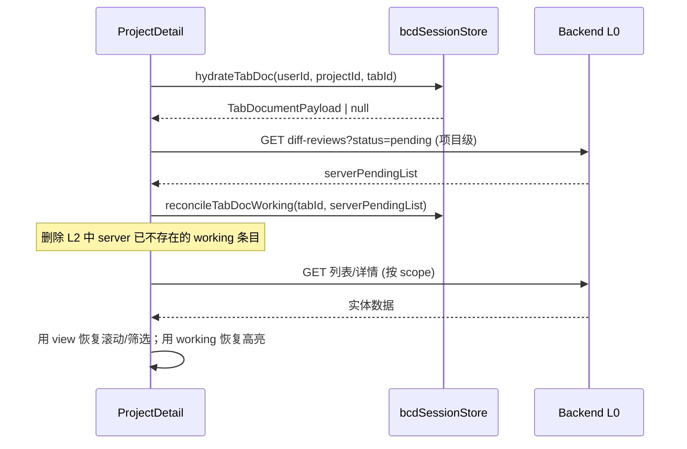
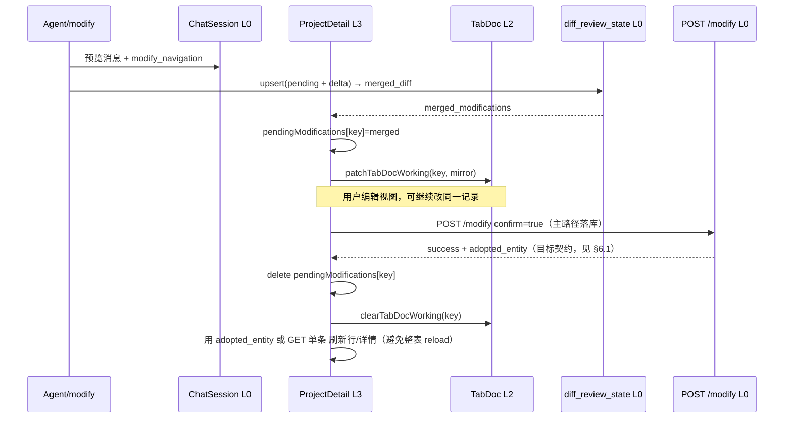

# 需求文档：Tab 级 sessionStorage 与前后端同步方案

> **定位**：在现有 [`需求文档_sessionStorage会话与任务状态管理.md`](./需求文档_sessionStorage会话与任务状态管理.md)（L0/L2 分层、`bcd:ss:*`）与 [`需求文档_diff_review闭环处理.md`](./需求文档_diff_review闭环处理.md)（Diff 真相与采纳闭环）之上，回答产品诉求：**每个用户、每个工作台 Tab 在浏览器 Tab 内用 `sessionStorage` 维持「像本地文件一样」的可编辑视图，刷新/切 Tab 不丢；Diff 采纳后等价于「保存到服务器」**。本文聚焦 **同步模型与边界**，不重复 Chat Session / Diff 合并规则全文。

---

## 1. 目标与动机

### 1.1 产品目标

| 诉求 | 说明 |
|------|------|
| **Tab = 工作区文档** | 计划列表 Tab、类型列表 Tab、详情 Tab 各自持有「当前视图状态」：滚动、筛选、展开行、未发送的 inline 编辑、Diff 高亮上下文等 |
| **少刷新** | 用户在工作台内的操作（切 Tab、F5、Agent 改完未采纳）应尽量 **原地恢复**，而不是每次从 API 全量重拉后「跳回第一条会话 / 第一个计划」 |
| **Diff 采纳 = 落盘** | 待采纳 Diff 是 **工作副本（working copy）**；用户点采纳后，数据写入 L0（MySQL），本地工作副本 **降级为只读或清除**，语义类似「保存文件」 |
| **多用户隔离** | 同一浏览器若切换登录账号，缓存键必须带 **`userId`**，避免 A 用户看到 B 用户的 Tab 快照 |

### 1.2 非目标（本文不做）

- 用 `sessionStorage` 替代后端 `ChatSession`、消息 transcript（口头「sessionStorage」仍指 L0，见 §2.1）。
- 改变 Diff **每记录仅一条 pending、同字段后者覆盖** 的合并语义（见 diff 需求文档 §4.2）。
- 跨设备、跨浏览器 Tab 的实时协同编辑（需 WebSocket / OT，单独立项）。

### 1.3 关联文档

| 文档 | 关系 |
|------|------|
| `需求文档_sessionStorage会话与任务状态管理.md` | L2 键空间、`bcdSessionStore.js` 已实现部分；本文扩展 **工作台 Tab 文档** |
| `需求文档_diff_review闭环处理.md` | Diff 生命周期、后端 `merged_diff`、采纳/拒绝清理 |
| `需求文档_工具导航_Tab复用与层级闭环.md` | Tab `id` / `kind`、导航与 Diff 落点 |
| `electron-vue3/src/utils/bcdSessionStore.js` | 实现落点；新增 API 在此模块扩展 |

---

## 2. 概念与分层（必须先统一）

### 2.1 术语（避免混称）

| 说法 | 技术实体 | 生命周期 |
|------|----------|----------|
| **Chat Session**（团队口头「会话存储」） | MySQL `ChatSession` + `/api/chat-sessions` | 持久 |
| **浏览器 Tab** | `window` 的一个标签页 | 关闭即销毁其 `sessionStorage` |
| **工作台 Tab** | `ProjectDetail.workbenchTabs[]` 中一项（`plan-list` / `type-list` / `detail-*`） | 现网仅存内存 ref，刷新丢失 |
| **Tab 文档（Tab Document）** | 本文提出的、**按工作台 Tab 序列化** 的 L2 快照 | 写入 `sessionStorage`，随浏览器 Tab 存活 |

### 2.2 三层真相模型

```text
L0  服务端真相（MySQL + API）     — 已采纳的数据、diff_review_state、ChatSession 消息
L2  Tab 文档（bcd:ss:tabdoc:*）   — 加速恢复：视图 + 未采纳工作副本的「展示镜像」
L3  Vue ref（组件内存）           — 运行态；由 L0 拉取 + L2 hydrate，用户操作写回 L2/L0
```

**铁律**：

1. **L0 优先**：冲突时以 API 为准；L2 不得覆盖已 `adopted` / `rejected` 的 Diff。
2. **L2 不存唯一真相**：消息正文、最终字段值、pending Diff 的权威合并结果均在 L0；L2 只缓存 **UI 状态 + 指向 L0 的引用（lifecycleId、fingerprint）**。
3. **采纳即提交**：`POST diff-reviews/resolve` 成功后，对应 Tab 文档内该记录的 `working` 段删除或标 `committed`。

### 2.3 「像文件」的类比

| 文件系统概念 | BadCaseDoctor 等价 |
|--------------|-------------------|
| 磁盘上的文件 | L0：`bug` / `badcase` / `testcase` / `card` 表行 + `diff_review_state` |
| 编辑器里未保存的 buffer | L3 + L2：`pendingModifications`、详情页字段 Diff 展示、列表行高亮 |
| `git add` / 暂存区 | Agent/modify 预览写入 pending，`confirmation_required=true` |
| `git commit` | 用户 **采纳** Diff → `resolve(adopted)` → L0 更新 |
| `git checkout --` | 用户 **拒绝** → `resolve(rejected)` → 清 L2/L3 pending |
| 另开窗口看同一文件 | 另一浏览器 Tab：独立 `sessionStorage`，靠 L0 reconcile |
| 文件已被别人改掉 | 他端/另一 Chat Session 改了同记录 → `lifecycle_id` 或 `updated_at` 不一致 → 触发 **冲突策略**（§5） |

---

## 3. Tab 文档模型

### 3.1 键命名（每用户 × 每项目 × 每工作台 Tab）

在现有 `bcd:ss:` 前缀下新增（**必须含 `userId`**，防止同机换号串数据）：

```text
bcd:ss:tabdoc:{userId}:{projectId}:{workbenchTabId}
```

- `workbenchTabId`：与 `ProjectDetail` 稳定 id 一致，如 `plan-12`、`type-list-bug-12-88`、`detail-bug-1001`。
- 顶层仍用 envelope：`{ schemaVersion, updatedAt, payload }`（与 `bcdSessionStore` 一致）。

**项目级索引键**（可选，用于 Tab 关闭后仍知「上次打开了哪些 Tab」）：

```text
bcd:ss:tabindex:{userId}:{projectId}
→ { openTabIds: string[], activeWorkbenchTabId: string | null, updatedAt }
```

与现有 `bcd:ss:workbench:{projectId}`（§5.4，**无 userId**）的关系：**新方案 supersede**；迁移时读旧键、写新键、删旧键。

### 3.2 单个 Tab 文档 `payload` 结构（建议 v1）

```typescript
type TabDocumentPayload = {
  /** 与 workbenchTabs[].id 一致 */
  tabId: string
  kind: 'plan-list' | 'type-list' | 'detail' | string
  /** 归属维度，用于 reconcile 时拉 API */
  scope: {
    projectId: number
    planId?: number | null
    cardId?: number | null
    target?: 'bug' | 'badcase' | 'testcase' | 'card'
    targetId?: number | null
  }

  /** 视图状态（可丢精度，不可丢安全） */
  view: {
    scrollTop?: number
    scrollAnchorRowId?: string | number
    filterType?: string
    searchKeyword?: string
    sortKey?: string
    expandedRowIds?: (string | number)[]
    /** 详情 Tab：当前激活的 section / 折叠态 */
    uiFlags?: Record<string, unknown>
  }

  /**
   * 工作副本：仅 mirror L0 pending，不自行合并业务规则
   * key = `${target}:${targetId}`
   */
  working: Record<string, {
    lifecycleId: number
    diffFingerprint: string
    status: 'pending'  // 仅 pending 写入；adopted 后必须删条目
    /** 展示用，来源于最后一次 GET/upsert 的 merged_modifications */
    modificationsMirror?: Record<string, { old: unknown; new: unknown }>
    sourceSessionId?: number
    sourceMessageId?: string
    cachedAt: number
  }>

  /** 详情 Tab：用户手动改过但未点采纳的 inline 草稿（可选 v1.1） */
  fieldDrafts?: Record<string, unknown>

  revision: number  // 本地文档版本，每次 hydrate/dehydrate +1
}
```

**不写入 Tab 文档的内容**：

- 完整列表数据行（`cards[]` / `bugs[]`）——体积分页不稳定，刷新后 **用 API + view 锚点** 恢复。
- Chat 消息、ReAct 步骤全文。
- Token、密码。

### 3.3 写入时机（dehydrate）

| 事件 | 动作 |
|------|------|
| 切换工作台 Tab（`activateWorkbenchTab`） | 对 **离开** 的 Tab `dehydrateTabDoc`；对 **进入** 的 Tab `hydrateTabDoc` |
| `pendingModifications` / Diff slot 变更 | `patchTabDocWorking(recordKey, mirror)`，节流 300ms |
| 列表滚动、筛选、搜索 | `patchTabDocView` |
| 浏览器 `beforeunload` / `visibilitychange(hidden)` | 全量 `flushAllOpenTabDocs` |
| Diff **采纳/拒绝** | `clearTabDocWorking(recordKey)` + 内存 `pendingModifications` 已有逻辑 |

### 3.4 读取时机（hydrate）



---

## 4. 前后端同步策略（核心）

同步问题本质是：**L2 镜像、L3 内存、L0 数据库** 三者在时间上的顺序与权威源。采用 **「L0 为源 + 显式版本 + 事件驱动 reconcile」**，不做双向最终一致 CRDT（成本高且与 Diff 单 pending 语义冲突）。

### 4.1 三类数据的不同同步方式

| 数据类型 | 权威源 | 前端策略 | 后端要求 |
|----------|--------|----------|----------|
| **已采纳实体字段** | L0 表行 | 只读展示；采纳后 `invalidate` 该记录相关 Tab 文档 `working` | `resolve` 返回最新行或 `etag` |
| **待采纳 Diff** | L0 `diff_review_state` | L2 只存 mirror；写入前 **upsert 必带 pending+delta**，展示用返回的 `merged_*` | 已有 `diff-reviews/upsert`、`/resolve` |
| **纯 UI 状态** | L2 Tab 文档 | 无需同步到服务器；刷新 hydrate 即可 | 无 |
| **Agent 沙箱预览** | L0 消息 `modify_navigation` + Diff | 聊天区靠 Chat Session API；工作台靠 Diff + 导航事件 | 消息落库 |

### 4.2 标准时序：从未采纳到采纳（「保存文件」）



**要点**：采纳前用户对列表/详情的 **本地滚动、筛选** 可只写 L2；**字段 old/new** 必须以最后一次 **服务端 merged** 为准，禁止前端二次合并最终 Diff。采纳后展示以 **§6.1** 为准，不依赖「全表 `fetchCards` / `refreshActiveWorkbenchList`」才能看到新值。

### 4.3 Reconcile 触发点（必须统一调用）

在以下时机对 **当前项目** 执行 `reconcileTabDocs(projectId, serverPendingList)`（可与现有 `reconcileDiffSlots` 合并实现）：

1. `ProjectDetail` **mounted**（进入项目）
2. **window focus** / 定时 60s（可选，检测他端采纳）
3. **切换工作台 Tab**（hydrate 前）
4. **Chat Session SSE 结束**且工具含 modify/create
5. **Diff resolve 成功**之后（本地已清，防残留）

规则：

- `serverPendingList` 中 **不存在** 的 `target:targetId` → 删除所有 Tab 文档里对应 `working` 条目。
- 存在但 `lifecycleId` / `diffFingerprint` 与 L2 不一致 → **以服务端为准** 覆盖 mirror，并 `toast`「该记录已在其他会话更新」。
- L2 有 `working` 但服务端无 pending → 删除 L2（典型：另一 Tab 已采纳）。

### 4.4 刷新（F5）恢复顺序

与 [`需求文档_sessionStorage会话与任务状态管理.md`](./需求文档_sessionStorage会话与任务状态管理.md) §7.1 对齐，扩展为：

```text
1. 鉴权用户 → userId
2. GET chat-sessions、GET diff-reviews?status=pending
3. reconcileDiffSlots + reconcileTabDocs（项目级）
4. hydrate tabindex → 恢复 workbenchTabs 元数据（可选：仅恢复 tab 条，不自动打开已关闭 Tab）
5. hydrate 当前 activeWorkbenchTab 的 tabdoc
6. GET 列表/详情 API，应用 view 锚点
7. resolveActiveSession → 恢复右侧 Chat Session 选中（bcd:ss:project，已有）
```

**禁止**：用 L2 的 `modificationsMirror` 直接写库；**禁止**刷新后用 L2 覆盖 L0 已采纳字段。

### 4.5 冲突场景与策略

| 场景 | 检测 | 处理 |
|------|------|------|
| 用户 Tab A 未采纳，Agent 在会话 B 又改同记录 | `lifecycleId` 或服务端 `updated_at` 变大 | 覆盖 L2 mirror，UI 展示新 merged Diff，提示「已更新待确认内容」 |
| 用户 Tab A 显示 pending，他端已采纳 | reconcile 后 server 无 pending | 清 L2/L3 pending，列表去掉高亮 |
| 用户本地 `fieldDrafts` 有草稿，但 pending 已采纳 | resolve 成功事件 | 清 `fieldDrafts` 与 `working` |
| 两工作台 Tab 同时打开同详情 | 同 `target:targetId` 共享一条 L0 pending | 两 Tab 文档可各有一份 mirror，reconcile 时 **同 key 同内容**；采纳任一处清全局 |
| QuotaExceeded | `sessionStorage` 写失败 | 降级仅 L3 + 提示；优先丢弃 `view`，保留 `working` 的 fingerprint |

**不支持**：两用户同时采纳同一 pending（后端应乐观锁：`lifecycle_id` 不匹配则 409）。

---

## 5. API 与模块契约（前端）

在 `bcdSessionStore.js` / `bcdSessionStore.keys.js` 扩展：

| 方法 | 说明 |
|------|------|
| `tabDocKey(userId, projectId, tabId)` | 键常量 |
| `getTabDocument(userId, projectId, tabId)` | 读单 Tab 文档 |
| `patchTabDocument(userId, projectId, tabId, partial)` | 合并 payload |
| `dehydrateWorkbenchTab(userId, projectId, tabState)` | 从 `workbenchTabs` + refs 序列化 |
| `hydrateWorkbenchTab(userId, projectId, tabId)` | 反序列化到 refs |
| `clearTabDocWorking(userId, projectId, recordKey)` | 采纳/拒绝后 |
| `reconcileTabDocs(userId, projectId, serverPendingList)` | 项目级对账 |
| `flushTabIndex(userId, projectId, tabs, activeId)` | 写 tabindex |
| `dumpAll()` | 已有，扩展列出 `tabdoc` / `tabindex` |

**`ProjectDetail.vue` 接入点**：

- `upsertWorkbenchTab` / `activateWorkbenchTab` / `closeWorkbenchTab` → dehydrate/hydrate。
- `restorePendingDiffReviews` 成功后 → `reconcileTabDocs`。
- `handleDiffAdopted` / `handleDiffRejected` → `clearTabDocWorking`。

**体积**：单 Tab 文档建议 ≤ **128KB**；`modificationsMirror` 仅保留待展示字段，超长截断；项目内 Tab 数建议上限 **20**（超出时 LRU 删最旧 `tabdoc` 键）。

---

## 6. 后端配合与采纳后刷新（体验关键）

现有 `diff-reviews` 已满足 pending 真相；**「采纳后立即看到新值」** 需前后端各做一点增量。Tab 级 L2 不能替代这一步——L2 只存 mirror，采纳后字段值必须以 L0 为准。

### 6.1 采纳后立即看到新值（**建议与后端落实，前端可先行兜底**）

#### 现网行为（2026-05）

| 接口 | 采纳相关行为 | 响应体 |
|------|----------------|--------|
| `POST /api/projects/:id/modify`（`confirm: true`） | **主路径**：落库并删除 `diff_review_state` | 成功时多为 `{ success, async?, ... }`，**通常不含**完整实体行 |
| `POST /api/projects/:id/diff-reviews/resolve` | 幂等删 pending；旧客户端仅调 resolve 的场景 | `{ success, status: 'deleted' }`，**无实体快照** |

前端 `ProjectDetail` 采纳后除 **乐观更新** 外，常会 `restorePendingDiffReviews`、`refreshActiveWorkbenchList(1)`、甚至 `fetchCards(1)`——能最终一致，但 **延迟与闪烁** 明显，与「像保存文件后立刻看到磁盘内容」不符。

#### 目标契约（推荐后端实现）

在 **`POST /modify`（`confirm: true`）** 成功响应中增加（`resolve` 可同步带上，但落库以 modify 为准）：

```json
{
  "success": true,
  "target": "bug",
  "target_id": 1001,
  "adopted_entity": { },
  "etag": "W/\"bug-1001-1735689600\""
}
```

| 字段 | 说明 |
|------|------|
| `adopted_entity` | 采纳后该记录在 L0 的 **完整行**（与对应 `GET /api/{target}s/:id` 单条接口字段一致），列表行与详情页共用 |
| `etag`（可选） | 供后续 `If-None-Match` 或 reconcile；无实体时至少返回 etag |

**后端同学落地要点**：

1. `confirm: true` 在 **同一事务** 内写完业务表 + 删 `diff_review_state` 后，再查一次实体序列化进 `adopted_entity`。
2. 批量采纳 `POST /modify`（`items[]`）时，每项返回 `{ target, target_id, adopted_entity?, error? }`，避免前端为 N 条记录打 N 次全表刷新。
3. 若暂时无法拼完整实体，**至少**返回变更字段子集 `adopted_fields: { title, status, ... }` + `updated_at`，前端可 merge 进内存行。

#### 前端兜底（**后端未返实体时即可做，成本低**）

采纳成功（`modify` 或 `resolve`）后，统一走 **`patchRecordAfterAdopt(target, targetId, serverPayload?)`**：

```text
1. 若 serverPayload.adopted_entity 存在 → merge 进 badcases/cards 内存行 + 刷新打开中的详情组件 props
2. 否则 → 按 target 调单条 GET（一次请求）：
   - bug      → GET /api/bugs/{id}
   - badcase  → GET /api/badcases/{id}
   - testcase → GET /api/testcases/{id}
   - card     → GET /api/cards/{id}
3. 用返回行 upsert 当前列表数组中的对应项（findIndex + splice），**不**默认触发整页 fetchCards
4. 清 pendingModifications、clearTabDocWorking、restorePendingDiffReviews({ afterAdopt: true })（仅对账 pending，不依赖其拉实体）
```

| 对比 | 全表 `fetchCards(1)` | 单条 GET + 内存 patch |
|------|----------------------|------------------------|
| 请求量 | 大（整计划卡片表） | 1 次 |
| 列表滚动/筛选 | 易丢 | 保留 |
| 与 Tab 文档 L2 | 无关 | `view` 锚点仍有效 |

**实现落点**：`ProjectDetail.vue` 中 `confirmModify` / `handleDetailModifyAdopted` 成功分支；抽取 `fetchRecordByTarget(target, id)` 复用现有详情页已用的 GET 路径。

#### 验收（本节专用）

1. 详情采纳改 `title` 后，**500ms 内**列表同行标题更新，且无整表 loading 遮罩。
2. 断网回滚场景仍走现有乐观回滚；有网时以单条 GET 或 `adopted_entity` 校正乐观误差。
3. `bug` 改 title 时列表行仍遵守「Bug 列表 title 与 Card 标题解耦」现网规则（单条 GET 后只更新实体行，Card 标题另按需 `GET /api/cards/:id`）。

### 6.2 其它后端增量（可并行，优先级低于 §6.1）

| 项 | 用途 |
|----|------|
| `GET diff-reviews?status=pending` 返回 `lifecycle_id`、`diff_fingerprint`、`updated_at` | reconcile 与冲突提示 |
| 列表/详情 `GET` 支持 `If-None-Match` / `updated_since` | hydrate 后减少重复拉取 |
| （可选）`GET /api/projects/:id/workbench-revision` | 项目级 monotonic revision，focus 时比对即可 reconcile |

**不需要**：为每个工作台 Tab 建表；Tab 文档纯前端 L2。

---

## 7. 分阶段落地

### M0（与现网兼容，1～2 天）

- [x] 键空间增加 `userId`（从 `localStorage` / 登录态读取）。
- [x] 实现 `tabindex`：`activeWorkbenchTabId` + `openTabIds`（解决刷新后 Tab 条丢失）。
- [x] `dehydrate` / `hydrate` 仅 `view`（滚动、筛选、搜索词）— `tabWorkbenchSession.js` + `workbenchListRootRef`。
- [x] `beforeunload` flush。

### M1（Diff 工作副本 + 采纳刷新，3～5 天）

- [x] `working` mirror 与 `pendingModifications` 双写；采纳/拒绝清 L2。
- [x] 进入项目、`focus`、`restorePendingDiffReviews` → `reconcileTabDocs`。
- [x] 与 `bcd:ss:diff` 桥接键统一：`setDiffSlot` 可选同步写入当前 Tab 的 `tabdoc.working`。
- [x] **§6.1 前端兜底**：`patchRecordAfterAdopt` + 单条 GET；默认不再为单条采纳全表 reload。
- [x] **§6.1 后端**：单条 `POST /modify` `confirm: true`（非评论、非 `MODIFY_ADOPT_ASYNC`）同步落库并返回 `adopted_entity` + `etag`。

### M2（体验，可选）

- [x] 详情 `fieldDrafts`（未采纳前的 inline 编辑；`NewBug` 嵌入模式 + tabdoc）。
- [x] Tab LRU 与 Quota 降级策略（`TAB_DOC_MAX_KEYS=20`，超限删最久未 touch 的 tabdoc；写失败降级 view/listSnapshot）。
- [x] 列表 `listSnapshot` + L3 内存：切 Tab 先展示缓存行，后台 `fetch*`（`background: true`）。
- [x] 详情 keep-alive：`hideEmbeddedEditor` + `v-show` 层，同实体 Tab 切回不 remount。
- [ ] Dev 面板：`dumpAll()` 展示各 `tabdoc` 体积。

---

## 8. 验收标准

1. **刷新**：打开「新建迭代计划」列表 Tab 并滚动、筛选后 F5，Tab 条与滚动位置可恢复（允许列表数据重拉后锚点定位）。
2. **切 Tab**：在详情 Tab 有待采纳 Diff，切到列表再切回，Diff 高亮仍在（且与 L0 pending 一致）。
3. **采纳**：详情采纳后，列表与详情均无 pending 高亮；`sessionStorage` 中该记录 `working` 条目已删除。
4. **跨会话**：会话 A 生成 pending，会话 B 同记录再改，刷新后仅展示 **最新 merged**（同 diff 文档 §4.2）。
5. **换用户**：同浏览器换账号登录，不读取上一用户的 `tabdoc` 键。

---

## 9. 风险与约束

| 风险 | 缓解 |
|------|------|
| `sessionStorage` 5MB 限额 | 单键上限、Tab 数 LRU、mirror 不存全文 |
| L2 与 L3 双写不一致 | 统一经 `bcdSessionStore`，禁止组件直接 `sessionStorage.setItem` |
| 列表数据陈旧 | hydrate 后 **必拉** API；L2 只恢复 view + pending 展示 |
| Electron 多窗口 | 每窗口独立 `sessionStorage`；L0 仍以对账为准 |
| 与 Chat Session 混淆 | 文档、代码注释、PR 描述中区分 **Chat Session（L0）** 与 **Tab 文档（L2）** |

---

## 10. 小结

- **每个用户的每个工作台 Tab** 用 `bcd:ss:tabdoc:{userId}:{projectId}:{tabId}` 保存 **视图 + pending 展示镜像**，实现「像打开了一个本地文件」的体验。
- **真正落盘** 仍只靠 L0：Diff **采纳** = 提交；L2 在采纳后必须失效对应 `working`。
- **同步** 不靠双向合并，而靠 **L0 优先 + lifecycleId/fingerprint reconcile + 关键节点 API 拉取**，与现有 Diff 闭环文档一致。
- **采纳后丝滑展示**（§6.1）：优先后端 `adopted_entity`；否则前端 **单条 GET** 补丁内存行——与 Tab L2 正交，但应 **M1 与后端一并落实**。

实现时以 `bcdSessionStore.js` 为唯一写入口，`ProjectDetail.vue` 为工作台 hydrate/dehydrate 与 **`patchRecordAfterAdopt`** 编排中心；冲突时以本文 §4.3、§4.5 为准。
