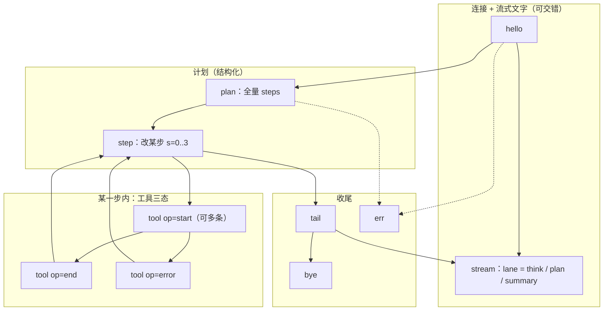
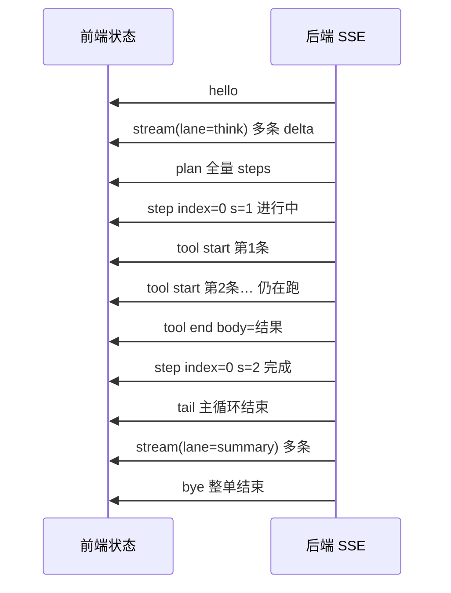

# 需求文档：Agent 执行流程现状与优化需求

## 1. 文档目标

本文档用于梳理当前项目中 Agent 端到端执行流程（前端 -> 后端路由 -> ReAct 引擎 -> 工具执行 -> SSE 回传 -> 会话落库 -> 列表/详情联动），并明确当前不合理点与后续优化需求，作为下一阶段改造依据。

---

## 2. 范围

本次梳理覆盖以下模块：

- 后端入口：`routers/agent.py` 中 `POST /api/agent/react`
- Agent 主体：`agents/intelligent_devops_agent.py`
- ReAct 循环：`agents/react_simplified.py`
- 工具注册：`agents/tool_registry.py` + `agents/tools/*`
- 前端流式消费：`electron-vue3/src/components/SimpleChatPanel.vue`
- 会话消息持久化：`app.py` 中 `POST /api/chat-sessions/<session_id>/messages`

不在本次范围：

- BrowserUse 独立接口链路细节
- 非 ReAct 的旧式 `/api/agent/execute` 分发链路优化

---

## 3. 当前架构总览（现状）

### 3.1 前端入口（SimpleChatPanel）

1. 用户发送消息后，前端调用 `POST /api/agent/react`（`stream=true`）。
2. 前端通过 `ReadableStream` 逐行解析 SSE `data:`。
3. 前端同时消费两类事件：
   - 顶层事件（`type=plan/thinking/action_start/action_result/finished...`）
   - 明细事件（`type=step`，内部 `event=reasoning/todos/executing/observation/done...`）
4. 前端将工具结果二次解析为 UI 数据结构：
   - `modifyNavigation` / `modifyGroups`
   - `navigation`（grep 导航）
   - `executionResults` / `searchResults`
5. 前端再调用 `POST /api/chat-sessions/<id>/messages` 持久化 AI 消息内容（含 reasoning、steps、modify/group 等 JSON）。

### 3.2 后端入口（/api/agent/react）

1. 读取请求参数：`user_input/model/project_id/plan_id/images/pending_diff_context/locale`。
2. 若带图片，先做视觉描述并注入到 `user_input`。
3. 获取（或复用）LLM 与 `IntelligentDevOpsAgent` 实例（按 model 缓存）。
4. 启动流式响应（SSE）：
   - 后台线程跑异步循环
   - 将 `agent.handle_user_request_stream(...)` 产出的 chunk 放入 `Queue`
   - 主线程持续 `yield data: ...` 输出到前端

### 3.3 Agent 主控（IntelligentDevOpsAgent）

1. 初始化并注册工具（业务工具 + 分层工具 + skill 工具）。
2. 调用 `react_engine.run_stream(...)` 进入主循环。
3. 将引擎内部事件重新映射为顶层 SSE 事件（`plan`、`thinking`、`action_start`、`action_result`、`finished` 等）。
4. 同时继续透传 `type=step` 事件用于前端细粒度渲染。

### 3.4 ReAct 引擎（SimplifiedReActEngine）

当前是“动态主循环”实现，不是一次性脚本：

1. 前置处理：
   - locale 标准化
   - pending diff 上下文索引
   - 项目/计划信息加载
   - 低信息输入、modify/create 冲突输入拦截澄清
2. THINK 阶段：
   - 流式获取 reasoning/content
   - 解析 Todo（`todos_partial` -> `todos`）
   - 下发 `plan`/`plan_init`
3. ACT+OBSERVE 主循环：
   - 每轮根据上下文生成 decision
   - 选择工具并执行
   - 产出 observation，更新 plan 状态
   - 必要时动态 `plan_update`
4. 结束阶段：
   - 输出 `done`（最终 findings/summary）
   - 输出 `finished`（主循环统计与快照）

---

## 4. 当前事件协议（现状）

### 4.1 主要 SSE 事件（后端 -> 前端）

- 顶层：`status`、`plan`、`plan_init`、`plan_update`、`thinking`、`action_start`、`action_result`、`step_status`、`phase_wait`、`finished`
- step 内事件：`reasoning`、`todos_stream`、`todos_partial`、`todos`、`todo_start`、`executing`、`observation`、`finding`、`evidence`、`done` 等

### 4.2 当前协议特点

1. 存在“顶层 + step 内”双通道并行输出。
2. 多数语义存在镜像或重叠（如 thinking 与 step.reasoning）。
3. 前端要同时维护两套状态合并逻辑，复杂度高。

---

## 5. 当前不合理点（需优化）

## 5.1 协议层

1. **事件语义重复**：顶层与 step 内事件并存，前端需要重复消费和去重。
2. **协议边界不清**：哪些字段是“权威数据源”不明确（如 plan 与 steps 的最终一致性）。

## 5.2 职责分层

1. **前端承担过多业务编排**：对 `modify/create/grep` 结果进行大量二次推导、分组、补全与导航派发。
2. **后端输出契约不够稳定**：同类工具结果可能有多种结构，前端需写大量兼容分支。

## 5.3 状态一致性

1. **Agent 对象按 model 全局缓存**，存在跨请求/跨会话状态污染风险（尤其是可变上下文字段）。
2. **前端本地状态与后端持久化状态存在漂移风险**（需要多处兜底校正）。

## 5.4 可观测性与调试

1. 日志量大但缺乏统一 `request_id/session_id/step_id/tool_call_id` 贯穿。
2. 问题定位依赖人工串联多段日志，复盘成本高。

## 5.5 维护成本

1. `SimpleChatPanel.vue` 承担了协议解析、业务决策、导航编排、状态修复等多重职责，文件复杂度高。
2. ReAct 和前端之间缺少“版本化协议”，导致每次字段变更影响面大。

---

## 6. 优化需求（目标态）

## 6.1 协议收敛：双通道合并为单一 SSE 协议（高优先级）

本节描述**目标态**约定，用于评审是否合理；落地时需配套 `protocol_version` 与迁移期双写/兼容策略（见第 9 节）。

**阅读顺序**：若觉得后文 `kind` 过细、眼花缭乱，**请先读 §6.1.9** 与 **§6.1.11**（数量与总览）；用 **阶段 + 步骤状态 0–3 + 工具三态（start / end / error）** 理解全流程；**§6.1.3 详表**作「展开版 / 迁移对照」，实现上以 **§6.1.9 的 8～9 类 `kind`** 为准。

### 6.1.1 合并原则

1. **一条物理 SSE 连接、一种解析路径**：每条 `data:` 对应**一个** JSON 对象，不再同时下发「顶层 `type=thinking`」与「`type=step` + `event=reasoning`」两套镜像。
2. **信封统一**：所有事件共用同一外层字段；语义只由**规范事件名** `kind`（或 `type`，二选一固定）表达，避免「顶层 type」与「step 内 event」两套命名空间。
3. **权威数据只写一处**：例如计划表仅以 `plan.snapshot` 为权威；工具结果仅以 **`tool` 事件**为权威（与 **§6.1.9** 对齐时：`op: end` 成功体、`op: error` 失败体；详表里的 `tool.result` 即落在此两类之一）；不再要求前端合并「顶层 action_result」与「step observation」。
4. **可关联、可排序**：每条事件带 `seq`（单调递增）与 `request_id`；与步骤相关的事件带 `step_index`（0-based）或 `step_id`（1-based，与 UI 一致时需在协议中固定一种并在全链路统一）。
5. **调试与回放**：如需原始引擎日志，使用**单独**通道（如仅 debug 开关下的 `trace` 事件，或后端落盘），不混入默认 UI 协议。

### 6.1.2 统一信封（建议字段）

每条 SSE 消息体（JSON）建议长这样（字段名可在 v1 冻结时最终敲定）：

| 字段 | 必填 | 说明 |
|------|------|------|
| `protocol_version` | 是 | 如 `1`，用于灰度与兼容。 |
| `seq` | 是 | 本连接内从 0 或 1 递增，前端 reducer 可检测丢包、乱序。 |
| `request_id` | 是 | 单次 `/api/agent/react` 请求唯一 ID，贯穿日志与前端状态。 |
| `kind` | 是 | 规范事件名，见下表。 |
| `phase` | 建议 | `think` \| `act` \| `observe` \| `finalize`，与现有 `react_phase` 对齐，便于 UI 分样式。 |
| `step_index` | 条件 | 与某一步强相关时填写；无则省略。 |
| `payload` | 是 | 本事件业务体；结构由 `kind` 决定。 |
| `meta` | 否 | 如 `locale`、`model`、`session_id` 等低频元数据。 |

说明：**不再使用** `type: "step"` 包裹内层 `event`；内层差异全部升格为不同的 `kind`。

### 6.1.3 规范事件清单（kind）与 payload 职责

下列为**单一协议下建议保留/合并后**的事件集合。列「原双通道来源」便于对照现状。

#### A. 会话与错误

| kind | 用途 | payload 要点 | 原双通道来源 |
|------|------|--------------|--------------|
| `session.status` | 流已建立、占位「处理中」 | `message` 或空 | `type=status` |
| `session.intent` | 意图分类结果（若仍需） | `intent` 结构化 | 流末尾 `type=intent` |
| `error` | 不可恢复或阶段性错误 | `code`, `message`, `retryable?` | `step` 内 `error` 等 |

#### B. 思考与规划（THINK）

| kind | 用途 | payload 要点 | 原双通道来源 |
|------|------|--------------|--------------|
| `think.delta` | 模型思考流式增量 | `channel`: `reasoning` \| `content`；`text` 增量；可选 `step_index`（逐步思考时） | `reasoning`、`reasoning_step`；顶层映射的 `thinking` |
| `think.segment` | 思考阶段边界（可选，减少前端启发式） | `segment`: `think` \| `observe` 等 | `reasoning_timing` |
| `todo.stream` | Todo/XML 原始流增量 | `text` | `todos_stream` |
| `todo.partial` | Todo 解析中间态 | `items` 部分结构 | `todos_partial` |
| `todo.final` | Todo 字符串列表定稿 | `items: string[]` | `todos` |
| `plan.overview` | 仅概览用（多步时折叠展示） | `steps` 轻量列表；`overview_only` | `plan` |
| `plan.snapshot` | **计划表权威快照**（全量替换） | `mode`；`steps[]`（id/name/tool/params/status/result…）；`reason`: `init` \| `update` \| `skill_workflow_fill` \| `skill_adjust` | `plan_init`、`plan_update` |
| `plan.step_status` | 某步状态变更 | `step_index` 或 `step_id`；`status`: `pending` \| `running` \| `done` \| `skipped` | `step_status` |
| `phase.wait` | 解析/等待提示 | `kind`；`active`；`message` | `phase_wait` |
| `skill.matched` | 技能匹配信息（若保留） | `skill`, `score` | `skill_matched` |
| `policy.block` | 策略拦截（不可改字段、澄清等） | `message`, `kind` | `immutable_field_rejection`、`intent_clarification` |

**B 类举例（小故事 + 每条在干什么）**  

下面假设用户输入：**「把测试用例2的状态改成待审」**。只演示 **THINK / 规划阶段** 会出现哪些 `kind`；为可读性，`payload` 做了省略，真实字段以 6.1.2 信封 + 表格为准。`seq` 连续递增。

---

**1）`think.delta`（`channel: reasoning`）**  
- **作用**：把模型「深度思考」像打字机一样一段段推给前端，填满右侧「Thought」区域。  
- **特点**：会有很多条，每条只有**增量** `text`，前端拼成完整思考内容。

```json
{ "protocol_version": 1, "seq": 3, "request_id": "req-abc", "kind": "think.delta", "phase": "think", "payload": { "channel": "reasoning", "text": "用户要改状态，需要先定位「测试用例2」对应记录，再调用 modify…" } }
```

---

**2）`think.segment`（可选）**  
- **作用**：告诉前端「下面这段思考属于哪一类」，减少靠猜。例如从「纯规划」切到「观察结论」前发一条。  
- **没有它也能做**：前端可以只靠 `phase` + 时间顺序凑合，但容易乱。

```json
{ "protocol_version": 1, "seq": 4, "request_id": "req-abc", "kind": "think.segment", "phase": "think", "payload": { "segment": "think" } }
```

---

**3）`todo.stream`**  
- **作用**：模型在输出 **Todo/任务列表的原始形态**（例如带 XML 标签的长串）时，**原样流式**下发；前端可以显示「正在生成任务结构」或折叠原始流。  
- **和 `think.delta` 的区别**：这里是**任务列表的原始通道**，不是人类可读「推理段落」；所以用单独 `kind`，避免和 reasoning 混在一起。

```json
{ "protocol_version": 1, "seq": 5, "request_id": "req-abc", "kind": "todo.stream", "phase": "think", "payload": { "text": "<todos><item>使用 grep 定位" } }
```
```json
{ "protocol_version": 1, "seq": 6, "request_id": "req-abc", "kind": "todo.stream", "phase": "think", "payload": { "text": "标题含「测试用例2」的记录</item>" } }
```

---

**4）`phase.wait`**  
- **作用**：在「等模型闭标签」「等解析器跑」这种**没有新内容但耗时**的间隙，给 UI 一个**可展示的等待文案**（例如「正在接收规划结构…」「正在解析规划结构…」），避免用户以为卡死。  
- **`active: true/false`**：可成对出现，表示「开始等待 / 等待结束」。

```json
{ "protocol_version": 1, "seq": 7, "request_id": "req-abc", "kind": "phase.wait", "phase": "think", "payload": { "kind": "todo_xml", "active": true, "message": "正在接收规划结构…" } }
```

---

**5）`todo.partial`**  
- **作用**：解析器已经**部分**读出几条 todo，但整段 XML 还没结束；前端可以**渐进更新**「可能会执行的任务」预览（不必等全部完成）。  

```json
{ "protocol_version": 1, "seq": 8, "request_id": "req-abc", "kind": "todo.partial", "phase": "think", "payload": { "items": ["使用 grep 工具定位…", "使用 modify 工具修改状态…"] } }
```

---

**6）`todo.final`**  
- **作用**：Todo **字符串列表定稿**，后端后续主循环就按这个列表执行；这是**执行顺序的权威文字来源**（在结构化 `plan.snapshot` 之前或与之对应）。  

```json
{ "protocol_version": 1, "seq": 9, "request_id": "req-abc", "kind": "todo.final", "phase": "think", "payload": { "items": ["使用 grep 工具定位标题含「测试用例2」的测试用例", "使用 modify 工具将目标用例状态改为待审"] } }
```

---

**7）`skill.matched`（可选）**  
- **作用**：若走了「技能 / 工作流」匹配，告诉前端**命中哪个 skill、分数多少**；UI 可显示小标签「按 xxx 技能编排」。**不参与执行逻辑也可忽略展示。**  

```json
{ "protocol_version": 1, "seq": 10, "request_id": "req-abc", "kind": "skill.matched", "phase": "think", "payload": { "skill": "modify_testcase_status", "score": 0.82 } }
```

---

**8）`plan.overview`（可选）**  
- **作用**：给左侧/顶部 **「计划概要」** 用——步数多时可以**折叠**，只显示标题级一行（`overview_only: true` 时更明显）。**不承载**工具参数等细节。  

```json
{ "protocol_version": 1, "seq": 11, "request_id": "req-abc", "kind": "plan.overview", "phase": "think", "payload": { "overview_only": true, "steps": [{ "title": "定位记录" }, { "title": "修改状态" }] } }
```

---

**9）`plan.snapshot`（核心）**  
- **作用**：**计划表的唯一权威快照**（全量替换）。每一行对应左侧步骤列表的一条：`name`、将要用的 `tool`、`params`、`status` 等。之后若计划被技能调整，会再发一条**同 kind**，用 `payload.reason` 区分是首包还是更新。  

```json
{ "protocol_version": 1, "seq": 12, "request_id": "req-abc", "kind": "plan.snapshot", "phase": "think", "payload": { "reason": "init", "mode": "normal", "steps": [
  { "id": 1, "name": "使用 grep …", "tool": null, "params": {}, "status": "pending", "result": null },
  { "id": 2, "name": "使用 modify …", "tool": null, "params": {}, "status": "pending", "result": null }
] } }
```

若执行中途技能把计划改写成 3 步，会再来一条例如：`"reason": "skill_adjust"`，`steps` 为新的完整数组。

---

**10）`plan.step_status`**  
- **作用**：只更新**某一步的状态**（`pending` / `running` / `done` / `skipped`），不动其它步。左侧列表高亮、打勾都靠它。  
- **说明**：表格把本项放在 B 类是因为它和「计划 UI」强相关；**第一条 `running` 往往在开始进入工具前发出**（与 C 类紧挨着），但协议上仍是同一种事件。

```json
{ "protocol_version": 1, "seq": 13, "request_id": "req-abc", "kind": "plan.step_status", "phase": "act", "step_index": 0, "payload": { "step_id": 1, "status": "running" } }
```

---

**11）`policy.block`（分支结局，与上面互斥）**  
- **作用**：**还没执行工具**就被规则拦住（例如用户要改「类型」字段、或输入含糊要澄清）。之后通常直接接 `run.done` 或 `error`，不再进入 grep/modify。  

```json
{ "protocol_version": 1, "seq": 14, "request_id": "req-xyz", "kind": "policy.block", "phase": "think", "payload": { "kind": "immutable_field", "message": "「类型」为系统固定字段，不可修改。可修改：状态、标题…" } }
```

---

**小结（按时间顺序记 B 类）**  
`think.delta`（推理打字机）→ 可选 `think.segment` → `todo.stream`（原始任务 XML 流）→ 穿插 `phase.wait`（别让用户以为挂了）→ `todo.partial`（先露几条）→ `todo.final`（字符串列表定稿）→ 可选 `skill.matched` → 可选 `plan.overview`（折叠概要）→ **`plan.snapshot`（权威计划表）** → **`plan.step_status`（逐步变状态）**；若违规则 **`policy.block`** 结束规划。

---

#### C. 执行与观察（ACT / OBSERVE）

| kind | 用途 | payload 要点 | 原双通道来源 |
|------|------|--------------|--------------|
| `tool.start` | 即将调用工具 | `tool`；`params`；`step_index`；`message` | `executing`；顶层 `action_start` |
| `tool.result` | 工具执行结果（**权威**） | `tool`；`success`；`data`（与工具契约一致）；`summary`/`summary_nl`；`step_index` | `observation`；顶层 `action_result` |
| `artifact.evidence` | 执行证据（可选展示） | 结构化 evidence | `evidence` |
| `finding.append` | 追加一条发现 | `text` 或结构化 | `finding` |
| `narrative.delta` | 决策叙述/旁白流（若与 think 分流） | `text`；`step_index` | `agent_thought`、`llm_text_stream`、`react_ui_stream` 等可合并为此类 |
| `todo.boundary` | 单条 todo 起止（若仍需显式边界） | `edge`: `start` \| `end`；`step_index` | `todo_start`、`todo_end` |
| `tool.retry` | 重试/探索提示 | `message` | `retry`、`exploring` |
| `step.skip` | 跳过某步 | `step_index`；`reason` | `skip` |

#### D. 收尾（FINALIZE）

| kind | 用途 | payload 要点 | 原双通道来源 |
|------|------|--------------|--------------|
| `loop.finished` | **主循环已结束**（统计与快照） | `steps_count`；`duration`；`thinking_time`；`plan_snapshot`；`observations_tail?` | `finished`（注意：发生在最终总结之前） |
| `summary.delta` | 总结文本流式增量 | `text` | `summary_stream` |
| `summary.reset` | 分段总结边界（避免两段模型输出粘在一起） | 空或 `reason` | `summary_stream_reset` |
| `run.done` | **整次请求结束**（前端可关加载态） | `findings[]`；`summary`；`steps_count`；`duration`；`thinking_time` | `done` |

### 6.1.4 推荐事件时序（逻辑顺序）

1. `session.status`  
2. `think.delta` / `todo.stream` / `todo.partial` / `todo.final`  
3. `plan.overview`（可选）→ `plan.snapshot`（`reason=init`）  
4. 每步：`plan.step_status(running)` → `tool.start` → `tool.result` →（可选）`artifact.evidence`、`finding.append` → `plan.step_status(done)` →（可选）`todo.boundary`  
5. 若改计划：`plan.snapshot`（`reason=update|skill_adjust`）  
6. `loop.finished`  
7. `summary.delta`（多段时中间可插 `summary.reset`）  
8. `run.done`  
9. （可选）`session.intent`  

与现状一致点：**`loop.finished` 早于最终 `summary`/`run.done`**，避免前端把「循环结束」与「全文结束」混为一谈。

### 6.1.5 与旧协议的对照与废弃约定

| 旧方式 | 新方式 |
|--------|--------|
| 先 `type=thinking` 再 `type=step`+`reasoning` | 仅 `think.delta`（`channel=reasoning`） |
| `type=action_start` + `type=step`+`executing` | 仅 `tool.start` |
| `type=action_result` + `type=step`+`observation` | 仅 `tool.result` |
| `plan_init` 与 `plan_update` 两种顶层 | 统一 `plan.snapshot`，用 `payload.reason` 区分 |
| `type=step` 作为万能包裹 | **删除**；若需调试，单独 `trace` 或日志 |

### 6.1.6 待评审的不合理点 / 风险（请在评审时重点看）

1. **事件粒度**：`think.delta` 与 `narrative.delta` 是否足够区分「THINK 阶段推理」与「OBSERVE 阶段旁白」；若模型侧通道模糊，是否要在 payload 强制 `phase` + `stream_channel`。  
2. **计划双轨**：`plan.overview` 与 `plan.snapshot` 是否冗余；可约定「仅 `plan.snapshot` + 首包带 `overview_hint`」合并为一类事件。  
3. **step_id 与 step_index**：现状混用；单一协议必须全链路统一，否则列表高亮与工具结果会对不齐。  
4. **tool.result 体积**：大 JSON 是否要做「摘要事件 + 详情拉取」；否则 SSE 与落库压力集中。  
5. **兼容性成本**：`SimpleChatPanel` 需改为单 reducer；迁移期是否后端双写旧事件（不推荐长期）或前端适配层一周游。  
6. **版本冻结**：`protocol_version` 升级时，旧客户端只读 `run.done`/`error` 的降级策略是否要有。

### 6.1.7 与第 7 节「目标流程」的对应关系

第 7 节中的 `step.update`、`tool.result`、`final` 可映射为：

- `step.update` → 本节的 `plan.step_status` +（可选）`todo.boundary`  
- `tool.result` → 本节 `tool.result`  
- `final` → 本节 `loop.finished` + `summary.delta` + `run.done` 的组合（文档第 7 节可在协议冻结后改为与 `kind` 名称一致）

### 6.1.8 事件很多时，流程还能「通顺流畅」吗？（分析）

**结论（先给判断）**：  
- **对用户主观体验**：事件多**不等于**卡顿；只要 **SSE 连续、`seq` 有序、关键状态有明确终态**（尤其 `tool.result`、`plan.snapshot`、`run.done`），界面可以一直很「顺」——甚至因为细粒度更新，**比大块 JSON 更少白屏**。  
- **对工程与长期维护**：当前清单里的 `kind` **偏多**，若全部在 v1 强制实现，**更容易出现顺序边角、重复语义、前端 reducer 膨胀**，反而让开发和排障「不顺」。  
因此：**流畅感主要靠「时序清晰 + 权威数据源少」**；**kind 数量要分层，不能一锅端全做满**。

**为什么说「多 kind」有两面性**

| 有利的一面 | 不利的一面 |
|------------|------------|
| 每种 `kind` 职责单一，适合写成 **纯函数 reducer**，单测好写 | 实现者要记住 **合法顺序与可选分支**，文档再全也会漏 |
| 流式场景下可 **边收边渲染**（思考、计划、工具、总结分开），用户感知「一直在动」 | **`todo.*` 与 `plan.*` 并行存在**时，若未规定谁权威，易出现 UI 与状态短暂打架 |
| `phase.wait` 等可消除「死寂期」焦虑 | 可选 kind 过多时，**灰度与兼容矩阵**变复杂 |

**和「双通道」对比**：  
单一协议下 kind 虽多，但**每条只发一次业务语义**、不再镜像，整体仍比「顶层 + step 各一套」**更易推理**——前提是 **v1 划定「最小闭环子集」**，其余标为可选或调试级。

**建议的「最小通顺路径」（v1 建议只做这些也能跑完全程）**

1. `session.status` → `error` / `run.done`（生命周期）  
2. `think.delta`（可先合并 reasoning/content，暂不拆 `narrative.delta`）  
3. `plan.snapshot`（**唯一权威计划表**；首版可砍掉 `plan.overview`，或合并进 snapshot 的字段）  
4. `plan.step_status` + `tool.start` + `tool.result`（执行主链）  
5. `loop.finished` + `summary.delta`（可选压缩）+ `run.done`  

**可延后或条件启用的 kind**（不影响主链通顺）：`think.segment`、`todo.stream`/`todo.partial`（若改为 Markdown 块 + 后端一次性解析，可减流）、`todo.final`（若与 `plan.snapshot` 始终同步生成可二选一）、`plan.overview`、`skill.matched`、`artifact.evidence`、`finding.append`、`todo.boundary`、`summary.reset`、`session.intent` 等。

**一句话**：  
事件多**可以**让流程在体验上更细、更顺，但**只有**在 **「最小子集冻结 + 权威唯一 + 顺序文档化」** 的前提下成立；否则 kind 越多，**工程上越不顺**。评审时应明确 **P0 事件白名单**，其余进 **P1/P2 或 `capabilities` 协商**。

### 6.1.9 极简心智模型：阶段 + 步骤状态 0–3 + 工具三态 start / end / error（推荐优先理解）

目标：**人**只记三根支柱；**程序**只处理少量 `kind`，`switch` 分支可控；后文 6.1.3 的细 `kind` 视为「可折叠」到本节的实现细节。

#### 三根支柱（比记几十个 kind 容易）

1. **阶段（Phase）**：整次请求走到哪一段了（连接、想、跑工具、收尾、结束、错）。  
2. **步骤（Step）**：计划里第几条，每条只有一个 **状态码 s ∈ {0,1,2,3}**。  
3. **工具（Tool）**：某步真正干活时，工具侧只有 **三种语义态**（仍用同一 `kind: tool`，用 payload 里的 **`op` 或 `toolState`** 区分）：
   - **`start`**：**开始调用**；也可**重复发送**表示**仍在执行中**（进度文案、排队、已等待 X 秒、流式中间态等），不必再发明第四种 kind。  
   - **`end`**：**正常结束**（成功），带完整结果体。  
   - **`error`**：**工具级失败**（超时、业务错误、不可重试等），带错误码/文案；与整请求失败的顶层 `err` 区分（见下表 `err`）。

所有「打字机」类内容（思考、原始计划文本、总结）**不单独一种 kind**，统一成 **`stream` + 车道 `lane`**，由前端按车道追加字符串即可。

#### 阶段 Phase（建议用整数，便于代码）

| 值 | 代号 | 含义 |
|----|------|------|
| 0 | connect | 流已建立 |
| 1 | think | 推理与计划生成中（可有 `stream`） |
| 2 | run | 主循环：按步执行工具 |
| 3 | wrap | 循环已结束，正在生成总结类文案 |
| 4 | end | **整次请求成功结束**（与 `bye` 对齐） |
| -1 | error | 失败或不可继续 |

（可选）每条 SSE 带冗余字段 `phase`，或单独发少量 `phase` 切换事件，二选一即可。

#### 步骤状态 s（与列表勾选 / 进度一致）

| s | 含义 |
|---|------|
| 0 | 未开始（pending） |
| 1 | 进行中（running） |
| 2 | 已完成（done） |
| 3 | 跳过（skipped） |

#### 工具：三态约定（start 可多条，end / error 各至多一条闭环）

| `op`（建议字段名） | 含义 | 是否可重复 |
|--------------------|------|------------|
| `start` | 工具**已开始**或**仍在进行** | **可以**：首条表示开始，后续多条表示进行中（心跳、进度 message） |
| `end` | 工具**成功结束** | 通常一条，与后续 `start` 视为新一次调用 |
| `error` | 工具**失败结束** | 通常一条，闭环该步工具区 |

payload 建议始终带 **`index`（步骤下标）**、**`name`（工具名）**；`start` 可带 `message`、`params` 摘要；`end` 带 `body`（结果）；`error` 带 `code`、`message`、可选 `details`。

#### 协议压扁：建议 **8～9 个 `kind`**（下表含可选 `phase`）

仍保留统一信封：`protocol_version`、`seq`、`request_id`、`payload`（本节 **`kind` 即下表**）。

| kind | 作用 |
|------|------|
| `hello` | 连接成功（对应 Phase 0） |
| `phase` | （可选）显式切换阶段，payload 含 `phase: number` |
| `stream` | **所有流式文本合一**；payload：`lane`: `think` \| `plan` \| `summary`（及可选 `meta`）；`delta`: 字符串增量 |
| `plan` | **计划表唯一权威**，每次 payload 为**完整** `steps[]`（含每步 `title`、`s`、可选 `toolHint` 等） |
| `step` | 只更新一步：payload：`index`（0-based）、`s`（0–3） |
| `tool` | 工具三态：payload：`op`: `start` \| `end` \| `error`；`name`；`index`；`body`（仅 `end`）；`message`（`start` 进度）；`code`/`message`（`error`） |
| `tail` | 主循环结束统计（时长、步数、快照等，可选） |
| `bye` | **整请求终态**（findings、summary 等，与 Phase 4 对齐） |
| `err` | 错误；`policy.block` 类也可归并为此，`code` 区分类型 |

#### 常见疑问：`hello` / `stream` / `tail` 能不能并进 `tool`？`step` 干啥用？

**1）`hello` 不宜并进 `tool`**  
- `hello` 表示 **SSE/会话已连通**，没有「工具名、步骤 index、业务 payload」。  
- 若硬造一个伪工具（如 `name: "_connect"`），只是 **把连接态伪装成工具调用**，语义脏，且与真实 `grep`/`modify` 的 `start/end/error` 生命周期不一致。  
- **可简化**：若产品接受，可 **省略 `hello`**，用「收到首条任意事件」或 HTTP 连接成功即视为已连通；**不推荐**并入 `tool`。

**2）`stream` 不宜并进 `tool`**  
- `stream` 是 **模型自然语言/计划原文的增量**，不是注册表里的 **可执行工具**；payload 是 **`delta` 字符串**，而 `tool end` 的 payload 是 **结构化 `body`**。  
- 若合并，仍要在 `tool` 里写 **`if name === 'think' then 追加文本 else 解析 body`**，**分支没少**，只是把两类事塞进同一个 `kind`，可读性更差。  
- **结论**：**文字流**与**工具调用**维度不同，分开更清晰。

**3）`tail` 可以合并，且建议与 `bye` 斟酌合并**  
- `tail` 是 **主循环结束的元信息**（统计、快照），**不是**某次工具调用的结果；放进 `tool` 同样牵强。  
- **合理简化**：与 **§6.1.10** 一致，可将 **`tail` + `bye` 冻成一条 `finished`**（payload 里分 `loopStats` 与 `finalSummary` 两段），减少一种 `kind`。  
- **保留独立 `tail` 的唯一理由**：循环已完、总结还在流式输出时，前端要先关掉「执行中」、展示统计，**仍要总结打字机**；若合并为一条 `finished`，则须在 **同类型事件** 里区分「仅统计 / 带终态」，用子字段即可。

**4）`step` 的作用是什么？能不能不要？**  
- **作用**：在 **不重复发送整份 `plan`** 的前提下，只改 **左侧第 N 步的勾选状态**（`s=0..3`），驱动列表高亮、打勾、跳过态。  
- **`tool` 与 `step` 分工**：`tool` 管 **「调用了什么、结果是什么」**；`step` 管 **「计划里第几步在流程上走到哪了」**。有时工具还没结束就要把步标成 running（或工具失败后要把步标成 done+错误展示），**仅靠 tool 事件推导步状态**容易漏边角。  
- **可激进省略 `step` 的条件**：若每次状态变化都 **重发全量 `plan`（含每步 `s`）**，则 **可以不要 `kind: step`**，代价是 payload 更大、合并冲突要后端算清。  
- **推荐**：保留 **`step` 做轻量补丁**；与 **`plan` 全量**二选一为主路径，另一为可选优化。

**为何程序也顺**：reducer 典型只有 `plan` 全量替换、`step` 改一位、`tool` 三分支（`start` 可幂等更新 UI）、`stream` 按 lane 追加、`bye`/`err` 收尾；**不再为每种细事件写一种 `kind`**。

#### 极简 reducer 伪代码

```
onMessage(m):
  switch m.kind:
    case 'plan':   state.steps = m.payload.steps
    case 'step':   state.steps[m.payload.index].s = m.payload.s
    case 'tool':
      if m.payload.op === 'start':   updateToolProgress(...)   // 首条=开始，多条=仍进行中
      if m.payload.op === 'end':    attachToolSuccess(...)
      if m.payload.op === 'error':  attachToolFailure(...)
    case 'stream': appendLane(m.payload.lane, m.payload.delta)
    case 'tail':   state.stats = m.payload
    case 'bye':    state.final = m.payload; state.phase = 4
    case 'err':    state.phase = -1; state.error = m.payload   // 整请求级；与 tool.error 区分
```

#### 与 6.1.3 细 kind 的映射（实现或迁移时查）

| 6.1.3 细 kind（展开） | 极简层落点 |
|------------------------|------------|
| `think.delta`、`todo.stream`、`narrative.delta`、`summary.delta`、`summary.reset`（策略上可合并段） | `stream` + 不同 `lane`；`reset` 可清空对应 lane 缓冲区 |
| `plan.snapshot`、`plan_update`、`plan.overview` | 统一为多次 **`plan`（全量 steps）**；overview 可由前端从 steps 推导 |
| `plan.step_status` | **`step`**（`s` 0–3） |
| `tool.start`、重复 `executing` 心跳 | **`tool`**（`op: start`，可多条） |
| `tool.result` / observation 成功 | **`tool`**（`op: end`） |
| 工具失败 / 可恢复错误 | **`tool`**（`op: error`）或业务约定后仍走 `end`+`success:false`（二选一冻结） |
| `loop.finished` | **`tail`** |
| `run.done` | **`bye`** |
| `error`、`policy.block` | **`err`**（`code` 区分） |
| `phase.wait`、`skill.matched`、`artifact.evidence`、`finding.append`、`todo.boundary`、`session.intent` 等 | **v2 / 调试开关** 或 `stream(lane='meta')` 单行 JSON，避免主协议膨胀 |

**映射表白话说明（防晕）**  

- **第一行（think.delta 等 → `stream`）**：以前每种「打字机」各起一个名字；**极简层只保留一种事件 `stream`**，用 **`lane` 区分**这段话是思考、计划原文还是总结。`summary.reset` 表示「清空某条车道的缓冲区」，避免两段总结粘在一起。  
- **第二行（plan.* → `plan`）**：以前有快照、更新、概览多种；**极简层只发「整表 steps」**，发几次就整体替换几次；概览可从 steps **数出来**，不必单独一种 kind。  
- **第三行（plan.step_status → `step`）**：只表示**左边第几步**的 **0/1/2/3**，不携带工具大段 JSON。  
- **第四行（tool.start、executing 心跳 → `tool` + start）**：**开始**和**还在跑**都用 **`op: start`**，可连发多条（例如「修改中…已等待 30s」）。  
- **第五行（成功 observation → `tool` + end）**：工具**正常跑完**，结果在 **`body`**。  
- **第六行（失败）**：要么 **`op: error`**，要么约定 **`op: end` 且 `success: false`**，**二选一写进协议**，不要两套混用。  
- **第七行（loop.finished → `tail`）**：主循环**刚跑完**时的统计/快照；**此时总结可能还在流式输出**，所以还不是「整单结束」。  
- **第八行（run.done → `bye`）**：**整次请求真正结束**，可关加载、落库终态。  
- **第九行（error、policy.block → `err`）**：**整单级别**失败或策略拦截（与**单步工具失败** `tool.error` 不同）。  
- **最后一行（phase.wait 等）**：**第一版可以不实现**；若要传，塞进 **`stream(lane='meta')`** 一行 JSON 即可，避免主协议继续膨胀。

**示意图（Mermaid，非 UML）**  

以下用 **Mermaid** 描述时间与数据流；在 Cursor / VS Code 等安装 **Markdown Preview Mermaid** 或自带 Mermaid 预览即可渲染（非 UML）。





**一眼记**：**字走 `stream`，表走 `plan`+`step`，干活走 `tool`（start→end/error），收工先 `tail` 再 `bye`，整单炸了走 `err`。**

#### 6.1.10 图示暴露的问题与流程「丝滑」化要求

上文两张 Mermaid 图用于**帮助理解**极简事件怎样串起来，但若按**现状双通道**去实现，恰恰会放大下列问题。本节把**根因**与**优化要求**写死，作为与 §6.2、§6.6 一致的落地依据。

##### 6.1.10.1 问题溯源（与图对照）

1. **双重事件源、内容易重复**  
   流程图里既有顶层 **`stream(lane=think)`**，又与旧协议里 **`step` 内的 `reasoning`** 之类并存时，模型同一段思考可能被发两遍，前端难以判断以谁为准。  
   **丝滑要求**：**只保留一种权威文本源**——推理增量**仅**通过顶层 **`thinking`（或 §6.1.9 的 `stream` + `lane=think`）** 下发；**禁止**再在 `step` 内重复发 `reasoning`。`step` 若保留，则**只做与步骤绑定的非重复信息**（如与某步相关的短摘要），或进一步收敛为仅状态字段。

2. **时序图暗示「先长思考流、再必有 plan」**  
   示例顺序是 `stream(think)` → `plan`，容易让人以为**每条请求都会生成计划**。简单任务（单步 modify 等）不应让用户空等计划块。  
   **丝滑要求**：**计划按需出现**——与 **§6.6** 一致：提示词约定**仅当预计 ≥3 步**（或产品选定阈值）才输出 `## Plan` / 才下发 **`plan` 事件**；简单任务**可无 `plan`**，前端**无 `plan` 则不展示待办区**，只展示思考流与后续工具结果。

3. **`tool` 与 `step` 交替、前端被迫「推导进度」**  
   若仅靠 `tool start/end` 与 `step` 多条事件前后交错，前端要自己推断「当前第几步、是否算完成」，逻辑易碎。  
   **丝滑要求**：**后端打包「可渲染进度」**——每一步的**状态变更**与**工具结果摘要**尽量在协议上**可单条消费**或与 **§6.2** 的「可直接渲染结构」一致；前端**只做状态映射**，不做业务编排（不分组、不猜导航）。

##### 6.1.10.2 如何让 Agent 流程更丝滑（分层要求）

**（一）协议层：收敛事件类型、单一权威**

1. **目标顶层事件（命名可与 §6.1.9 冻结为一套，下表为对照）**  

   | 建议顶层 `type` | 作用 | 与 §6.1.9 对应 |
   |-----------------|------|----------------|
   | `thinking` | 思考流式增量（**唯一**推理主通道） | `stream`，`lane=think` |
   | `summary` | 收尾总结流式增量 | `stream`，`lane=summary`；或独立 `type`（二选一冻结） |
   | `plan` | 计划表全量（**可选**；无则简单任务） | `plan` |
   | `step_update` | 某步状态 + 可选展示文案（减少前端推导） | `step`（payload 可含 `message` / `tool_hint`） |
   | `tool_result` | 工具结束态：**成功体 / 失败体**一次给全 | `tool`，`op=end` 或 `op=error` |
   | `finished` | 整单结束（统计 + 终态；可与 `tail`+`bye` 合并为一条，冻结时选定） | `tail` + `bye` 或合并 |

2. **去掉 `step` 内与顶层重复的事件**（如 `reasoning` 完全由顶层 `thinking` 替代）；**统一信封**：`type` + 必要字段 + `seq` / `request_id`，前端 **switch(type)** 更新 UI，**不解析多层嵌套 `step.event`**。

3. **工具进行中**：若需心跳，可用 **`tool` + `op=start`（可多条）**（§6.1.9），或并入 **`step_update`** 携带 `status=running` 与 `progress_message`；**冻结一种**，避免双写。

**（二）执行层：计划按需出现**

1. 系统提示词：仅当预计 **≥3 步**（可调）时输出 **`## Plan`** / 触发 **`plan` 事件**；否则直接结论或直接进工具链。  
2. 前端：**收到 `plan` 才渲染待办列表**；未收到则仅渲染思考流 + 工具区 + 总结。

**（三）工具执行层：后端打包可渲染结果**

1. 工具返回统一壳：**`{ success, data, message?, navigation? }`**（字段以工具契约为准，但壳固定）。  
2. **`modify` / `create` / `grep`**：后端直接输出 **diff 预览、分组元数据、列表导航** 等（见 **§6.2**），示例方向：  
   `{ target_id, fields: [{ field, old, new }], navigation: { type: "detail", id: 123 } }`  
   前端**不再**在 `SimpleChatPanel` 内拼 `modifyGroups`、猜 fingerprint。

**（四）前端：从「业务推导」到「状态映射」**

1. 建立 **统一事件 reducer**：每个 `type` → 纯函数更新一块 state。  
2. 用 **computed / watch** 驱动待办列表、工具卡片、diff 沙箱，避免在组件内散落 `if (event===...)`。  
3. 将 SSE 解析与协议归并抽离为 **`useAgentStream`（或同名 composable）**，`SimpleChatPanel.vue` 只做布局与交互。

##### 6.1.10.3 与时序图的关系（避免误读）

§6.1.9 中的**时序图表示「复杂、多步、含计划」的全路径**；**简单任务**应理解为：**在 `thinking` 若干条之后可直接进入 `tool_result` 链，中间无 `plan`**。后续修订图示时可增加「可选 plan」标注或单独画一条简化时序。

#### 与 6.1.8 的关系

6.1.8 的「最小通顺路径」若再收一层，**即以 6.1.9 的 8～9 类为 P0**（见下节计数）；6.1.3 保留为**设计备查与迁移对照表**，不必在 v1 全部暴露给前端。

### 6.1.11 「有多少种 kind」与优化后的总体形态

#### 6.1.11.1 数量对照（避免和「当前代码」混淆）

| 所指对象 | 大约几种 | 说明 |
|----------|----------|------|
| **当前线上实现**（`IntelligentDevOpsAgent` + 前端） | **顶层 `type` 约 10+**，再加每条几乎必发的 **`type=step`**，其内 **`event` 约 20+ 种**（reasoning、todos_stream、executing、observation、done…） | **双通道/双命名空间**：同一语义可能既有顶层又有 step 内，前端要合并，易晕。 |
| **§6.1.3 详表**（目标态「展开版」） | **26 种** `kind`（A 类 3 + B 类 11 + C 类 8 + D 类 4） | 设计备查、迁移映射用；**不要求产品代码一次实现 26 个**。 |
| **§6.1.9 极简协议** | **9 种**：`hello`、`phase`（可选）、`stream`、`plan`、`step`、`tool`、`tail`、`bye`、`err` | 日常实现按此 **switch** 即可；`phase` 可省略改为冗余字段。 |
| **§6.1.10 丝滑顶层命名** | **6 类业务 `type`**：`thinking`、`summary`、`plan`、`step_update`、`tool_result`、`finished`，另加整单 **`err` / 连接态**（与 `hello` 对齐） | 与 6.1.9 **一一可对表**，冻结时选定一套对外名称即可。 |

#### 6.1.11.2 优化「总体长什么样」（一张脑图）

1. **一根线**：浏览器 ← 一条 SSE ← 后端；**不再**「顶层一套 + step 内一套」两套镜像。  
2. **几类事**：**文字流**（思考/总结）· **计划表**（可选）· **步骤进度** · **工具三态**（start/end/error）· **收尾**（统计 + 整单结束）· **错误**。  
3. **谁说了算**：每种数据 **一个权威**（计划只有 `plan`，工具结果只在 `tool_result` / `tool end|error`，推理只在 `thinking` / `stream·think`）。  
4. **简单任务**：**可以没有 `plan` 事件**；提示词按需生成（§6.6）；时序上思考若干条后可直接进工具与结果。  
5. **重活在后端**：工具出 **`{ success, data, navigation? }`** + modify/create 的 **可渲染 diff/分组**（§6.2）；前端 **reducer + `useAgentStream`**，只做映射不做推导。  
6. **文档分层**：**先记 6.1.9 / 6.1.10 的个位数类型**；6.1.3 当字典；6.1.10 当「丝滑」验收标准。

**一句话**：从「顶层 + step 内几十种 event」收束到 **个位数 `type`** + **统一信封** + **计划可选** + **后端打包 UI**；`kind` **不是越多越好**，而是 **越少越冻结、越好维护**。

---

## 6.2 职责重构（高优先级）

1. 后端输出“可直接渲染”的结构化结果（尤其 modify/create/grep）。
2. 前端从“业务推导者”降级为“状态展示者 + 用户交互触发者”。
3. 将 `modifyGroups` 分组、导航元数据、回放信息尽量在后端生成。

## 6.3 状态机治理（高优先级）

1. 明确 Agent 请求级上下文，避免缓存实例跨请求残留状态。
2. 对关键状态建立后端权威源，前端恢复时以权威源为准。
3. 会话恢复和页面刷新后，保证同一消息状态可重建、可复现。

## 6.4 可观测性（中优先级）

1. 统一埋点字段：`request_id/session_id/project_id/step_id/tool`。
2. 关键阶段耗时标准化：think、decision、tool_execute、observe、finalize。
3. 错误分类统一：协议错误、工具错误、模型错误、超时错误。

## 6.5 代码可维护性（中优先级）

1. 将 `SimpleChatPanel` 的流式解析、modify 导航编排拆分为 composable/service。
2. 提炼共享解析器（SSE parser + event reducer），减少页面组件内逻辑。
3. 建立 Agent 协议契约测试（后端事件快照 + 前端 reducer 测试）。

## 6.6 规划与待办：性能优化与呈现设计（设计思考）

本节记录对「待办 / 计划生成慢」的原因分析与可选优化方案，以及与 **Cursor 式计划 UI**（复选框、图标）的关系，供评审与落地时对照。与 6.1 中单协议里的 `todo.stream` / `todo.partial` / `todo.final` / `plan.snapshot` 可并行演进：**传输层仍用规范事件，模型侧输出格式可从 XML 迁到更轻量的文本块**。

### 6.6.1 为何容易感觉「慢」（根因）

1. **强制结构化输出**：若每次决策都要求模型输出整块 XML（如 `<todos>...</todos>`），会增加 **token 数量与生成时间**，且模型要先「排版」再「闭合标签」，尾部延迟明显。  
2. **解析链路与校验**：后端或前端需做 XML 解析、结构校验、失败重试或降级，带来 **额外 CPU 与等待**，错误时还拉长一轮。  
3. **计划粒度与任务不匹配**：简单任务（如单字段 modify）理论上一步即可，若仍走「完整待办清单」路径，等于 **多付一轮规划成本**，用户感知为「想太久才动手」。  
4. **更本质的一点**：**生成待办本身就是一次（或嵌入在 think 流里的一次）LLM 决策**；若不对「何时需要计划」做约束，简单任务也会被迫承担完整计划成本。

### 6.6.2 优化方向（可选组合）

| 方向 | 思路 | 说明 |
|------|------|------|
| **1. 条件化生成计划** | 仅在「预计需要多步」时才输出计划 | 在系统提示中约定：例如 **仅当预计 ≥3 步** 时才输出独立计划块；否则直接结论/直接工具意图。对齐 Cursor「多数时候不展开长计划」的体验，**简单任务可接近零计划开销**。 |
| **2. 更轻量的载体格式** | 用 **Markdown 片段** 代替 XML | 例如固定 `## Plan` 标题 + 有序/无序列表。解析可基于行级或正则块提取，**比 XML 容错更好、实现更轻**；流式阶段可边收边抽未完成列表。 |
| **3. 规划工具化（可选）** | `generate_todo` / `plan` 类工具 | 将「生成计划」封装为**一次工具调用**：模型仅在判断需要时调用，返回结构化 JSON；主循环再逐步执行。规划与执行阶段分离，**避免每一步都嵌套大块计划文本**。 |
| **4. 规划与执行分模型** | 规划用小快模型，执行用主模型 | 计划生成对措辞精度要求可低于最终修改类推理；**Flash 级模型**出计划、主模型执行，可降延迟与成本（需评估计划错误率）。 |
| **5. 前端异步呈现** | 流式块一到就更新 UI | 计划生成在链路上仍是串行的，但 **SSE 边收边解析边渲染**（配合 `todo.partial` 或从 think/plan 块增量解析），可显著降低**主观等待**。 |

### 6.6.3 优先推荐（实施顺序建议）

1. **提示词策略**：明确「仅多步时输出计划」的阈值与格式（与产品一致，如 ≥3 步）；与 **§6.1.10.2（二）**「计划按需出现」一致。  
2. **格式迁移**：在保留兼容的前提下，将计划块从 XML 迁到 **`## Plan` + Markdown 列表**；后端解析器同步改写。  
3. **与现有能力衔接**：若已实现从 thinking 流中解析待办，则主要工作是 **收紧触发条件 + 换解析器**，而非从零搭建。  
4. 再视指标决定是否引入 **规划工具** 或 **分模型**。

### 6.6.4 「Cursor 有复选框和图标，Markdown 够用吗？」

**结论：够用作为「模型输出格式」；复选框与图标不是 Markdown 的能力，而是前端渲染层的能力。**

- **模型侧**：只需输出 **人类可读、易抽取** 的文本结构（如 `## Plan` 下列表）。Markdown 在这里是 **传输与可读性载体**，不要求标准 Markdown 渲染器单独画出复选框。  
- **产品侧（如 Cursor）**：前端在流式缓冲中 **识别计划块** → 将列表 **解析为数据结构**（如 `{ text, status }[]`）→ 用 **自定义组件** 渲染：复选框、进行中/完成图标、折叠等。复选框状态可与 **步骤状态事件**（如单协议中的 `plan.step_status`）或本地 UI 状态绑定。  
- **交互**：勾选是否回传后端取决于产品设计（纯本地进度 vs 驱动 Agent 继续），与「是不是 Markdown」无关。

### 6.6.5 与本项目（Vue3 + SSE）的落地要点

1. **解析**：在 `SimpleChatPanel`（或拆出的 composable）中，对 think/plan 流做 **块级检测**（`## Plan` … 直到下一个同级标题或流结束），解析出 `items[]`。  
2. **渲染**：`v-for` + 自定义「计划行」组件：左侧图标/复选框、右侧文案、`status` 与 `plan.step_status` 或工具执行结果对齐。  
3. **协议**：模型输出变轻量后，仍可映射为现有或 6.1 中的 `todo.partial` / `todo.final` / `plan.snapshot`（后端在解析 Markdown 后 **填充 payload**，前端 reducer 不必关心 XML 细节）。  
4. **历史与复制**：原始 Markdown 可随消息落库，复制对话时仍可读；增强 UI 仅影响展示层。

### 6.6.6 风险与待决策项

1. **阈值**：「几步以上才出计划」需与真实任务分布对齐，避免复杂任务被误判为「无计划」导致胡执行。  
2. **解析鲁棒性**：Markdown 比 XML 宽松，需约定 **唯一块标记**（如仅允许一个 `## Plan`）与失败降级（整段当普通思考文本）。  
3. **与技能 / 工作流**：若强依赖「固定多步 todos」，条件化计划后需保证 **注入式工作流**（如 grep→modify）仍在后端或提示词中兜底。

---

## 7. 目标流程（建议）

1. 前端发送请求（`/api/agent/react`）并携带上下文标识。
2. 后端以**单一权威协议**持续下发事件（命名与 **§6.1.10** 建议顶层 `type` 对齐时可冻结为 `thinking` / `plan` / `step_update` / `tool_result` / `summary` / `finished` 等）：
   - `plan`（**可选**，简单任务可不发）
   - `step_update`（或 `step.update`）
   - `tool_result`（含成功/失败统一壳）
   - `thinking`、`summary`（流式文本）
   - `finished`（整单结束）
3. 前端 reducer 按事件类型做纯状态更新，不做业务推导（详见 **§6.1.10**）。
4. 关键业务对象（modify/create/grep 导航）由后端保证统一结构。
5. 前端只负责渲染、交互与消息落库。

---

## 8. 验收标准（DoD）

1. 前端不再依赖双通道镜像事件才能正确渲染。
2. modify/create/grep 的展示与导航逻辑可由统一 schema 驱动。
3. 同一请求在日志中可通过统一 ID 全链路追踪。
4. 会话回放与实时执行展示结果一致（同输入、同输出结构）。
5. `SimpleChatPanel` 中与 Agent 协议直接耦合的分支数量显著下降。

---

## 9. 实施优先级建议

### P0（先做）

1. 定义并冻结 Agent SSE 协议 v1。
2. 后端统一输出 modify/create/grep 结构。
3. 前端落地统一 reducer，清理重复解析路径。

### P1（随后）

1. Agent 实例缓存策略改造（请求级上下文隔离）。
2. 增加协议契约测试与回放测试。

### P2（增强）

1. 面向性能优化的流式分段策略、背压与超时可视化。
2. 进一步拆分聊天面板组件，降低单文件复杂度。
3. 按 **6.6** 推进：条件化计划、`## Plan` + Markdown 列表、计划区组件化（复选框/状态图标）。

---

## 10. 备注

本文档是“现状梳理 + 优化需求”基线文档。后续可在此基础上继续补充：

- 事件字段级别 schema 表（JSON Schema）
- 各工具标准返回契约（modify/create/grep/search）
- 前后端迁移计划（兼容期、灰度策略、回滚方案）
- 待办格式从 XML 迁 Markdown 的兼容期与解析器对照（见 **6.6**）
- Mermaid 图示与「丝滑」分层要求、建议顶层 `type` 与 §6.1.9 对照（见 **6.1.10**）
- 「当前有多少 kind、优化后总体形态」一览（见 **6.1.11**）

**已落地的第一步（代码，非仅文档）**

- 后端：`POST /api/agent/react` 流式每条 JSON 默认带 **`protocol_version`: 1**、**`seq`**、**`request_id`**（`routers/agent.py`）；ReAct 引擎出口统一 v1（`agents/react_simplified.py` + `agents/sse_react_v1.py`）。  
- **双通道收敛（进行中）**：高频流式事件已映射为 **`stream` + `lane`**：`think`（原 `reasoning`）、`plan`（原 `todos_stream`）、`summary`（原 `summary_stream` / `summary_stream_reset`）；其余仍 `lane=engine`。  
- 前端：`createReactAiMessageState.js`、`agentReactV1Ui.js`；`SimpleChatPanel` 对顶层 `plan`/`step`/`tool`/`tail`/`bye`/`err` 及 **`stream` 各 `lane`** 更新 UI。  
- **P0/P1 逐项状态**：见 **`docs/P0P1_协议与双通道落地对照.md`**（与 §9、§6.1.9 对照，随迭代更新）。  
- **尚未做**（后续迭代）：工具返回统一可渲染体、`useAgentStream` 吞掉整段 fetch、提示词计划按需（§6.6）、Agent 请求级隔离等。

