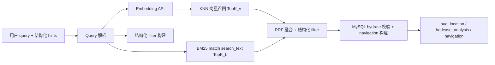

# 需求文档：Grep 检索升级（统一向量索引 + 全字段检索）

> 版本：v2 设计稿（2026-05）  
> 范围：grep 工具、ES 向量索引、Bug/BadCase 首批入库、编排层 target 分类治理  
> **性能优化定位**：**工具层 / 检索子系统**（embed、ES、rerank、plan_tree 并行），不替代 [推理/执行分离总纲](./需求文档_下一轮性能优化_推理执行分离总结与响应形态.md) 的 P0。  
> 关联：[意图识别与 grep-modify 路由](./意图识别与grep-modify路由机制.md)、[grep 与 modify 候选集对齐](./需求文档_grep与modify候选集对齐_现状与优化方向.md)

---

## 1. 背景：为什么要重做 grep

### 1.1 用户诉求

1. **每个字段都应该能搜到**（负责人、状态、标题、复现步骤、问题分类等）。
2. **自然语言检索**：「登录忘记密码」「负责人 hx 的 bug」应稳定命中，不依赖模型是否猜对 `target`。
3. **向量语义检索**：相近表述、跨字段语义（如「没跳转首页」命中「登录后没有跳转到首页」）应能召回。
4. **分类别搜错太多**：当前强制在 `card / bug / badcase / testcase` 四选一，ReAct 与 grep 互相纠正，误路由频发。

### 1.2 典型失败案例（SQL grep，2026-05 日志）

| 用户输入 | 失败环节 | 结果 |
|----------|----------|------|
| 将负责人 hx 的 bug 检索出来 | `keywords='负责人:hx'`，`assignee=None`，target 被纠正为 `card` | 0 条 |
| 改 Bug 标题（沙箱采纳） | 采纳 payload 误带 `_previewBefore` 而非 `title` | 库内未更新（已另修） |

**结论**：仅靠 MySQL `ILIKE` + 模型选 `target`，在 **Card 与源表双轨**、**外键负责人**、**编排误纠正** 三重结构下，无法达到「全字段、低误分类」的产品预期。

### 1.3 设计方向（一句话）

> **用 ES 统一索引「工作项」语义面，MySQL 仍作权威数据源；grep 默认走「混合检索 + 结构化过滤」，`target` 从「检索前置条件」降级为「结果过滤/展示偏好」。**

---

## 2. 现状架构与痛点

### 2.1 当前 grep 数据流

```
用户话 → LLM 选 target + keywords
       → grep_tool 按 target 分支查 MySQL（_GREP_SEARCH_FIELDS + assignee_id 解析）
       → 产出 bug_location / card_location / navigation
       → ReAct merge → modify
```

### 2.2 四类 target 为何总出错

| 痛点 | 说明 |
|------|------|
| **Card 与源表双轨** | 同一业务对象有 `Card.id` 与 `Bug.id`，主键可撞号；grep `target=card` 与 `target=bug` 命中集不同。 |
| **target 前置** | 模型必须先猜对类型再查；用户口语常省略或混说「卡片上的 bug」。 |
| **字段分散** | Bug 用 `assignee_id`，BadCase 用 `assignee` 字符串；Card 镜像部分字段；`_GREP_SEARCH_FIELDS` 各表不一致。 |
| **编排纠正链** | `react_simplified` 对 target 有多处纠正（card/bug/testcase），与用户显式意图冲突时仍覆盖。 |
| **无全文/向量** | 长文本（复现步骤、base_problem）LIKE 性能差；语义近义无法召回。 |

### 2.3 现有 ES / Embedding 资产（可复用）

项目 `config.py` 已具备：

| 配置项 | 默认/说明 |
|--------|-----------|
| `ES_HOST` / `ES_PORT` | `117.72.33.38:19200`（或 `ES_URL`） |
| `ES_USERNAME` / `ES_PASSWORD` / `ES_API_KEY` | 鉴权 |
| `ES_INDEX_PREFIX` | `bdc_{env}_`，如 `bdc_dev_` |
| `ES_LONG_MEMORY_INDEX` | 长期记忆向量索引（已实现） |
| `EMBEDDING_API_KEY` | 默认回落 `QWEN_API_KEY` / `DASHSCOPE_API_KEY` |
| `EMBEDDING_BASE_URL` | 可设 DashScope compatible-mode |
| `EMBEDDING_MODEL` | 当前默认 `text-embedding-3-small`，**需改为百炼向量模型** |

已有代码：

- `memory/embedding_client.py` — OpenAI-compatible Embedding 客户端
- `memory/es_long_memory.py` — ES `dense_vector` 建索引、写入、KNN 检索

grep 向量索引应 **复用 ES 连接与 EmbeddingClient**，新建独立业务索引，不与 `long_memory` 混写。

---

## 3. 目标架构（Grep v2）

### 3.1 统一「工作项」索引（Work Item Index）

**不再要求检索前猜对 card/bug/badcase/testcase**。改为单索引（或 alias）承载可检索文档：

```
物理索引（建议）: {ES_INDEX_PREFIX}work_item
文档 _id:           {entity_type}:{record_id}     例 bug:709974124503502848
```

每条 ES 文档表示 **源表一行**（Phase 1：`bug` + `badcase`；Phase 2：`testcase`；Card 仅作关联字段，不单独建检索主文档，见 §4.4）。

| 字段类型 | ES 字段 | 用途 |
|----------|---------|------|
| 主键 | `record_id` (keyword) | MySQL 主键，navigation 权威 id |
| 实体 | `entity_type` (keyword) | `bug` / `badcase` / `testcase` |
| 租户 | `project_id` (integer) | 必选过滤 |
| 范围 | `plan_id` (long) | 迭代过滤；可 null |
| 关联 | `card_id` (long) | 跳转 Tab；可 null |
| 结构化 | `assignee_id`, `assignee_display`, `status`, `priority`, … | **精确过滤**（负责人、状态） |
| 全文 | `search_text` (text, analyzer) | BM25；由关键字段拼接 |
| 向量 | `embedding` (dense_vector) | 语义 KNN |
| 分字段 | `fields.*` (object, 部分 keyword/text) | 字段级过滤、高亮、debug |
| 元数据 | `updated_at`, `indexed_at`, `content_hash` | 增量同步 |

### 3.2 混合检索（Hybrid Retrieval）

单次 grep 查询流水线：



| 路径 | 适用 |
|------|------|
| **结构化 filter** | `assignee=hx`、`status=closed`、`entity_type=bug` — 必须精确 |
| **BM25** | 标题/步骤内关键词、ID 字符串 |
| **向量 KNN** | 语义 paraphrase、跨字段模糊意图 |
| **MySQL hydrate** | ES 命中后回源确认未删除、补全 navigation 所需 `plan_id` |

**降级**：`GREP_VECTOR_ENABLED=false` 或 ES 不可用时，回落现有 SQL grep（保留 P0 补丁，见 §8.1）。

### 3.3 grep API 演进（对 Agent 暴露）

保留现有参数，新增/调整语义：

| 参数 | v1 | v2 |
|------|----|----|
| `target` | 检索前必选分支 | **结果过滤**；默认 `all`；仅缩小展示/导航类型 |
| `keywords` | SQL ILIKE | 进 `search_text` BM25 + 向量 query 文本 |
| `assignee` | 部分生效 | **结构化 term filter**（与 UI 列表一致） |
| `status` / `plan_id` | 部分生效 | ES filter |
| `mode` | locate/associate/compare | 新增 `hybrid`（默认） |
| `entity_types` | — | 可选，等价于 target 多选 |

**关键变化**：即使用户说「bug」而模型传 `target=card`，混合检索仍可在 `entity_type=bug` 的文档上命中；target 误纠正不再导致 **0 结果**。

---

## 4. 索引设计（Phase 1：Bug + BadCase）

### 4.1 Embedding 配置

与 Qwen 共用 API Key，走 DashScope OpenAI 兼容 Embedding 接口：

```env
# .env 建议
EMBEDDING_API_KEY=${QWEN_API_KEY}          # 或与 DASHSCOPE_API_KEY 相同
EMBEDDING_BASE_URL=https://dashscope.aliyuncs.com/compatible-mode/v1
EMBEDDING_MODEL=tongyi-embedding-vision-plus-2026-03-06

GREP_VECTOR_ENABLED=true
# 物理索引名建议带模型/维度后缀，见 §10.2；留空则走默认规则
GREP_WORK_ITEM_INDEX=                      # 例 bdc_dev_work_item_tongyi_v1_1024
GREP_VECTOR_TOP_K=30
GREP_VECTOR_MIN_SCORE=0.55                   # 需线上调优，见 §10.5
GREP_HYBRID_RRF_K=60                         # 需线上调优，见 §10.5

# 写入侧
GREP_INDEX_ASYNC=true                        # 默认异步；新建后立即 grep 见 §10.3
GREP_EMBED_BATCH_SIZE=16                     # 攒批调 embedding，见 §10.1
GREP_EMBED_BATCH_FLUSH_MS=500                # 或超时 flush
EMBEDDING_PROVIDER=remote                    # remote | local（BGE 等，见 §10.1）
EMBEDDING_LOCAL_MODEL=BAAI/bge-small-zh-v1.5 # local 时生效
```

> **维度**：以首次 `embed()` 返回值为准，`ensure_index(dims)` 动态建 mapping（与 `ESLongMemoryStore` 相同模式）。上线前在 dev 打一条样本确认 dims，写入文档/配置注释。

### 4.2 物理索引 Mapping（草案）

**索引命名（与 §10.2 一致）**：物理索引名建议 `{ES_INDEX_PREFIX}work_item_{provider}_v{ver}_{dims}`，例如 `bdc_dev_work_item_tongyi_v1_1024`；对外读写统一走 alias `bdc_dev_work_item`（或 `{ES_INDEX_PREFIX}work_item`），换模型时只切 alias，避免 downtime。

```json
{
  "settings": {
    "number_of_shards": 1,
    "analysis": {
      "analyzer": {
        "bdc_search": { "type": "custom", "tokenizer": "standard", "filter": ["lowercase", "cjk_width"] }
      }
    }
  },
  "mappings": {
    "properties": {
      "record_id": { "type": "keyword" },
      "entity_type": { "type": "keyword" },
      "project_id": { "type": "integer" },
      "plan_id": { "type": "long" },
      "card_id": { "type": "long" },
      "assignee_id": { "type": "integer" },
      "assignee_display": { "type": "keyword" },
      "status": { "type": "keyword" },
      "priority": { "type": "keyword" },
      "title": { "type": "text", "analyzer": "bdc_search", "fields": { "keyword": { "type": "keyword" } } },
      "search_text": { "type": "text", "analyzer": "bdc_search" },
      "embedding": { "type": "dense_vector", "dims": "<runtime>", "index": true, "similarity": "cosine" },
      "fields": {
        "type": "object",
        "enabled": true,
        "properties": {
          "description": { "type": "text" },
          "steps_to_reproduce": { "type": "text" },
          "expected_result": { "type": "text" },
          "actual_result": { "type": "text" },
          "severity": { "type": "keyword" },
          "bug_type": { "type": "keyword" },
          "environment": { "type": "keyword" },
          "case_category": { "type": "keyword" },
          "base_problem": { "type": "text" },
          "reproduction_steps": { "type": "text" },
          "badcase_result": { "type": "text" },
          "answer": { "type": "text" },
          "problem_reason": { "type": "text" },
          "solution": { "type": "text" }
        }
      },
      "content_hash": { "type": "keyword" },
      "updated_at": { "type": "date" },
      "indexed_at": { "type": "date" }
    }
  }
}
```

### 4.3 入库字段清单（MySQL → ES）

#### Bug（源表 `bug`）

| 分组 | MySQL 列 | ES 用途 |
|------|----------|---------|
| 标识 | `id`, `project_id`, `plan_id`, `card_id` | filter / navigation |
| 列表 | `title`, `status`, `priority`, `severity` | keyword + search_text |
| 负责人 | `assignee_id` → join `User.name` | `assignee_id` + `assignee_display` filter |
| 详情 | `description`, `steps_to_reproduce`, `expected_result`, `actual_result` | `fields.*` + search_text |
| 环境 | `bug_type`, `environment`, `browser`, `os` | fields + search_text |
| 附件 | `attachments` | JSON 展平文件名/URL 进 search_text（可选） |

**search_text 拼接模板（示意）**：

```
title\ndescription\nsteps_to_reproduce\nexpected_result\nactual_result
status priority severity bug_type environment browser os
assignee:{display_name}
```

#### BadCase（源表 `bad_case`）

| 分组 | MySQL 列 | ES 用途 |
|------|----------|---------|
| 标识 | `id`, `project_id`, `plan_id`, `card_id` | filter |
| 列表 | `title`, `status`, `priority`, `case_category` | filter + search_text |
| 负责人 | `assignee`（字符串） | `assignee_display`；若能映射 User 则填 `assignee_id` |
| 核心 | `base_problem`, `reproduction_steps`, `badcase_result` | fields + search_text |
| 答案链 | `answer`, `correct_answer`, `problem_reason`, `solution` | fields + search_text |
| 其它 | `document_type`, `plan`, `assigned_users` | search_text |

**embedding 输入**：对 `search_text` 做长度截断（如 8k 字符）后调用 `tongyi-embedding-vision-plus-2026-03-06`；与 long_memory 共用 `EmbeddingClient`。

### 4.4 Card / TestCase 策略（降低分类错误）

| 实体 | Phase 1 | Phase 2 | 说明 |
|------|---------|---------|------|
| **Bug** | ✅ 入库 | — | 用户改缺陷的主路径 |
| **BadCase** | ✅ 入库 | — | 与 Bug 并列源表 |
| **TestCase** | — | ✅ 入库 | 字段多、步骤 JSON，第二批 |
| **Card** | ❌ 不单独建主文档 | 可选「展示层」副本 | **检索以源表为准**；ES 文档带 `card_id` 供 UI 跳转；避免 Card.id 与 Bug.id 撞号导致 duplicate 语义 |

**navigation 构建**：仍要求 `plan_id`（与现有对齐文档一致）；hydrate 阶段从 MySQL 补全，缺 plan 的命中写入 `raw_location` 但不进 navigation，行为与现网一致。

---

## 5. 同步与入库 pipeline

### 5.1 写入触发

| 触发 | 时机 | 索引模式 |
|------|------|----------|
| **实时（默认）** | Bug/BadCase `POST/PUT/PATCH` commit 后 | **异步**队列 → 攒批 embed → ES upsert |
| **强实时** | 用户创建后 **同一轮对话立刻 grep** | 见 §10.3：同步索引或检索侧 SQL 兜底 |
| **批量回填** | `scripts/backfill_grep_index.py` | 同步攒批（16～32 条/批），限速 |
| **删除** | ORM delete 后 | ES `delete_by_query` |
| **采纳/modify** | modify 落库成功 | 与实时写入同 pipeline |

**幂等**：`content_hash = sha256(search_text + 结构化字段)`，未变则 **跳过 embed 与 ES 写**（省 API 费用）。

**攒批写入（§10.1）**：Indexer 内存队列 `GREP_EMBED_BATCH_SIZE`（建议 10～20，默认 16）或 `GREP_EMBED_BATCH_FLUSH_MS`（默认 500ms）触发一次 `embeddings.create(input=[...])` 批量调用，再按 `_id` 写回 ES。

### 5.2 Indexer 模块（建议路径）

```
memory/work_item_indexer.py    # 组装文档、算 hash、攒批 embed、写 ES
memory/es_work_item_store.py   # 索引 CRUD + hybrid search（参考 es_long_memory.py）
memory/embedding_client.py     # remote（百炼）/ local（BGE）双后端 + embed_batch，见 §10.1
memory/embed_batch_queue.py    # 攒批队列（可选独立模块）
agents/tools/grep_tool.py      # hybrid 入口 + 新建记录 SQL 兜底，见 §10.3
agents/tools/grep_assignee.py  # parse_assignee 多 id + 模糊，见 §10.4
```

**失败**：写 `grep_index_queue` 表或 Redis 重试队列；grep 检索时对该 id 回落 SQL 单条补查。

### 5.3 配置项汇总（新增建议）

```python
# config.py 扩展（设计稿）
GREP_VECTOR_ENABLED = os.getenv("GREP_VECTOR_ENABLED", "false").lower() == "true"
GREP_WORK_ITEM_INDEX = os.getenv("GREP_WORK_ITEM_INDEX", "")  # 空则 alias 名；物理索引带 dims 后缀
GREP_WORK_ITEM_ALIAS = os.getenv("GREP_WORK_ITEM_ALIAS", "") or f"{ES_INDEX_PREFIX}work_item"
GREP_VECTOR_TOP_K = int(os.getenv("GREP_VECTOR_TOP_K", "30"))
GREP_VECTOR_MIN_SCORE = float(os.getenv("GREP_VECTOR_MIN_SCORE", "0.0"))
GREP_HYBRID_RRF_K = int(os.getenv("GREP_HYBRID_RRF_K", "60"))
GREP_INDEX_ASYNC = os.getenv("GREP_INDEX_ASYNC", "true").lower() == "true"
GREP_EMBED_BATCH_SIZE = int(os.getenv("GREP_EMBED_BATCH_SIZE", "16"))
GREP_EMBED_BATCH_FLUSH_MS = int(os.getenv("GREP_EMBED_BATCH_FLUSH_MS", "500"))
EMBEDDING_PROVIDER = os.getenv("EMBEDDING_PROVIDER", "remote")  # remote | local
EMBEDDING_LOCAL_MODEL = os.getenv("EMBEDDING_LOCAL_MODEL", "BAAI/bge-small-zh-v1.5")
GREP_SEARCH_LOG_ENABLED = os.getenv("GREP_SEARCH_LOG_ENABLED", "true").lower() == "true"
```

---

## 6. Query 解析（编排 + 工具层）

### 6.1 统一 Query Parser（替代「整句塞 keywords」）

输入：用户原话 + LLM 给的 `keywords` / `assignee` / `target`

输出：

```python
@dataclass
class GrepQuery:
    semantic_query: str          # 进 embedding
    bm25_query: str              # 进 search_text
    assignee: Optional[str]
    status: Optional[str]
    entity_types: List[str]      # 默认 ["bug","badcase"] phase1；或 all
    plan_id: Optional[int]
    project_id: int
    record_id: Optional[int]     # 纯数字 id 精确
```

**规则（P0，与向量并行）**：

| 句式 | 解析 |
|------|------|
| 负责人 hx 的 bug | `assignee=hx`, `entity_types=[bug]`，`semantic_query` 去掉负责人片段 |
| 负责人:hx / assignee:hx | 字段语法剥离 → `assignee=hx` |
| 登录忘记密码 | `semantic_query=登录忘记密码`, BM25 同 |
| 709974124503502848 | `record_id=...` + 各 entity_type term should |

**负责人解析（§10.4）**：`parse_assignee(hint, project_id)` 返回 **全部** 匹配到的 `assignee_id` 列表（重名、模糊 `hx*` 均用 ES `terms` / SQL `IN`），不单取第一个；可选附带 `active_only` 过滤离职账号（若 User 表有状态字段）。

### 6.2 target 分类治理

| 策略 | 说明 |
|------|------|
| **检索默认 `entity_types=all`**（Phase1 实际索引 subset） | 模型不传 target 也能搜 |
| **用户显式 bug** | 仅 filter `entity_type=bug`；**禁止** card 纠正覆盖 |
| **grep 返回带 `entity_type`** | merge/modify 用命中行的类型，不再猜 |
| **Card 跳转** | 结果带 `card_id`；UI 仍开 type-list Tab |

### 6.3 observation 结构（Agent 可读）

```json
{
  "search_backend": "es_hybrid",
  "query_parsed": { "assignee": "hx", "entity_types": ["bug"] },
  "hits": [
    {
      "entity_type": "bug",
      "record_id": "709974124503502848",
      "score": 0.82,
      "title": "登录后没有跳转到首页",
      "assignee_display": "hx",
      "plan_id": "1",
      "card_id": "709944091793690624",
      "highlights": { "title": ["登录", "首页"] }
    }
  ],
  "navigation": { "...": "与现网一致，由 hydrate 生成" },
  "assignee_resolved": { "hint": "hx", "user_ids": [2] }
}
```

---

## 7. 与 modify / navigation 的衔接

- **权威 ID**：仍为源表 `record_id`（Bug.id / BadCase.id），与 [候选集对齐文档](./需求文档_grep与modify候选集对齐_现状与优化方向.md) 一致。
- **modify target**：由命中行 `entity_type` 决定，**不由 grep 的 target 参数单独决定**。
- **批量 modify**：`navigation_ids` 从 ES 命中 + hydrate 得到，与 SQL grep 同一套 `_merge_grep_observation_into_context` 消费。

---

## 8. 分阶段实施计划

### 8.1 Phase 0 — SQL grep 止血（1–2 天，可与向量并行）

不依赖 ES，降低现网误搜：

| 项 | 内容 |
|----|------|
| P0.1 | ReAct `_enrich_grep_params_from_user_text`：拆 assignee、禁 bug→card 误纠正 |
| P0.2 | grep_tool `_parse_structured_grep_keywords`：`负责人:hx` → assignee |
| P0.3 | prompts / 工具描述更新 |

### 8.2 Phase 1 — Bug + BadCase 向量索引（核心，约 1–2 周）

| 项 | 内容 |
|----|------|
| P1.1 | `config` 增加 `GREP_*`；`EMBEDDING_MODEL=tongyi-embedding-vision-plus-2026-03-06` |
| P1.2 | `es_work_item_store.py` + mapping 自动创建 |
| P1.3 | `work_item_indexer.py`：Bug/BadCase 字段映射、search_text、embed、upsert |
| P1.4 | 回填脚本 + Bug/BadCase API 写后异步索引 |
| P1.5 | `grep_tool._grep_hybrid()`：BM25 + KNN + assignee filter |
| P1.6 | hydrate + 现有 navigation 构建复用 |
| P1.7 | 单测 + 基准集（见 §9） |

### 8.3 Phase 2 — TestCase + 体验

| 项 | 内容 |
|----|------|
| P2.1 | TestCase 入库（steps JSON 展平） |
| P2.2 | 字段级高亮、explain、慢查询日志 |
| P2.3 | 前端列表筛选项与 grep filter 对齐 API |
| P2.4 | 可选：Card 展示层只读副本（仅 title/description，不参与 id 权威） |

### 8.4 Phase 3 — 运维与质量

| 项 | 内容 |
|----|------|
| P3.1 | 索引 lag 监控、`grep_index_queue` 告警 |
| P3.2 | A/B：hybrid vs SQL 命中率、误分类率 |
| P3.3 | 增量 reindex + alias 切换（§10.2） |
| P3.4 | 搜索日志 + 参数网格调优（§10.5） |

---

## 9. 验收标准

### 9.1 检索质量

| # | 场景 | 期望 |
|---|------|------|
| 1 | 将负责人 hx 的 bug 都检索出来 | ES filter `assignee_display=hx` + entity bug；≥1 条与列表一致 |
| 2 | 登录忘记密码（语义） | 向量召回含「登录后没有跳转到首页」类标题 |
| 3 | 负责人:hx（仅 keywords） | Parser 等价 assignee=hx |
| 4 | 用户说 bug，模型传 target=card | hybrid 仍命中 bug 文档 |
| 5 | plan_id=当前迭代 | 与 SQL 计划子树 filter 结果集一致（允许 hydrate 后差异 <1%） |
| 6 | ES 不可用 | 自动回落 SQL grep，不 500 |

### 9.2 索引一致性

| # | 场景 | 期望 |
|---|------|------|
| 7 | 修改 Bug 标题 | 60s 内 ES title/search_text/embedding 更新（异步默认）；同步模式见 §10.3 |
| 8 | 删除 BadCase | ES 文档删除 |
| 9 | 回填脚本 | 项目内 bug+badcase 条数与 MySQL count 一致 |
| 12 | 创建 Bug 后 5s 内同会话 grep | 命中该条（同步索引 **或** SQL 兜底） |
| 13 | 负责人 hx 重名（2 人） | 返回两人名下全部 Bug，不丢结果 |

### 9.3 分类与 modify 闭环

| # | 场景 | 期望 |
|---|------|------|
| 10 | grep 后批量改状态 | modify target_ids 与 ES 命中 record_id 一致 |
| 11 | navigation 可跳转 | 有 plan_id 的命中进 navigation |

---

## 10. 深度设计补充（成本、实时性、负责人、调优）

> 本节展开 §10 摘要表未覆盖的实现细节，对应评审提出的五项风险与建议。

### 10.1 Embedding 成本与延迟

**风险**：每条文档变更都调外部 Embedding API；高并发下 **费用、限流、超时** 叠加，索引 lag 拉长。

**现状能力**：`content_hash` 已可跳过内容未变的 re-embed。

**建议方案**：

| 手段 | 说明 |
|------|------|
| **攒批调用** | Indexer 队列达到 `GREP_EMBED_BATCH_SIZE`（建议 **10～20**，默认 16）或超过 `GREP_EMBED_BATCH_FLUSH_MS`（默认 500ms）时，一次 `embeddings.create(input=[text1,…,textN])`；百炼 compatible-mode 与 OpenAI SDK 均支持 batch input。 |
| **回填限速** | `backfill_grep_index.py` 固定 batch + sleep，避免打满 QPS 配额。 |
| **Remote 降级** | API 429/超时：指数退避重试 → 入 `grep_index_queue`；检索仍可用 BM25 + SQL。 |
| **Local 备选** | `EMBEDDING_PROVIDER=local`，CPU 跑 **BGE-small-zh**（如 `BAAI/bge-small-zh-v1.5`，384 维）：无 API 费、延迟稳定；需额外内存（约 500MB～1GB）与 `sentence-transformers` 依赖。可与 remote **双轨**：dev/内网 local，prod remote。 |
| **调度经验迁移** | 攒批队列 + 超时 flush 类似页表批量刷盘：单 worker 消费队列，控制 in-flight batch 数（建议 ≤2），避免 embedding 线程池被打满。 |

**实现要点**（`memory/work_item_indexer.py`）：

```python
# 伪代码
class EmbedBatchQueue:
    def enqueue(self, doc_id, search_text, content_hash): ...
    def flush(self):
        batch = self._drain(max_size=GREP_EMBED_BATCH_SIZE)
        vectors = embedding_client.embed_batch([b.text for b in batch])
        es_store.bulk_upsert(zip(batch, vectors))
```

**验收**：回填 1 万条 BadCase，embed API 调用次数 ≈ `ceil(10000 / batch_size)`，而非 10000。

---

### 10.2 向量维度变更与 reindex

**风险**：更换 embedding 模型（如 384 维 → 768/1024 维）后，旧索引 **无法原地升级** `dense_vector.dims`，必须重建。

**建议：物理索引带维度后缀 + alias 切换**

```
物理索引:  bdc_dev_work_item_tongyi_v1_1024
别名:      bdc_dev_work_item  → 指向当前物理索引
```

| 步骤 | 操作 |
|------|------|
| 1 | 新模型首次 `embed()` 得到 `dims`，创建 `work_item_{provider}_v2_{dims}` |
| 2 | 回填 / 双写至新索引 |
| 3 | `_aliases` API：`bdc_dev_work_item` 从 old → new（原子切换） |
| 4 | 观察后删除旧物理索引 |

**配置**：

- 自动生成物理名：`f"{ES_INDEX_PREFIX}work_item_{slug(EMBEDDING_MODEL)}_{dims}"`
- 读写始终用 `GREP_WORK_ITEM_ALIAS`（默认 `{ES_INDEX_PREFIX}work_item`）

**注意**：remote（1024 维）与 local BGE（384 维）**不可共用同一物理索引**；换 provider 即走 alias 迁移流程。

**验收**：切换 alias 期间 grep 无 500；切换后 KNN 正常；旧索引可保留 7 天回滚。

---

### 10.3 实时性：新建后立刻 grep

**风险**：默认 **异步索引**（`GREP_INDEX_ASYNC=true`）时，用户创建 Bug 后数秒内 ES 搜不到，同轮 Agent 「创建 → 立刻定位」体验差。

**分级策略**：

| 场景 | 策略 |
|------|------|
| **默认写路径** | 异步队列 + 攒批 embed（吞吐优先） |
| **同请求强一致** | API 可选 `?sync_index=1` 或内部 `index_work_item(..., sync=True)`：commit 后 **同步** 单条 embed + ES upsert（延迟 +200～800ms，仅创建/关键更新） |
| **Agent 创建后立即 grep** | grep hybrid 结果为空且 `context.recent_created_ids` 命中 → **SQL 单条/小集合兜底**（按 id + project_id），合并进 hits（标记 `source=sql_fallback`） |
| **全局开关** | `GREP_INDEX_ASYNC=false`：所有写入同步索引（仅适合 dev / 小数据量） |

**推荐默认**：生产保持异步 + **检索侧 SQL 兜底**（实现简单、不拖慢创建 API）；对「创建接口返回后立即跳转详情」的前端路径可传 sync。

**验收**：创建 Bug 后 5s 内同会话 grep 必含该 id（async + 兜底 或 sync 二选一达标即可）。

---

### 10.4 负责人：`assignee_display` 与 `assignee_id`

**风险**：

- 用户只记得 **名字**（`hx`），库内 **重名** 多人；
- 展示名与 `User.name` 不一致（列表 `assignee` 字符串 vs 外键）；
- 已离职账号仍占 `assignee_id`。

**索引侧**（写入 ES 时）：

- Bug/TestCase/Card：`assignee_id` + `assignee_display`（与列表 API 同一 `resolve_assignee_display(project_id, assignee_id)`）；
- BadCase：`assignee` 字符串写入 `assignee_display`；若可映射 User 则补 `assignee_id`。

**检索侧**（`parse_assignee(hint, project_id)`）：

| 步骤 | 行为 |
|------|------|
| 1 | 精确 match `User.name == hint`（项目成员范围） |
| 2 | 若无，前缀/模糊：`hint*` → `User.name ILIKE 'hint%'`（支持用户说「hx」匹配 `hxzhang` 时可配置） |
| 3 | 邮箱前缀 `hint@` |
| 4 | 返回 **全部** `user_ids[]`，**禁止**只取 `limit(1)` |
| 5 | ES filter：`assignee_id` **terms** 查询；BadCase 额外 `assignee_display` term/wildcard |
| 6 | 可选：`active_only=true` 时过滤离职（依赖 User 状态字段，无则文档化跳过） |

**重名 UX**：observation 可返回 `assignee_resolved.matched_users: [{id,name},…]`；命中条数异常多时提示用户收窄。

**验收**：项目内两个 `hx` 时，`assignee=hx` 返回 **并集** 全部 Bug，不少于 SQL `assignee_id IN (...)` 结果。

---

### 10.5 混合检索参数线上调优

**风险**：`GREP_HYBRID_RRF_K`、`GREP_VECTOR_MIN_SCORE`、`GREP_VECTOR_TOP_K`、BM25 boost 等默认值 **不一定适配** 真实标题长度、BadCase 长文本分布。

**建议流程**：


**日志字段**（`grep_search_log` 表或 ES 独立 index）：

- `query_raw`, `query_parsed`, `project_id`, `backend`（hybrid/sql）
- `top_k`, `rrf_k`, `min_score`, `hits[{id,score,rank}]`, `latency_ms`
- `user_feedback`（可选：点击/navigate 视为正样本）

**调参网格（示例）**：

| 参数 | 搜索范围 | 优化目标 |
|------|----------|----------|
| `GREP_HYBRID_RRF_K` | 20, 40, 60, 80 | MRR@10 |
| `GREP_VECTOR_MIN_SCORE` | 0.45～0.75 step 0.05 | 精确率 / 召回率 F1 |
| `GREP_VECTOR_TOP_K` | 20, 30, 50 | 延迟 P95 < 800ms |
| BM25 vs KNN 权重 | RRF 前分别 top_k | 负责人纯 filter 场景下降向量权重 |

**上线策略**：stg 固定基准 query 集（≥50 条，含负责人、语义、id 精确）；参数变更需回放通过再改 prod env。

**验收**：每季度一次调参记录写入 docs 或内部 wiki；P95 检索延迟与误召回率可追踪。

---

## 11. 风险与约束（摘要）

| 风险 | 缓解 | 详见 |
|------|------|------|
| Embedding 成本/限流/超时 | content_hash；攒批 embed；local BGE 备选 | §10.1 |
| 模型 dims 变更 | 物理索引 `_v{dims}` + alias 切换 | §10.2 |
| 新建后短时搜不到 | 检索 SQL 兜底 / 可选 sync_index | §10.3 |
| 负责人重名/离职 | terms 多 id；模糊 hint；active_only | §10.4 |
| 混合检索参数不适配 | 搜索日志 + 网格调优 | §10.5 |
| ES 与 MySQL 不一致 | hydrate 以 MySQL 为准 | §3.2 |
| tongyi-embedding 接口变更 | 配置化 `EMBEDDING_MODEL` | §4.1 |

---

## 12. 附录 A：现网 SQL grep 字段覆盖（Legacy）

> Phase 1 向量上线后，SQL 路径仍作降级；字段覆盖问题在 hybrid 中由 search_text 统一解决。

| 实体 | ILIKE 列 | 负责人 |
|------|----------|--------|
| bug | title, description, steps… | assignee_id 解析 |
| badcase | title, assignee, base_problem… | assignee 字符串 |
| testcase | title, steps… | assignee_id |
| card | 多数字段镜像 | assignee_id |

---

## 13. 附录 B：问题日志（负责人检索）

```
User: 将负责人 hx的bug都检索出来
[REACT] target 纠正: bug -> card
grep: { keywords: '负责人:hx', assignee: None, target: 'card' }
→ 0 条
```

**Phase 0 修复后**：assignee=hx, target=bug  
**Phase 1 修复后**：即使 target 仍错，ES filter assignee + entity_type=bug 仍可命中；target 仅影响导航默认 Tab。

---

## 14. 附录 C：建议目录与文件

```
config.py                          # GREP_VECTOR_* , EMBEDDING_MODEL 默认值
memory/embedding_client.py         # remote / local 双后端 + embed_batch
memory/embed_batch_queue.py        # 攒批队列（可选独立模块）
agents/tools/grep_assignee.py      # parse_assignee 多 id + 模糊
grep_search_log（表或 ES）         # 检索日志，§10.5
memory/es_work_item_store.py       # 新建
memory/work_item_indexer.py        # 新建
agents/tools/grep_tool.py          # hybrid 入口
agents/tools/grep_query_parser.py  # 新建：结构化解析
agents/react_simplified.py         # enrich + 弱化 target 纠正
scripts/backfill_grep_index.py       # 新建
tests/test_grep_hybrid.py            # 新建
tests/test_grep_assignee_filter.py  # Phase 0
```

---

## 15. 相关文档

- [意图识别与 grep-modify 路由机制](./意图识别与grep-modify路由机制.md)
- [Grep 与 Modify 候选集对齐](./需求文档_grep与modify候选集对齐_现状与优化方向.md)
- 实现参考：`memory/es_long_memory.py`、`agents/tools/grep_tool.py`、`config.py`（ES / Embedding 段）
