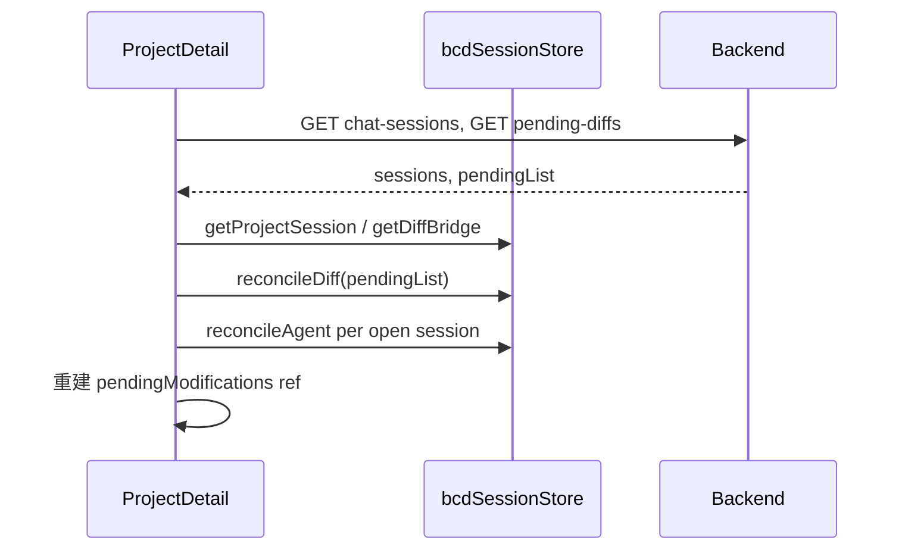

# 需求文档：Chat Session 与 Tab 本地缓存（会话状态管理）

> **术语约定（团队口头「sessionStorage」= 下文「Chat Session」）**  
> 讨论需求、排期、Agent 完善时，若说 **sessionStorage / 会话存储**，默认指 **后端 `ChatSession`（MySQL + `/api/chat-sessions`）** 及其关联态（消息、`session_id`、Diff 的 `source_session_id`、未来 `agent_tasks`），**不是** 浏览器 `window.sessionStorage`。  
> 浏览器 Tab 内加速请称 **Tab 本地缓存** 或 **`bcd:ss:*`**，避免与 Chat Session 混称。

## 1. 文档目标

本文档以 **后端 Chat Session 生命周期与状态** 为主、**浏览器 Tab 本地缓存（`bcd:ss:*`）** 为辅，约定：

- **Chat Session（L0）**：消息 transcript、`modify_navigation` / `modify_groups` 落库、按 `session_id` 关联的 Agent/ReAct、Diff 的 `source_session_id` 溯源；跨 Chat Session 的 Diff 仍按记录维度只保留最新（§2.5）。
- **Tab 本地缓存（L2，可选加速）**：仅记住「当前项目打开哪条 `ChatSession.id`」、输入草稿、create-hold 等；**不得**替代 Chat Session 存消息或 Diff 真相。
- **Agent 完善**：优先保证「换 Chat Session / 刷新 / 流式结束」后，以 **API 拉取的 Chat Session 数据** 恢复 UI；L2 只补「选中哪条会话」等体验。

本文档为**需求与方案约束**；具体模块路径、完整 TypeScript 类型与单元测试用例属于开发阶段交付物。

**关联文档**（实现时必须对齐，冲突时以持久化闭环文档为准）：

- `docs/需求文档_diff_review闭环处理.md` — Diff 生命周期；真相在 L0，Tab 缓存仅加速
- `docs/需求文档_Agent任务状态管理与DAG并发调度_MySQL.md` — 后端任务表与 `session_id` 关联

---

## 2. 背景与现状

### 2.1 现状概览

| 层级 | 是什么 | 典型数据 | 问题 |
|------|--------|----------|------|
| **Chat Session（后端）** | `ChatSession` 表 + `GET/POST /api/chat-sessions` | 消息、`modify_navigation`、`agent_result`、分页 | 完善 Agent 时以这里为 **主战场**；Diff 不按 session 分版，但需 `source_session_id` 溯源 |
| **Tab 本地缓存** | 浏览器 `window.sessionStorage`，键 `bcd:ss:*` / 遗留 `pendingModifyDiff` | `activeSessionId`、Diff 详情桥接、create-hold | 散落读写；**不能**当 Chat Session 替身 |
| 内存 `ref` | Vue 状态 | `currentSession`、`pendingModifications` | 刷新即失，需靠 Chat Session API + `diff-reviews` 重建 |
| `localStorage` | 跨 Tab 持久 | 用户、模型、`stable_created` | 与 Chat Session 职责分离 |

### 2.2 核心痛点

1. **Chat Session 切换/刷新体验**：换一条 `ChatSession` 或 F5 后，应以 **API 消息与 pending Diff** 为准恢复；另需 L2 记住「上次选中哪条 `ChatSession.id`」（见 §5.1，非消息正文）。
2. **Agent 刷新后续流（产品要求，见 §5.2.1）**：F5 后 SSE 连接会断，但后端 ReAct 线程可继续跑；前端用 **`bcd:ss:agent` 记 `react_request_id`** + **`GET /api/agent/react/buffer`** 拉取断点后的包并继续渲染；终态后仍 **POST Chat Session 消息** 落库。
3. **Diff 桥接脆弱（存储层，非合并规则）**：`pendingModifyDiff` 全局单槽，多记录、多会话并发修改时 **槽位** 后者挤掉前者；与 `pendingModifications` 内存 map 易不一致。**每字段只保留最新** 的合并逻辑本身是正确的（见 §2.5），痛点是单键/散落读写，不是要改变覆盖策略。
4. **清理不彻底**：采纳/拒绝后部分路径未 `removeItem`，导致详情页误读旧 Diff（已有修复 scattered，缺统一契约）。
5. **无统一调试与观测**：无法一键 dump 当前 Tab 下所有 BCD 会话缓存。

### 2.3 设计原则（必须遵守）

1. **Chat Session 优先（L0）**：消息、沙箱预览字段（`modify_navigation`）、Agent 结果以 **Chat Session API / DB** 为准；口头「sessionStorage」指这一层。
2. **Tab 缓存仅加速（L2）**：`window.sessionStorage` / `bcd:ss:*` 不得作为消息或 Diff 的唯一真相源。
3. **Tab 隔离**：L2 同源每 Tab 独立；跨 Tab 共享用 `localStorage` 或后端 Chat Session。
4. **显式失效**：采纳/拒绝、删除 Chat Session、任务终态 → 清 L0 行 + 清对应 L2 槽。
5. **可版本迁移**：L2 JSON 带 `schemaVersion`；旧键可迁移或丢弃。

### 2.5 Diff 语义（现网正确，本文与 M1 **不修改**合并规则）

Diff 的产品真相与 `docs/需求文档_diff_review闭环处理.md` §3–§4.2 一致，**当前前后端实现按此运行，视为正确**；与「Chat Session 治理 / Tab 缓存迁移」**无关**，无需为迁 `bcd:ss` 而改写合并规则。

#### 2.5.1 记录与字段（含跨 ChatSession）

| 维度 | 规则 |
|------|------|
| 记录粒度 | 每个 **`project_id + target + target_id`** 在 L0（`diff_review_state`）仅 **一行 pending**（唯一索引 `unique_diff_review_record`）；**不按** `ChatSession.id` 拆多份待采纳 Diff |
| 跨会话 | 同一用户对同一记录在 **会话 A、会话 B** 先后改同一字段 → 仍只有 **一份最新** 待采纳 Diff（后者覆盖前者）；`source_session_id` 仅记录**最近一次**产生预览的会话，用于溯源，**不**表示「每个会话各存一版」 |
| 字段粒度 | **不同字段**：并集保留；**同一字段**：只保留 **最新一次** 修改（后者 `new` 覆盖前者 `new`），与是否跨会话无关 |
| 操作者 | `operator_id` 控制 pending 可见/可采纳范围（`GET diff-reviews` 过滤）；同一记录全局仍只有一条 pending 行，不是「每会话每字段一条」 |
| 采纳后 | 该生命周期结束；无新改动则不展示；再次修改同一记录 → **新一轮** Diff（`lifecycle_id` 递增），而非回放旧版 |

#### 2.5.2 与「对话 Session」的关系（易混）

- **`ChatSession`**：聊天 transcript 容器；换会话只影响消息列表与 `bcd:ss:project` 的 `activeSessionId`（§5.1）。
- **Diff 真相键**：`(project, target, target_id)`，**不是** `(session_id, field)`。
- 前端 `SimpleChatPanel.getMergedPendingForTarget`：在**当前已加载消息**里按时间合并展示（同字段后者覆盖），用于沙箱/列表展示；刷新后以 `GET .../diff-reviews?status=pending` 与服务端 **最新一行** 对齐。

#### 2.5.3 本文档仍只改存储，不改上述语义

**本文档范围内 Diff 相关工作的唯一目标**：

- 把 `pendingModifyDiff` / 内存 `pendingModifications` 的 **存放位置、键命名、刷新后重建** 收到 `bcd:ss:diff` 与统一 API；
- `reconcileDiff` 仅用服务端 **当前 pending 列表** 删除已采纳/已失效的本地 slot，**不**引入「保留每一次 modify 事件」的存储模型。

**明确不属于本文改动**：

- 不要求「每一次 modify 都在 Tab 本地缓存里留一条记录」；
- 不改变 `getMergedPendingForTarget`、`_upsert_diff_review_state`、列表黄条、沙箱卡片所表达的 **「最新合并结果」** 语义（跨助手消息、跨 ChatSession 均为：不同字段并集、同字段后者覆盖，与 diff 需求文档 §4.2 相同）。

### 2.4 概念澄清：Chat Session（口头 sessionStorage）≠ 浏览器 Tab 缓存

| 团队说法 | 技术实体 | 存什么 | 不存什么 |
|----------|----------|--------|----------|
| **sessionStorage / 会话**（产品口径） | 后端 **`ChatSession`** + `chat_message` + API | 消息、助手 `modify_navigation`、`agent_result`、会话标题 | Diff 不按 session 拆多版（§2.5）；详情 Diff 真相在 `diff_review_state` |
| **Tab 本地缓存**（实现口径） | 浏览器 **`window.sessionStorage`**，键 `bcd:ss:*` | 当前选中的 `ChatSession.id`、草稿、create-hold、可选 Agent UI 镜像 | 消息列表、完整 ReAct 步骤、Diff pending 真相 |

对照 Claude Code 泄露架构：**transcript 在文件 / DB（Chat Session）**；浏览器存储只做 Tab 偏好。

| Claude 侧 | BadCaseDoctor 等价 |
|-----------|-------------------|
| `~/.claude/projects/*.jsonl` | **`ChatSession` + `/api/chat-sessions`**（= 口头 sessionStorage） |
| Workflow state ≠ conversation | `agent_result`、未来 `agent_tasks`（可带 `session_id`） |
| Bridge + SSE | `SimpleChatPanel` + 落库消息 |
| LSS + tabId（localStorage） | `bcd:ss:project` 的 `activeSessionId` 等 **Tab 缓存** |
| 内嵌页 `sessionStorage` | Electron 预览隔离（非 Chat Session 主链路） |

---

## 3. 范围

### 3.1 范围内

**A. Chat Session（主，口头 sessionStorage）**

- `ChatSession` / `chat_message` 与 Agent、Diff、`source_session_id` 的契约与恢复顺序。
- 切换 `ChatSession`：`SimpleChatPanel` 按 `sessionId` 拉消息；SSE 取消；不串台。
- 刷新：以 `GET /api/chat-sessions/:id` 恢复 transcript；沙箱预览靠消息上的 `modify_navigation`（及 `diff-reviews`）。

**B. Tab 本地缓存（辅，`bcd:ss:*`）**

- `electron-vue3/src/utils/bcdSessionStore.js`：仅 L2 键命名与读写。
- 迁移 `pendingModifyDiff` → `bcd:ss:diff`（**不改** Diff 合并语义）。
- `activeSessionId` 等 UI 加速（§5.1）。

### 3.2 范围外

- 替换 `localStorage` 中的用户偏好（语言、模型选择、终端字号等）— 保持现状，仅在文档中划分职责。
- 后端新表结构的完整 DDL（Diff / `agent_tasks` 由各自需求文档定义）；本文只约定 **前端缓存字段与 reconcile 时机**。
- Electron 主进程 `userData` 文件存储（若未来需要跨重启恢复，单独立项）。

---

## 4. 存储职责划分

| 层级 | 介质 | 生命周期 | 典型数据 |
|------|------|----------|----------|
| 层级 | 介质 | 生命周期 | 典型数据 | 口头「sessionStorage」？ |
|------|------|----------|----------|-------------------------|
| **L0 真相** | MySQL + API | 永久 | **`ChatSession`、消息**、Diff `diff_review_state`、Agent 任务 | **是（主）** |
| L1 | `localStorage` | 浏览器持久 | 用户、模型、`stable_created` | 否 |
| **L2** | 浏览器 **`window.sessionStorage`**（`bcd:ss:*`） | Tab 关闭即清 | `activeSessionId`、Diff 桥接、create-hold | **否**（勿叫 sessionStorage） |
| L3 | Vue `ref` | 组件存活 | 列表、SSE 缓冲 | 否 |

**读写顺序（进入项目 / 切换 Chat Session）**：

```
L0：GET chat-sessions、GET chat-sessions/:id（消息 + modify_navigation）、GET diff-reviews
  → 重建 L3（列表 pending、对话区沙箱）
L2（可选）：读 activeSessionId，决定默认打开哪条 ChatSession；与 L0 列表校验
  → 禁止用 L2 覆盖 L0 消息或 Diff
```

---

## 5. Tab 本地缓存键命名空间（`bcd:ss:*`）

> 本节全部是浏览器 **`window.sessionStorage`**，**不是** 后端 Chat Session。口头「sessionStorage」请跳转到 **§2.4 / L0 Chat Session**。

统一前缀：`bcd:ss:`（BadCase Doctor **Tab** Session Storage，避免与 Chat Session 混名）。所有值为 JSON，顶层必含：

```json
{
  "schemaVersion": 1,
  "updatedAt": 1735689600000,
  "payload": { }
}
```

### 5.1 项目 UI：当前打开的 Chat Session `bcd:ss:project:{projectId}`

用于 **记住 Tab 内选中哪条后端 `ChatSession`**（不是 Chat Session 数据本身）。

| 字段 | 类型 | 说明 |
|------|------|------|
| `activeSessionId` | `number \| null` | 当前选中的 `ChatSession.id` |
| `openSessionIds` | `number[]` | 项目内已打开的对话 Tab 顺序（可选，默认仅 active） |
| `draftBySession` | `Record<sessionId, string>` | 各会话输入框未发送草稿（可选 v1） |
| `scrollAnchorBySession` | `Record<sessionId, string>` | 历史消息分页锚点 `before_id`（可选 v1） |

**行为**：

- 用户切换左侧会话 Tab → `patch` 更新 `activeSessionId`。
- 刷新页面 → 读取后若 `activeSessionId` 在服务端仍存在则恢复，否则回退列表第一项或空态。
- 删除会话 → 从 `openSessionIds` / `draftBySession` 剔除；若删的是 active，按规则选下一个。

#### 5.1.1 本键（Tab 缓存）存什么、不存什么

| 应存（L2） | 不应存（走 L0/L3） |
|------------|-------------------|
| `activeSessionId` — 当前选中的 `ChatSession.id` | 整段聊天消息列表 |
| `draftBySession`（可选 v1.1）— 各会话输入框未发送草稿 | ReAct 步骤、工具输出、todo 全文 |
| `scrollAnchorBySession`（可选 v1.1）— 历史分页 `before_id` | `pendingModifyDiff` / Diff 真相（见 5.3，**独立键**） |
| `streamingHint`（可选）— `{ sessionId, startedAt }` 仅用于刷新后 UI 提示 | Token、密码、用户登录态 |

#### 5.1.2 现网差距（`ProjectDetail.vue`）

当前逻辑（`watch(route.params.id)`）在 `fetchSessions()` 后**固定**：

```javascript
currentSession.value = sessionHistory.value[0].id  // 按 created_at 排序后的第一条
```

即：用户正在聊会话 B，刷新后可能被切回「最新创建」的会话 A。  
**首期改造目标**：改为优先 `resolveActiveSession(projectId, sessionHistory)`，不存在再回退 `[0]`。

涉及方法（须写入/读出 5.1 缓存）：

- `switchSession(sessionId)` — 切换时写 `activeSessionId`
- `createNewSession()` — 成功后写 `activeSessionId`
- 删除会话 — 清理并切换下一个或置 `null`
- `watch(route.params.id)` — 进入项目时恢复

`SimpleChatPanel` 仍通过 `props.sessionId` 拉 `getChatSession`；**不负责**决定「当前项目选哪条会话」，仅可选负责草稿读写。

#### 5.1.3 首期模块（已合并进 `bcdSessionStore.js`）

**不要**再新建 `chatSessionUiStore.js`（避免双模块双写）。5.1 读写统一为：

- `getProjectSession` / `patchProjectSession`
- `setActiveSession` / `getActiveSessionId` / `resolveActiveSession`
- `saveDraft` / `getDraft` / `clearDraft`（v1.1 草稿，API 已就绪）
- 键常量：`electron-vue3/src/utils/bcdSessionStore.keys.js` → `projectSessionKey(projectId)`

参考实现（行为契约，与现网 `bcdSessionStore.js` 一致，代码可微调）：

```javascript
const KEY = (projectId) => `bcd:ss:project:${projectId}`

export function readChatUi (projectId) {
  try {
    const raw = sessionStorage.getItem(KEY(projectId))
    if (!raw) return {}
    const o = JSON.parse(raw)
    return o.payload ?? o
  } catch {
    return {}
  }
}

export function writeChatUi (projectId, patch) {
  if (projectId == null || projectId === '') return
  const prev = readChatUi(projectId)
  const payload = {
    activeSessionId: prev.activeSessionId ?? null,
    openSessionIds: prev.openSessionIds ?? [],
    draftBySession: prev.draftBySession ?? {},
    scrollAnchorBySession: prev.scrollAnchorBySession ?? {},
    ...patch
  }
  sessionStorage.setItem(KEY(projectId), JSON.stringify({
    schemaVersion: 1,
    updatedAt: Date.now(),
    payload
  }))
}

export function setActiveSession (projectId, sessionId) {
  writeChatUi(projectId, { activeSessionId: sessionId })
}

export function getActiveSessionId (projectId) {
  return readChatUi(projectId).activeSessionId ?? null
}

/** 若 id 仍在服务端列表中则返回，否则 null */
export function resolveActiveSession (projectId, sessionList) {
  const id = getActiveSessionId(projectId)
  if (id == null) return null
  const exists = sessionList.some((s) => s.id === id)
  return exists ? id : null
}
```

#### 5.1.4 `ProjectDetail` 接入三步（首期必做）

**接入状态（2026-05-22）**：① `switchSession` / `createNewSession` 已 `setActiveSession`；② `watch(route.params.id)` 已 `resolveActiveSession`；③ `ChatSessions` 删会话已 `removeSessionFromProjectCache` + `clearCreateHold` + `clearAgentRun` + `clearDiffSlotsForSession`。

**① 切换 / 新建会话时写入**

```javascript
// switchSession 末尾
setActiveSession(projectId.value, sessionId)

// createNewSession 成功且 currentSession 赋值后
setActiveSession(projectId.value, newSess.id)
```

**② 进入项目 / 刷新时读出**

```javascript
await fetchSessions()
const restored = resolveActiveSession(projectId.value, sessionHistory.value)
if (restored != null) {
  currentSession.value = restored
  const info = sessionHistory.value.find((s) => s.id === restored)
  if (info) sessions.value[restored] = info
} else if (sessionHistory.value.length > 0) {
  currentSession.value = sessionHistory.value[0].id
  sessions.value[currentSession.value] = sessionHistory.value[0]
  setActiveSession(projectId.value, currentSession.value)
}
```

**③ 删除会话**

- 若删的是当前 active：切换到剩余列表首条或 `null`，并 `setActiveSession` / `writeChatUi({ activeSessionId: null })`；
- 从 `draftBySession` / `openSessionIds` 删除该 `sessionId`。

#### 5.1.5 `SimpleChatPanel` 草稿（可选，v1.1）

在 `watch(() => props.sessionId)` 中：

- 离开旧 `sessionId` 前：`saveDraft(projectId, oldId, inputText)`
- 进入新 `sessionId` 后：从 `draftBySession[newId]` 恢复输入框（无则 `''`）

**禁止**在 `SimpleChatPanel` 用 sessionStorage 缓存 `messages` 数组。

#### 5.1.6 流式进行中刷新

不依赖 **Tab 缓存** 续 SSE；以 **Chat Session API 已落库消息** 为准（与 Claude transcript 一致）：

1. 刷新后 `loadSessionMessages()`（`GET /api/chat-sessions/:id`）；
2. 若最后一条 assistant 仍为进行中/不完整 → UI 提示「连接可能已断开」；
3. 可选 L2：`streamingHint: { sessionId, startedAt }` 仅作提示，超过 120s 视为 stale，**仍以 Chat Session 消息为准**。

Agent 与 `session_id` 绑定的细粒度镜像见 **5.2**（可延后）。

#### 5.1.7 与 Chat Session、Diff 桥接分离

| 实体 / 键 | 职责 |
|-----------|------|
| **后端 `ChatSession`**（口头 sessionStorage） | 消息、`modify_navigation` 持久化 |
| `bcd:ss:project:{projectId}`（Tab 缓存） | 仅 `activeSessionId`、草稿等 UI |
| `pendingModifyDiff` → `bcd:ss:diff:{projectId}`（Tab 缓存） | 详情 Diff **桥接**；真相仍在 `diff_review_state` |

**禁止**把 Diff payload 并入 `bcd:ss:project`；**禁止**用 Tab 缓存代替 Chat Session 存消息。

#### 5.1.8 数据流（Chat Session + Tab 缓存分工）

```text
用户选中某条 Chat Session（后端 id）
  → L2：setActiveSession(projectId, chatSessionId)   // Tab 缓存，可选
  → L0：SimpleChatPanel(props.sessionId) → GET /api/chat-sessions/:id   // 真正会话数据

用户 F5
  → L0：fetchSessions() + GET 当前 Chat Session 消息
  → L2：resolveActiveSession() 仅恢复「选中哪条」；消息不以 L2 为准

用户关闭浏览器 Tab
  → L2 清空；L0 Chat Session 仍在 MySQL
```

### 5.2 Agent 运行态镜像 `bcd:ss:agent:{projectId}:{chatSessionId}`（Tab 缓存，可选）

用于 **Tab 内 UI 提示**（非 Chat Session 正文）；键中 `{chatSessionId}` = 后端 **`ChatSession.id`**。**真相顺序**：① Chat Session 消息（`steps` / `agent_result` / `modify_navigation`）；② 可选 `GET /api/agent/tasks`（见下，且 **非** Chat Session id）。

| 字段 | 类型 | 说明 |
|------|------|------|
| `runId` | `string` | 单次 ReAct 运行的 **`react_request_id`**（SSE `request_id`，与 `ChatSession.id` 不同） |
| `messageId` | `number \| null` | 关联的 assistant 消息 id（落库后） |
| `status` | `enum` | `idle` \| `streaming` \| `completed` \| `failed` \| `cancelled` \| `stale` |
| `startedAt` / `updatedAt` | `number` | 毫秒时间戳 |
| `taskIds` | `string[]` | 可选；`REACT_AGENT_TASK_DAG=1` 时由后端写入的 `agent_tasks.id` 列表 |

#### 5.2.1 刷新 / SSE 中断：**自动续流**（产品要求，优先级高）

| 场景 | 行为 | 是否续流 |
|------|------|----------|
| 流式进行中 **F5** | L0 先 `GET` 已落库消息；L2 `bcd:ss:agent` 有 `runId`（**`react_request_id`**，≠ `ChatSession.id`）且后端 `run-status` 为 running → 轮询 **`GET /api/agent/react/buffer?since_seq=`** 重放并继续渲染 | **是** |
| 网络闪断（未刷新） | 同上，若 Tab 未关且 `reactStreamRequestIdRef` 仍在，可不等刷新由前端重连 buffer（可选） | **是** |
| 后端已结束、前端才刷新 | `run-status` 非 running → 清 `bcd:ss:agent`；仅展示 L0 消息；若流结束但未落库则补一次 `POST` 助手消息 | **否（仅收尾）** |
| Tab 缓存 `streaming` 超时 | 标 `stale` 但仍可试 buffer；后端已停则提示重发 | 视后端 |

**三层分工**：

1. **L0（终态）**：流结束后 `POST /api/chat-sessions/:id/messages` 写入完整 `steps` / `modify_navigation` 等（与现网一致）。
2. **L2（续流指针）**：`patchAgentRun` 写入 `runId`、`lastSeq`、`clientMessageId`、`uiSnapshot`（节流，约 1.5s）。
3. **后端缓冲**：`agents/react_sse_buffer.py` 在 **`q.put` 时** 带 `seq` 写入 Redis/内存；刷新后不靠原 SSE 连接，靠 buffer 拉取。

**接口（已实现）**：

| 方法 | 路径 | 说明 |
|------|------|------|
| GET | `/api/agent/react/run-status?request_id=` | 是否仍在跑 |
| GET | `/api/agent/react/buffer?request_id=&since_seq=` | 断点后续事件列表 |

**请求体约定**：`POST /api/agent/react` 每次运行使用 **独立** `request_id`（UUID）；`chat_session_id` 传 **`ChatSession.id`**（仅溯源，不参与 buffer 键）。**禁止**再用 Chat Session id 充当 `request_id`（否则同会话多轮运行互相覆盖 cancel/buffer）。

**辅助**：`REACT_AGENT_TASK_DAG=1` 时可额外 `GET /api/agent/tasks?session_id={react_request_id}` 展示工具任务摘要，**不能替代** buffer 续流。

**后续增强**：真·SSE 长连接续订（`Last-Event-ID`）、服务端流结束自动写 Chat Message（无需前端收尾）。

关联：`docs/需求文档_Agent任务状态管理与DAG并发调度_MySQL.md` §7.3.1（浏览器续流 vs §6.5 服务端恢复）。

#### 5.2.2 任务中断与跨轮续作（产品要求，优先级高）

与 §5.2.1（同一次 run 的 **SSE 续流**）正交：用户 **停止 / 断网 / 关 Tab** 后，任务状态写入 **MySQL `react_agent_runs`**，下次在同一 **Chat Session** 里发消息可 **接着干**。

| 能力 | 存储 | 说明 |
|------|------|------|
| 中断检查点 | `react_agent_runs.checkpoint_json` | 含 `steps`、`plan_steps`、`execution_results`、`modify_navigation`、待确认项等 |
| 每会话一条 interrupted | `status=interrupted` | 新中断会 `superseded` 旧记录 |
| 续作触发 | 用户点 **「继续上次任务」** → `POST /api/agent/react` + `resume_run_id` | **不**在普通发消息时自动带 `resume_run_id` |
| 正常结束 | `POST /api/agent/react/checkpoint/complete` | 清除 interrupted，避免误续 |
| 用户忽略 | `POST /api/agent/react/checkpoint/dismiss` | 标 `dismissed`，隐藏横幅 |

**接口**：

| 方法 | 路径 |
|------|------|
| POST | `/api/agent/react/checkpoint` |
| POST | `/api/agent/react/checkpoint/complete` |
| POST | `/api/agent/react/checkpoint/dismiss` |
| GET | `/api/agent/react/resumable?chat_session_id=` |

**与 `agent_tasks` 关系**：`agent_tasks` 是 **单次工具调用** 单元（需 `REACT_AGENT_TASK_DAG=1`）；`react_agent_runs` 是 **整轮 ReAct 运行** 检查点。二者可同时存在，续作以前者拼上下文为主。

**实现**：`agents/react_run_store.py`、`SimpleChatPanel` 在停止/失败时 `saveReactRunCheckpoint`，成功时 `completeReactRunCheckpoint`；加载时会话走 `resolveSessionRecoveryOnLoad`（见 §5.2.3）。

#### 5.2.3 加载时会话恢复优先级（续流 vs 中断续作）

二者**正交**，但加载同一 Chat Session 时须**互斥决策**，避免「后端仍在跑」却展示「继续上次任务」。

| 优先级 | 条件 | 行为 |
|--------|------|------|
| **P1** | `bcd:ss:agent.status=streaming` 且 `GET /run-status` 为 **running** | **SSE buffer 续流**（§5.2.1）；**不**展示中断续作横幅 |
| **P2** | P1 不满足，且 `GET /resumable` 有 `interrupted`，且其 `react_request_id` **非** running | 输入区上方展示 **「继续上次任务」/「忽略」**；用户点击后才带 `resume_run_id` |
| — | 否则 | 无自动恢复 |

**冲突消解（后端）**：

- `mark_run_started` / `upsert_interrupted_run`：若该 `react_request_id` 仍在跑，**不写** interrupted（`checkpoint` 返回 `skipped: still_running`）。
- `get_resumable_run`：若对应 `react_request_id` 仍 running，返回空。
- 新 run `mark_run_started` 时 **supersede** 同 `react_request_id` 的旧 interrupted 行。

**前端**：`resolveSessionRecoveryOnLoad` 先 P1 再 P2；`tryResumeReactStreamAfterLoad` 仅由 P1 调用。

#### 5.2.4 并发工具 DAG 与检查点（缺口说明）

**你说得对**：若一步内多工具 **并发/有依赖**（`REACT_AGENT_TASK_DAG=1`，`run_dag_async`），仅靠 `react_agent_runs` 里扁平的 `steps` / `execution_results` **不够**，原先也 **没有** 树形 DAG 结构。

| 层级 | 存什么 | 能否表达并发 DAG |
|------|--------|------------------|
| Chat 消息 `steps` | UI 时间线 | 多为线性展示，**无** `dependencies` 边 |
| `react_agent_runs` v1 | `checkpoint` 扁平 UI 快照 | **否** |
| `agent_tasks` 表 | 每工具一行 + `dependencies[]` | **是**（真相在 MySQL，`session_id`=react_request_id） |
| `react_agent_runs` v2 | `checkpoint.agent_task_dag` | **是（快照）**：`nodes`、`layers`（拓扑分层）、`pending/running` id 列表 |

**保存时（已实现）**：`POST /api/agent/react/checkpoint` 服务端会 `enrich_checkpoint_with_agent_dag`，把当前 `react_request_id` 下全部 `agent_tasks` 打成 DAG 快照写入检查点。

**续作时（部分）**：

- **已有**：`resume_run_id` → `build_resume_user_input` 把 DAG 摘要拼进 prompt，避免模型完全不知道 pending 层。
- **未有（须单独立项）**：引擎 **从 DAG 未完成层接着调度**（`run_dag_async` 只跑 `pending`/`running` 重置为 `pending`，不重建整图）。否则并发中断后仍是「新 ReAct 轮 + 文本上下文」，不是任务级精确续跑。

**默认 `REACT_AGENT_TASK_DAG=0`** 时表内无行，`agent_task_dag` 为空，续作仍只靠消息与扁平 checkpoint。

关联：`docs/需求文档_Agent任务状态管理与DAG并发调度_MySQL.md` §7.1–7.2（`tool_task_*` 事件含 `dependencies`）。

### 5.3 Diff 详情桥接 `bcd:ss:diff:{projectId}`

替代现有裸键 `pendingModifyDiff`，支持 **按记录分槽**（仍遵守「详情一次只编辑一条」的 UX 时可保留单 active 指针）。

**每个 slot 存什么**：该 `target:targetId` 在 **当前待采纳生命周期内、经合并后的最新 Diff**（与列表 `pendingModifications[key]`、对话区沙箱展示同源），**不是** modify 工具每次调用的历史数组。多轮对话对同一字段再次修改时，slot 与内存 map 应被 **整份替换为最新合并结果**，而非 append 一条事件。

**与 §2.5 对齐**：M1 迁移只改「写到哪里、如何 reconcile」，**禁止**在 slot 结构里新增 `history[]` / `revisions[]`  unless 另开 diff 需求变更。

| 字段 | 类型 | 说明 |
|------|------|------|
| `activeKey` | `string` | 当前详情正在展示的 `target:targetId` |
| `slots` | `Record<key, DiffSlot>` | 各记录桥接数据 |

`DiffSlot` 最小字段（与现 `setPendingModifyDiffSession` 对齐）：

- `target`, `targetId`, `diff`, `modifications`, `messageId`, `batchIndex`
- `lifecycleId`, `diffFingerprint`（与后端合并接口一致，见 diff 需求文档）
- `sessionId`, `planId`（可选，用于 Tab 归属校验）

**行为**：

- 写入：仅当含 **详情字段** 的 modify 需要跳转详情时写入对应 slot；列表字段只更新内存 `pendingModifications`，不写 slot（与现逻辑一致）。
- 读取：`NewBadcase` / `NewBug` / `NewTestCase` 挂载时读 `activeKey` 对应 slot。
- 采纳 / 拒绝 / 全字段处理完 → `clearSlot(key)`；若无任何 slot → `removeItem` 整键。
- **禁止** 用本地 slot **覆盖** 服务端已采纳/已拒绝的 pending：进入页面前必须 `reconcileDiff(projectId)`（见 6.3）——reconcile 是 **删掉** 服务端已不存在的 pending 对应的本地缓存，不是用本地旧版覆盖服务端。

### 5.4 工作台 UI 快照（可选 v1.1）`bcd:ss:workbench:{projectId}`

| 字段 | 说明 |
|------|------|
| `activeWorkbenchTabId` | 当前工作台 Tab |
| `tabMetas` | 精简 Tab 描述（id、kind、targetId、planId），用于刷新后提示恢复，**不**恢复已失效 Diff |

v1 可只做 `activeWorkbenchTabId`，完整 Tab 列表仍以用户操作为准，避免恢复过期沙箱 Tab。

### 5.5 新建预览暂存 `bcd:ss:create-hold:{projectId}:{sessionId}`

**背景**：`create` 工具预览在「未指定 card_id」时会进入 `heldCreatesAwaitingCard` + 临时卡片确认条；刷新后若仅存内存 ref，沙箱/采纳块会消失。

| 字段 | 类型 | 说明 |
|------|------|------|
| `heldCreatesAwaitingCard` | `Record<scopeKey, { tempId, target, preview, messageId, createKey }>` | 等待用户确认临时卡片后再写入 `pendingCreates` |
| `tempCardByScope` | `Record<scopeKey, TempCardSlot>` | 与 `ProjectDetail.tempCardByScope` 对齐 |
| `awaitingMessageIds` | `string[]` | 对话区隐藏沙箱 Teleport 的 messageId 列表 |
| `nameDraftsByScope` | `Record<scopeKey, string>` | 临时卡片标题草稿（可选） |

**API（已实现于 `bcdSessionStore.js`）**：`getCreateHoldPayload` / `setCreateHoldPayload` / `patchCreateHold` / `clearCreateHold` / `awaitingMessageIdsFromHeld`。

**接入契约（待做）**：

1. `handleCreatePending` 在写入 `heldCreatesAwaitingCard` 后 → `patchCreateHold(projectId, currentSessionId, { heldCreatesAwaitingCard, awaitingMessageIds })`。
2. `ProjectDetail` `onMounted` + `switchSession` → `getCreateHoldPayload` 灌回 ref；`SimpleChatPanel` 通过已有 `create-awaiting-temp-card` 事件恢复 UI。
3. `flushHeldCreateAfterCardResolved` / 采纳新建 → `clearCreateHold` 或 patch 删除对应 scope。
4. **禁止**把 `pendingCreates`（列表待确认行）整表写入 sessionStorage——仍以内存 + `localStorage` 稳定键（`badcase_doctor:stable_created:*`）为准；create-hold 只负责「卡在未建卡片」的中间态。

**与 5.1 分离**：键独立，勿并入 `bcd:ss:project:{projectId}`。

### 5.6 内存态与 sessionStorage 边界（易混，须写清）

| 数据 | 介质 | 刷新后 |
|------|------|--------|
| `pendingModifications` | Vue ref | 每 `target:targetId` 一条 **最新** 待采纳视图；丢失 → `GET diff-reviews?status=pending` + `restorePendingDiffReviews` 按 §2.5 重建 |
| `pendingCreates` | Vue ref | 丢失 → 靠对话消息 `modifyNavigation` + `show-create-in-list` 重放；create-hold 负责 held 中间态 |
| `pendingModifyDiff` | 裸 sessionStorage | 单槽，待迁 5.3 |
| `heldCreatesAwaitingCard` | ref（目标：5.5 镜像） | 同上 |
| `workbenchTabs` | ref | 丢失；5.4 可选只存 `activeWorkbenchTabId` |

---

## 6. 统一 API（前端模块）

建议导出（命名可微调，行为不变）：

| 方法 | 说明 |
|------|------|
| `getProjectSession(projectId)` | 读 5.1 |
| `setActiveSession(projectId, sessionId)` | 写 active + 更新时间 |
| `getAgentRun(projectId, sessionId)` | 读 5.2 |
| `patchAgentRun(projectId, sessionId, partial)` | 合并更新运行态 |
| `clearAgentRun(projectId, sessionId)` | 终态清理 |
| `getDiffBridge(projectId)` | 读 5.3 |
| `setDiffSlot(projectId, key, slot, { setActive: true })` | 写 slot |
| `clearDiffSlot(projectId, key)` | 清除单槽 |
| `clearAllDiff(projectId)` | 项目级清空 |
| `reconcileDiff(projectId, serverPendingList)` | 以 API 当前 pending 为准：**删除**本地多余 slot；每条 slot 仍表示该记录 **最新待采纳** Diff，不重建历史版本链 |
| `reconcileAgent(projectId, sessionId, serverMessages)` | 根据最新消息 agent_result 校正运行态 |
| `dumpAll()` | 调试：列出当前 Tab 下所有 `bcd:ss:*` 键（仅 dev / `localStorage.bcd:ss:debug=1`） |
| `getCreateHoldPayload` / `patchCreateHold` / `clearCreateHold` | 读/写 5.5（见上） |
| `saveDraft` / `getDraft` / `clearDraft` | 5.1 输入框草稿（v1.1） |
| `removeSessionFromProjectCache` | 删会话时清理 5.1 内该 session 条目 |

**尚未实现（文档 §6 原表，开发 backlog）**：

| 方法 | 章节 | 说明 |
|------|------|------|
| `getAgentRun` / `patchAgentRun` / `clearAgentRun` | 5.2 | **续流指针**（§5.2.1）；`SimpleChatPanel` 已接 |
| `getDiffBridge` / `setDiffSlot` / `clearDiffSlot` / `reconcileDiff` | 5.3 | 替代 `pendingModifyDiff` |
| `reconcileAgent` | 5.2 | 依赖消息 `agent_result` 或任务 API |
| `getWorkbenchSnapshot` / `patchWorkbench` | 5.4 | 工作台 Tab 恢复（可选） |

**实现约束**：

- 所有写操作 `try/catch`，Quota 超出时降级为仅内存并 `console.warn`。
- 单键体积建议上限 **512KB**；`reactPlanSteps` 超过时只保留摘要（步骤 id、status、title）。
- 不提供泛化 `setItem(key, val)` 对外暴露，避免再次散落裸字符串键。

---

## 7. 业务流程

### 7.1 进入项目页（`ProjectDetail` mounted）



### 7.2 切换 AI 会话

1. `setActiveSession(projectId, newId)`
2. `SimpleChatPanel` `watch(sessionId)`：取消旧 SSE（已有 `rd.cancel('session_switch')`），加载新会话消息。
3. 若存在 `getAgentRun` 且 `status=streaming`，展示恢复条或继续订阅（依赖 SSE 是否支持同一 `runId` 续传，不支持则仅展示 stale 提示）。

### 7.3 对话产生 Modify（与现链路兼容）

语义不变（§2.5）：每次 modify 预览落库/落缓存时，同一记录同一字段 **只保留最新**；跨多条助手消息的展示合并（不同字段并集、相同字段后者覆盖）与现网 `getMergedPendingForTarget` 一致。

1. 列表字段 → 只更新 `pendingModifications`（内存），值为该记录 **当前最新** 列表侧 diff。
2. 详情字段 → `setDiffSlot` 写入 **合并后的最新** 详情 diff（与现 `setPendingModifyDiffSession` 等价），非 append 历史步。
3. 批量多条详情字段 → **一次** `setDiffSlot`（active 指针策略与现网一致；默认与现「只写一次 sessionStorage」一致）。

### 7.4 采纳 / 拒绝

1. API 成功 → 后端状态 `adopted|rejected`
2. `clearDiffSlot` + 内存 `pendingModifications` 剔除
3. 禁止保留 `bcd:ss:diff` 中对应 slot

### 7.5 会话删除

1. API `DELETE /api/chat-sessions/:id`
2. `clearAgentRun(projectId, sessionId)`
3. 从 `openSessionIds` / `draftBySession` 移除
4. Diff slots 中 `sessionId` 匹配的条目清除（或整项目 reconcile）

---

## 8. 与后端契约（增量）

本文不要求一次性实现全部 API，但前端模块需预留字段。建议后端补充（可分期）：

| 接口 | 用途 |
|------|------|
| `GET /api/projects/:id/session-bootstrap` | 返回 `activeSession` 建议、`pending_diffs[]`、`running_tasks[]`（聚合入口，减少多次往返） |
| Diff 列表查询 | 已有或按 `需求文档_diff_review闭环处理` 落地，供 `reconcileDiff` |
| `GET /api/agent/tasks?session_id=` | 供刷新后**只读**任务摘要；参数为 **`react_request_id`**，非 Chat Session id（§5.2.1） |

**指纹**：Diff slot 与 API 项比对 `lifecycleId` + `diffFingerprint`；若本地与后端 **最新 pending** 不一致，以 API 为准 **替换** 本地 slot 内容（仍是一份最新 Diff，不是保留多版）。

---

## 9. 迁移计划

### 阶段 M0（兼容层）— 部分完成

- [x] `bcdSessionStore.js` + `bcdSessionStore.keys.js`
- [x] 5.5 create-hold API（**未接入** `ProjectDetail`）
- [ ] `setDiffSlot` 双写 `bcd:ss:diff` + `pendingModifyDiff`
- [ ] `getDiffSlot` 读新键并迁移旧键

### 阶段 M1（Diff 调用方迁移）— 未开始

**范围说明**：仅 **存储键与读写入口** 迁入 `bcdSessionStore`；**不** 修改「每用户每字段只保留最新」的合并与展示规则（§2.5，现网正确）。

- [ ] `ProjectDetail.setPendingModifyDiffSession` → `setDiffSlot`（写入内容仍为 **最新合并** diff）
- [ ] `NewBadcase` / `NewBug` / `NewTestCase` 裸键迁移
- [ ] 挂载时 `reconcileDiff`（与 `restorePendingDiffReviews` 对齐；**删除** 已失效 slot，不追加历史）

### 阶段 M2（Chat Session 体验 + Tab 选中恢复）— 进行中

**目标**：刷新后仍打开上次那条 **后端 Chat Session**（验收 **S1**）；消息来自 API，非 Tab 缓存。

- [x] 5.1 API 并入 `bcdSessionStore.js`（不再单独 `chatSessionUiStore.js`）
- [x] `ProjectDetail`：`switchSession` / `createNewSession` / `watch(route.params.id)` 接入 **5.1.4** ①②
- [ ] 删会话 API/UI → `removeSessionFromProjectCache`（**5.1.4** ③）
- [ ] `SimpleChatPanel` 草稿 **5.1.5**
- [ ] 5.5 create-hold 与 `heldCreatesAwaitingCard` 双向同步
- [ ] Agent 镜像 **5.2**（完善 Agent 第二步，见 §16）

### 阶段 M3（清理）— 未开始

- [ ] 删除裸键 `pendingModifyDiff` 双写
- [ ] CI/脚本：禁止 `sessionStorage.setItem` 出现在 `utils/bcdSessionStore` 以外（白名单审查）

---

## 10. 非功能需求

| 项 | 要求 |
|----|------|
| 性能 | 单次读写在 1ms 级；避免在 `requestAnimationFrame` 热路径频繁写 |
| 安全 | 不存 token、密码；草稿仅本 Tab |
| 测试 | `bcdSessionStore` 纯函数部分 Jest/Vitest 单测；关键 reconcile 用例见下 |
| 调试 | `localStorage.setItem('bcd:ss:debug','1')` 时 `console.table(dumpAll())` |

---

## 11. 验收用例

### S1：刷新后会话恢复

1. 项目 A 选中会话 42 并发送一条消息；
2. F5 刷新；
3. 断言：`activeSessionId === 42`，对话历史加载会话 42。

### S2：采纳后 Diff slot 清除

1. 生成详情字段 Diff，写入 bridge；
2. 详情页采纳；
3. 断言：`slots` 无该 `target:targetId`；列表无黄条；刷新后仍无。

### S3：reconcile 以服务端为准

1. 本地 slot 保留旧 fingerprint；
2. 服务端该记录已 `adopted`；
3. 进入项目触发 `reconcileDiff`；
4. 断言：本地 slot 被删除，UI 不展示待采纳。

### S4：切会话取消流式

1. 会话 A 流式进行中，切换到会话 B；
2. 断言：A 的 SSE 取消；B 无 A 的 `streaming` 状态串台；`bcd:ss:agent:*` 分 session 隔离。

### S5：旧键迁移

1. 仅存在 `pendingModifyDiff` 旧数据；
2. 打开详情；
3. 断言：自动迁移到 `bcd:ss:diff:{projectId}` 且功能正常。

### S6：Tab 关闭

1. 写入若干 `bcd:ss:*`；
2. 关闭浏览器 Tab 再新开；
3. 断言：sessionStorage 为空，从 API 重建状态。

---

## 12. 文件与职责（建议）

| 模块 | 职责 | 状态 |
|------|------|------|
| `utils/bcdSessionStore.keys.js` | 键常量、`LEGACY_PENDING_MODIFY_DIFF` | 已建 |
| `utils/bcdSessionStore.js` | 5.1 对话上下文、5.5 create-hold、`dumpAll` | 5.1 已接 ProjectDetail；5.3/5.2 未实现 |
| `ProjectDetail.vue` | 对话恢复、Diff 写入（仍裸键）、create 流程 | 5.1 已接；Diff/create-hold 待迁 |
| `SimpleChatPanel.vue` | 会话切换、Agent SSE；**勿**缓存 messages | 草稿待接 5.1.5 |
| `NewBadcase.vue` / `NewBug.vue` / `NewTestCase.vue` | 读 `pendingModifyDiff` | 待 M1 |
| `ChatSessions.vue` | 可选 `setActiveSession` | 未接 |

### 12.1 现网禁止新增的裸键

以下键仅允许在迁移期出现于上表组件内，**新增代码不得再写**：

- `pendingModifyDiff`（→ `bcd:ss:diff:{projectId}`）
- 任意非 `bcd:ss:` 前缀的会话业务键

调试：`localStorage.setItem('bcd:ss:debug','1')` 后刷新项目页，控制台 `dumpAll()` 输出键表。

---

## 13. 开放问题（实现前确认）

1. **多详情 Tab 同时打开**：是否允许多个 `activeKey` 并行，还是强制单 active（当前行为为单槽）。
2. **SSE 续流**：见 §5.2.1；依赖 `react_sse_buffer` + `bcd:ss:agent` + 前端 `tryResumeReactStreamAfterLoad`。
3. **`session-bootstrap` 聚合接口**：是否纳入本需求首期，还是 M2 再做。
4. **Electron 多窗口**：每窗口独立 Tab，sessionStorage 天然隔离，无需额外处理。

---

## 15. 实现进度对照表（维护用）

| 能力 | 文档章节 | 代码 | 接入 | 验收 |
|------|----------|------|------|------|
| 刷新恢复 `activeSessionId` | 5.1 / M2 | `bcdSessionStore` 5.1 | `ProjectDetail` watch + switch/create | **S1** |
| 输入框草稿 | 5.1.5 | `saveDraft`/`getDraft` | `SimpleChatPanel` 切会话同步 save/restore + 加载后补恢复 | — |
| Diff 多槽 + reconcile（**不改合并语义**） | 5.3 / M1 | `setDiffSlot` / `reconcileDiffSlots` | `ProjectDetail` + `NewBug/Badcase/TestCase` 读 `getPendingModifyDiffForDetail` | S2/S3/S5 |
| Agent 刷新后续流 | §5.2.1 | buffer + bcd:ss:agent | `SimpleChatPanel` 仅 P1 续流 | **S8** |
| Agent Tab 缓存 5.2 | 5.2 | `patchAgentRun` 等 | 已接续流 | — |
| **§5.2.2 任务延续** | 5.2.2 | 后端 API 已有 | **暂缓**（DAG + 性能优化后） | — |
| create-hold 刷新恢复 | 5.5 | `patchCreateHold` | `ProjectDetail` sync/restore | 需新用例 **S7** |
| 删会话清 Tab 缓存 | 5.1 / 5.2 / 5.3 / 5.5 | `removeSessionFromProjectCache` 等 | `ChatSessions` 删除路径 | — |
| 工作台 Tab id | 5.4 | 未实现 | — | — |

### 15.1 建议下一迭代

1. **§5.2.2 任务延续**：待 MySQL DAG 调度与性能优化后，再接 `resumable` / `resume_run_id` 前端。
2. **验收**：S7 create-hold；S8 续流；Diff 多记录并行槽（S2/S3）。
3. **工作台 Tab id（5.4）**：仍待实现。

### 15.2 待补验收用例

**S7：刷新后 create-hold 恢复**

1. 触发「无 card_id」的新建预览，出现临时卡片确认条；
2. F5；
3. 断言：`heldCreatesAwaitingCard` 或 5.5 键非空；对话区仍显示确认条或沙箱预览；列表在确认卡片后出现 `pendingCreates` 行。

**S8：流式中断后续流**

1. 发起 Agent 提问，SSE 进入流式（多步工具更佳）；
2. 出现至少 1 个 step 后 **F5**；
3. 断言：页面加载后 **继续出现新 step/流式正文**（轮询 buffer），而非仅「连接已断开」；
4. 后端 run 结束后：Chat Session 出现完整助手消息（含 `steps` / 沙箱字段）；
5. `bcd:ss:agent` 终态被清除；下一轮提问使用 **新的** `request_id`。

---

## 16. 与 Agent/ReAct 完善的分工（一步步来）

| 步骤 | 依赖 **Chat Session（L0，口头 sessionStorage）** | 仅 Tab 缓存（`bcd:ss`） |
|------|-----------------------------------------------|-------------------------|
| 1 对话不串台 | `GET chat-sessions/:id` 消息；`sessionId` 切换取消 SSE | 可选 `activeSessionId` |
| 2 沙箱/采纳可见 | 消息 `modify_navigation` 落库；`diff-reviews` | 5.5 create-hold 中间态 |
| 3 刷新续流 | buffer + `bcd:ss:agent` + 消息落库 | §5.2.1，见 S8 |
| 4 任务表只读（可选） | `GET /api/agent/tasks`（`react_request_id`） | 需 `REACT_AGENT_TASK_DAG=1`；辅助，不替代 buffer |
| 5 任务 DAG / 服务端恢复 | `agent_tasks`、调度器 §6.5 | 服务端重启≠浏览器刷新 |

原则：**Agent 与 transcript 永属后端 Chat Session（L0）**；**不要说「把 Agent 存进 sessionStorage」**——若指浏览器缓存，仅 UI 加速；若指会话，即 **Chat Session API/表**。

---

## 14. 修订记录

| 版本 | 日期 | 说明 |
|------|------|------|
| v0.1 | 2026-05-21 | 初稿：基于现网 `pendingModifyDiff` 与 `ProjectDetail` / `SimpleChatPanel` 梳理 |
| v0.2 | 2026-05-21 | 增补 **5.1 对话 sessionStorage 实现细则**、Claude 泄露架构对照（2.4）、M2 首期优先级 |
| v0.3 | 2026-05-22 | **§5.5 create-hold**、**§5.6 内存边界**、**§15 进度表**、**§16 Agent 分工**；M2 部分落地；取消独立 `chatSessionUiStore.js` |
| v0.4 | 2026-05-22 | **§2.5 Diff 语义**：每用户每字段仅保留最新；现网合并逻辑正确；M1 只迁存储不改正文合并规则 |
| v0.5 | 2026-05-22 | **§2.5.1–2.5.2**：明确跨 ChatSession 仍按记录维度一份最新 pending；与 `diff_review_state` 唯一键对齐 |
| v0.6 | 2026-05-22 | **术语**：口头 sessionStorage = **后端 Chat Session**；浏览器层改称 Tab 本地缓存 `bcd:ss`；重写 §1–§5.1/§16 |
| v0.7 | 2026-05-22 | §5.2.1 曾写「仅提示不续流」（已由 v0.8 废止） |
| v0.8 | 2026-05-22 | **§5.2.1 续流**：`react_sse_buffer`、`/react/buffer`、`/react/run-status`；`bcd:ss:agent`；每轮独立 `request_id` |
| v0.9 | 2026-05-22 | **§5.2.2 中断续作**：表 `react_agent_runs`；checkpoint / resumable / `resume_run_id` |
| v0.10 | 2026-05-22 | **§5.2.3**：加载时 P1 续流优先于 P2 续作横幅；互斥与 `dismiss` API |
| v0.11 | 2026-05-22 | **§5.2.4**：并发 DAG；checkpoint v2 含 `agent_task_dag` 快照；引擎级 DAG 续跑仍待做 |
| v0.12 | 2026-05-22 | **M0/M1/M2 落地**：`bcd:ss` diff/create-hold/草稿/删会话清理；详情页迁 `getPendingModifyDiffForDetail`；§5.2.2 前端暂缓 |
