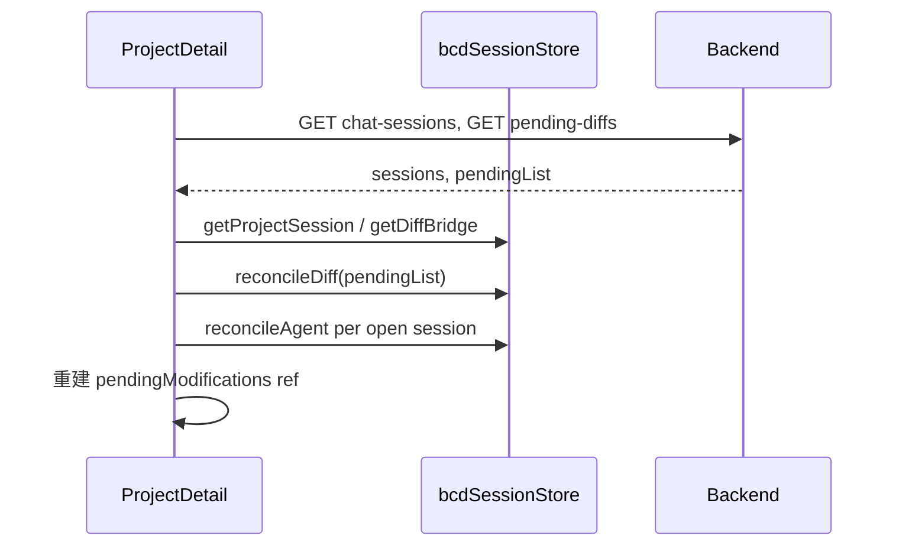

# 需求文档：sessionStorage 会话与任务状态管理

## 1. 文档目标

本文档定义 BadCaseDoctor 前端 **浏览器 sessionStorage 统一治理层** 的产品与技术需求，用于：

- 规范 **AI 对话会话** 在 Tab 内的选中态、草稿与切换恢复；
- 规范 **Agent / ReAct 运行态** 在流式中断、刷新、切 Tab 后的可恢复边界；
- 规范 **Diff Review / 待采纳修改** 在列表、详情、对话区之间的跨组件传递；
- 与后端持久化（MySQL、`ChatSession`、未来 `agent_tasks`、Diff 状态表）对齐，避免「本地缓存覆盖真相」。

本文档为**需求与方案约束**；具体模块路径、完整 TypeScript 类型与单元测试用例属于开发阶段交付物。

**关联文档**（实现时必须对齐，冲突时以持久化闭环文档为准）：

- `docs/需求文档_diff_review闭环处理.md` — Diff 生命周期、`sessionStorage` 仅作加速
- `docs/需求文档_Agent任务状态管理与DAG并发调度_MySQL.md` — 后端任务表与 `session_id` 关联

---

## 2. 背景与现状

### 2.1 现状概览

| 存储 | 典型键 / 用途 | 问题 |
|------|----------------|------|
| `sessionStorage` | `pendingModifyDiff`（单键 JSON） | 多处 `getItem`/`setItem`/`removeItem` 散落；仅支持**一条**详情 Diff 桥接；无版本、无项目/会话维度 |
| 内存 `ref` | `ProjectDetail.currentSession`、`pendingModifications`、`workbenchTabs` | 刷新即失；`ChatSessions.vue` 的 `currentSession` 也不持久 |
| `localStorage` | `user`、`selectedChatModel`、`badcase_doctor:stable_created:*`、`lastProjectId` 等 | 与 session 级状态混用，职责边界不清 |

### 2.2 核心痛点

1. **会话切换丢失上下文**：用户在项目页打开多个 AI Tab、切换工作台 Tab 或刷新后，无法稳定恢复「上次正在聊的 sessionId」。
2. **任务态仅驻留内存**：ReAct 流式进行中刷新页面，前端无法判断应展示「继续等待 / 已失败 / 可重试」；与后端 `agent_tasks`（规划中）缺少镜像字段。
3. **Diff 桥接脆弱**：`pendingModifyDiff` 全局单槽，多记录、多会话并发修改时后者覆盖前者；与 `pendingModifications` 内存 map 易不一致。
4. **清理不彻底**：采纳/拒绝后部分路径未 `removeItem`，导致详情页误读旧 Diff（已有修复 scattered，缺统一契约）。
5. **无统一调试与观测**：无法一键 dump 当前 Tab 下所有 BCD 会话缓存。

### 2.3 设计原则（必须遵守）

1. **持久化优先**：可恢复的业务状态以 API / DB 为准；`sessionStorage` 不得作为唯一真相源。
2. **Tab 隔离**：使用 `sessionStorage`（同源每 Tab 独立），不用其存跨 Tab 共享态；跨 Tab 用 `localStorage` 或后端。
3. **显式失效**：状态迁移（采纳、拒绝、会话删除、任务终态）必须触发对应命名空间的 `clear` / `patch`。
4. **可版本迁移**：JSON 结构带 `schemaVersion`，旧键可迁移或安全丢弃。

### 2.4 概念澄清：对话 Session ≠ `sessionStorage`（对照 Claude Code 泄露架构）

Claude Code 源码泄露（npm source map，终端 CLI）表明：**「会话管理」主战场不是浏览器 `sessionStorage`**，而是：

| Claude 侧 | 作用 | BadCaseDoctor 等价 |
|-----------|------|-------------------|
| `~/.claude/projects/*.jsonl` | 对话 transcript，可 `--resume` | `ChatSession` + `GET/POST /api/chat-sessions` |
| Workflow state ≠ conversation | 任务进度不混在聊天记录里 | `agent_result`、未来 `agent_tasks` |
| Bridge + SSE/WebSocket | 远程/流式会话 | `SimpleChatPanel` SSE + `routers/agent.py` |
| **LSS-*** + `tabId`（**localStorage**） | Tab 级 UI 偏好（字体等） | 本文 **5.1 对话 UI 缓存** |
| 内嵌预览页 `sessionStorage` | Electron 预览窗口隔离（曾有多会话串台 bug） | 非主对话链路 |

因此：**本文「对话的 sessionStorage」仅指 Tab 内 UI 加速**（当前选中哪条 `ChatSession`、可选输入草稿），**不得**用来存消息正文、ReAct 步骤或 Diff 真相。

---

## 3. 范围

### 3.1 范围内

- 新增统一模块（建议路径）：`electron-vue3/src/utils/bcdSessionStore.js`（或 `.ts`）。
- 键命名空间、读写 API、校验、与后端 reconcile 流程。
- 迁移现有 `pendingModifyDiff` 直读写至统一 API。
- `ProjectDetail`、`SimpleChatPanel`、`NewBadcase` / `NewBug` / `NewTestCase` 的接入约定。
- 会话选中态、Agent 运行态镜像、Diff 桥接三类数据的 schema。

### 3.2 范围外

- 替换 `localStorage` 中的用户偏好（语言、模型选择、终端字号等）— 保持现状，仅在文档中划分职责。
- 后端新表结构的完整 DDL（Diff / `agent_tasks` 由各自需求文档定义）；本文只约定 **前端缓存字段与 reconcile 时机**。
- Electron 主进程 `userData` 文件存储（若未来需要跨重启恢复，单独立项）。

---

## 4. 存储职责划分

| 层级 | 介质 | 生命周期 | 典型数据 |
|------|------|----------|----------|
| L0 真相 | MySQL API | 永久 | 会话消息、`ChatSession`、Diff `pending/adopted`、Agent 任务 |
| L1 跨会话 | `localStorage` | 浏览器持久 | 登录用户、选中模型、`stable_created` 映射 |
| L2 单 Tab 会话 | `sessionStorage`（本需求） | Tab 关闭即清 | 当前 sessionId、流式任务快照、详情 Diff 桥接、工作台 UI 快照 |
| L3 运行时 | Vue `ref` / `reactive` | 组件存活 | 列表渲染、SSE 缓冲、未落库草稿 |

**读写顺序（进入项目页 / 切换会话时）**：

```
L0 API 拉取 → 与 L2 对比 fingerprint / updatedAt → 以 L0 为准重建 L3 → 必要时回写 L2 加速
```

---

## 5. 键命名空间与 Schema

统一前缀：`bcd:ss:`（BadCase Doctor Session Storage）。所有值为 JSON，顶层必含：

```json
{
  "schemaVersion": 1,
  "updatedAt": 1735689600000,
  "payload": { }
}
```

### 5.1 项目会话上下文 `bcd:ss:project:{projectId}`

用于 **会话管理**（Chat Session UI）。

| 字段 | 类型 | 说明 |
|------|------|------|
| `activeSessionId` | `number \| null` | 当前选中的 `ChatSession.id` |
| `openSessionIds` | `number[]` | 项目内已打开的对话 Tab 顺序（可选，默认仅 active） |
| `draftBySession` | `Record<sessionId, string>` | 各会话输入框未发送草稿（可选 v1） |
| `scrollAnchorBySession` | `Record<sessionId, string>` | 历史消息分页锚点 `before_id`（可选 v1） |

**行为**：

- 用户切换左侧会话 Tab → `patch` 更新 `activeSessionId`。
- 刷新页面 → 读取后若 `activeSessionId` 在服务端仍存在则恢复，否则回退列表第一项或空态。
- 删除会话 → 从 `openSessionIds` / `draftBySession` 剔除；若删的是 active，按规则选下一个。

#### 5.1.1 对话 sessionStorage：存什么、不存什么

| 应存（L2） | 不应存（走 L0/L3） |
|------------|-------------------|
| `activeSessionId` — 当前选中的 `ChatSession.id` | 整段聊天消息列表 |
| `draftBySession`（可选 v1.1）— 各会话输入框未发送草稿 | ReAct 步骤、工具输出、todo 全文 |
| `scrollAnchorBySession`（可选 v1.1）— 历史分页 `before_id` | `pendingModifyDiff` / Diff 真相（见 5.3，**独立键**） |
| `streamingHint`（可选）— `{ sessionId, startedAt }` 仅用于刷新后 UI 提示 | Token、密码、用户登录态 |

#### 5.1.2 现网差距（`ProjectDetail.vue`）

当前逻辑（`watch(route.params.id)`）在 `fetchSessions()` 后**固定**：

```javascript
currentSession.value = sessionHistory.value[0].id  // 按 created_at 排序后的第一条
```

即：用户正在聊会话 B，刷新后可能被切回「最新创建」的会话 A。  
**首期改造目标**：改为优先 `resolveActiveSession(projectId, sessionHistory)`，不存在再回退 `[0]`。

涉及方法（须写入/读出 5.1 缓存）：

- `switchSession(sessionId)` — 切换时写 `activeSessionId`
- `createNewSession()` — 成功后写 `activeSessionId`
- 删除会话 — 清理并切换下一个或置 `null`
- `watch(route.params.id)` — 进入项目时恢复

`SimpleChatPanel` 仍通过 `props.sessionId` 拉 `getChatSession`；**不负责**决定「当前项目选哪条会话」，仅可选负责草稿读写。

#### 5.1.3 首期模块（可先于 `bcdSessionStore` 落地）

建议文件：`electron-vue3/src/utils/chatSessionUiStore.js`（后期合并进 `bcdSessionStore.js` 的 5.1 读写）。

键名与 5.1 一致：`bcd:ss:project:{projectId}`，或与下文示例等价的扁平键 `bcd:chat-ui:{projectId}`（**实现时二选一，禁止双写两套键**）。

参考实现（行为契约，代码可微调）：

```javascript
const KEY = (projectId) => `bcd:ss:project:${projectId}`

export function readChatUi (projectId) {
  try {
    const raw = sessionStorage.getItem(KEY(projectId))
    if (!raw) return {}
    const o = JSON.parse(raw)
    return o.payload ?? o
  } catch {
    return {}
  }
}

export function writeChatUi (projectId, patch) {
  if (projectId == null || projectId === '') return
  const prev = readChatUi(projectId)
  const payload = {
    activeSessionId: prev.activeSessionId ?? null,
    openSessionIds: prev.openSessionIds ?? [],
    draftBySession: prev.draftBySession ?? {},
    scrollAnchorBySession: prev.scrollAnchorBySession ?? {},
    ...patch
  }
  sessionStorage.setItem(KEY(projectId), JSON.stringify({
    schemaVersion: 1,
    updatedAt: Date.now(),
    payload
  }))
}

export function setActiveSession (projectId, sessionId) {
  writeChatUi(projectId, { activeSessionId: sessionId })
}

export function getActiveSessionId (projectId) {
  return readChatUi(projectId).activeSessionId ?? null
}

/** 若 id 仍在服务端列表中则返回，否则 null */
export function resolveActiveSession (projectId, sessionList) {
  const id = getActiveSessionId(projectId)
  if (id == null) return null
  const exists = sessionList.some((s) => s.id === id)
  return exists ? id : null
}
```

对外统一走 `bcdSessionStore.setActiveSession` / `resolveActiveSession` 时，内部可委托上述模块。

#### 5.1.4 `ProjectDetail` 接入三步（首期必做）

**① 切换 / 新建会话时写入**

```javascript
// switchSession 末尾
setActiveSession(projectId.value, sessionId)

// createNewSession 成功且 currentSession 赋值后
setActiveSession(projectId.value, newSess.id)
```

**② 进入项目 / 刷新时读出**

```javascript
await fetchSessions()
const restored = resolveActiveSession(projectId.value, sessionHistory.value)
if (restored != null) {
  currentSession.value = restored
  const info = sessionHistory.value.find((s) => s.id === restored)
  if (info) sessions.value[restored] = info
} else if (sessionHistory.value.length > 0) {
  currentSession.value = sessionHistory.value[0].id
  sessions.value[currentSession.value] = sessionHistory.value[0]
  setActiveSession(projectId.value, currentSession.value)
}
```

**③ 删除会话**

- 若删的是当前 active：切换到剩余列表首条或 `null`，并 `setActiveSession` / `writeChatUi({ activeSessionId: null })`；
- 从 `draftBySession` / `openSessionIds` 删除该 `sessionId`。

#### 5.1.5 `SimpleChatPanel` 草稿（可选，v1.1）

在 `watch(() => props.sessionId)` 中：

- 离开旧 `sessionId` 前：`saveDraft(projectId, oldId, inputText)`
- 进入新 `sessionId` 后：从 `draftBySession[newId]` 恢复输入框（无则 `''`）

**禁止**在 `SimpleChatPanel` 用 sessionStorage 缓存 `messages` 数组。

#### 5.1.6 流式进行中刷新

不依赖 sessionStorage 续 SSE（与 Claude 一致，以落库消息为准）：

1. 刷新后 `loadSessionMessages()`；
2. 若最后一条 assistant 仍为进行中/不完整 → UI 提示「连接可能已断开」；
3. 可选：5.1 中写 `streamingHint: { sessionId, startedAt }`，超过 120s 无更新视为 stale，**仍以 API 消息为准**。

Agent 运行态细粒度镜像见 **5.2**（M2 阶段，非对话首期必需）。

#### 5.1.7 与 `pendingModifyDiff` 分离

| 键 / 模块 | 职责 |
|-----------|------|
| `bcd:ss:project:{projectId}` | 对话：activeSessionId、草稿等 |
| `pendingModifyDiff` → `bcd:ss:diff:{projectId}` | 详情 Diff 桥接（5.3） |

**禁止**把 Diff payload 并入 `bcd:ss:project` 的 JSON，避免改对话状态误伤详情页。

#### 5.1.8 对话 sessionStorage 数据流

```text
用户选中会话
  → setActiveSession(projectId, sessionId)
  → SimpleChatPanel(props.sessionId) → GET /api/chat-sessions/:id

用户 F5
  → fetchSessions()
  → resolveActiveSession() → currentSession
  → loadSessionMessages()

用户关闭浏览器 Tab
  → sessionStorage 清空 → 下次进入项目从 API 取列表，无 restored 则回退 [0]
```

### 5.2 Agent 运行态镜像 `bcd:ss:agent:{projectId}:{sessionId}`

用于 **任务 / 流式状态管理**（与 SSE、`agent_tasks` 对齐）。

| 字段 | 类型 | 说明 |
|------|------|------|
| `runId` | `string` | 本次 ReAct 运行唯一 ID（后端生成或 SSE 首包下发） |
| `messageId` | `number \| null` | 关联的 assistant 消息占位 id |
| `status` | `enum` | `idle` \| `streaming` \| `completed` \| `failed` \| `cancelled` |
| `startedAt` / `updatedAt` | `number` | 毫秒时间戳 |
| `lastEventSeq` | `number` | 已消费 SSE 序号（用于断线续传判断，可选） |
| `reactPlanSteps` | `array` | 计划步骤快照（仅 `streaming` 时写入，控制体积） |
| `taskIds` | `string[]` | 关联 `agent_tasks.id` 列表（后端任务化后必填） |

**行为**：

- SSE `start` → `status=streaming`，写入 `runId`。
- SSE 终态 / 用户停止 → `status=completed|failed|cancelled`，保留至 reconcile 成功。
- 进入会话时：若 `status=streaming` 且 `updatedAt` 超过阈值（建议 120s）无更新 → 标为 `stale`，UI 提示「连接已断开，请刷新消息」；调用 `GET /api/chat-sessions/:id` 以服务端消息为准覆盖。
- 后端 `agent_tasks` 就绪后：以 `taskIds` 轮询或 SSE `task_status` 事件更新镜像，**不得**长期仅信前端缓存。

### 5.3 Diff 详情桥接 `bcd:ss:diff:{projectId}`

替代现有裸键 `pendingModifyDiff`，支持 **按记录分槽**（仍遵守「详情一次只编辑一条」的 UX 时可保留单 active 指针）。

| 字段 | 类型 | 说明 |
|------|------|------|
| `activeKey` | `string` | 当前详情正在展示的 `target:targetId` |
| `slots` | `Record<key, DiffSlot>` | 各记录桥接数据 |

`DiffSlot` 最小字段（与现 `setPendingModifyDiffSession` 对齐）：

- `target`, `targetId`, `diff`, `modifications`, `messageId`, `batchIndex`
- `lifecycleId`, `diffFingerprint`（与后端合并接口一致，见 diff 需求文档）
- `sessionId`, `planId`（可选，用于 Tab 归属校验）

**行为**：

- 写入：仅当含 **详情字段** 的 modify 需要跳转详情时写入对应 slot；列表字段只更新内存 `pendingModifications`，不写 slot（与现逻辑一致）。
- 读取：`NewBadcase` / `NewBug` / `NewTestCase` 挂载时读 `activeKey` 对应 slot。
- 采纳 / 拒绝 / 全字段处理完 → `clearSlot(key)`；若无任何 slot → `removeItem` 整键。
- **禁止** 用 slot 覆盖服务端 `pending`：进入页面前必须 `reconcileDiff(projectId)`（见 6.3）。

### 5.4 工作台 UI 快照（可选 v1.1）`bcd:ss:workbench:{projectId}`

| 字段 | 说明 |
|------|------|
| `activeWorkbenchTabId` | 当前工作台 Tab |
| `tabMetas` | 精简 Tab 描述（id、kind、targetId、planId），用于刷新后提示恢复，**不**恢复已失效 Diff |

v1 可只做 `activeWorkbenchTabId`，完整 Tab 列表仍以用户操作为准，避免恢复过期沙箱 Tab。

---

## 6. 统一 API（前端模块）

建议导出（命名可微调，行为不变）：

| 方法 | 说明 |
|------|------|
| `getProjectSession(projectId)` | 读 5.1 |
| `setActiveSession(projectId, sessionId)` | 写 active + 更新时间 |
| `getAgentRun(projectId, sessionId)` | 读 5.2 |
| `patchAgentRun(projectId, sessionId, partial)` | 合并更新运行态 |
| `clearAgentRun(projectId, sessionId)` | 终态清理 |
| `getDiffBridge(projectId)` | 读 5.3 |
| `setDiffSlot(projectId, key, slot, { setActive: true })` | 写 slot |
| `clearDiffSlot(projectId, key)` | 清除单槽 |
| `clearAllDiff(projectId)` | 项目级清空 |
| `reconcileDiff(projectId, serverPendingList)` | 用 API 返回的 pending 列表校正 slots，删除多余槽 |
| `reconcileAgent(projectId, sessionId, serverMessages)` | 根据最新消息 agent_result 校正运行态 |
| `dumpAll()` | 调试：列出当前 Tab 下所有 `bcd:ss:*` 键（仅 dev / `localStorage.bcd:ss:debug=1`） |

**实现约束**：

- 所有写操作 `try/catch`，Quota 超出时降级为仅内存并 `console.warn`。
- 单键体积建议上限 **512KB**；`reactPlanSteps` 超过时只保留摘要（步骤 id、status、title）。
- 不提供泛化 `setItem(key, val)` 对外暴露，避免再次散落裸字符串键。

---

## 7. 业务流程

### 7.1 进入项目页（`ProjectDetail` mounted）



### 7.2 切换 AI 会话

1. `setActiveSession(projectId, newId)`
2. `SimpleChatPanel` `watch(sessionId)`：取消旧 SSE（已有 `rd.cancel('session_switch')`），加载新会话消息。
3. 若存在 `getAgentRun` 且 `status=streaming`，展示恢复条或继续订阅（依赖 SSE 是否支持同一 `runId` 续传，不支持则仅展示 stale 提示）。

### 7.3 对话产生 Modify（与现链路兼容）

1. 列表字段 → 只更新 `pendingModifications`（内存）。
2. 详情字段 → `setDiffSlot` + 派发 `show-modify-in-detail`（与现 `setPendingModifyDiffSession` 等价）。
3. 批量多条详情字段 → **一次** `setDiffSlot`（active 为最后一条或批量首条，与产品确认；默认与现「只写一次 sessionStorage」一致）。

### 7.4 采纳 / 拒绝

1. API 成功 → 后端状态 `adopted|rejected`
2. `clearDiffSlot` + 内存 `pendingModifications` 剔除
3. 禁止保留 `bcd:ss:diff` 中对应 slot

### 7.5 会话删除

1. API `DELETE /api/chat-sessions/:id`
2. `clearAgentRun(projectId, sessionId)`
3. 从 `openSessionIds` / `draftBySession` 移除
4. Diff slots 中 `sessionId` 匹配的条目清除（或整项目 reconcile）

---

## 8. 与后端契约（增量）

本文不要求一次性实现全部 API，但前端模块需预留字段。建议后端补充（可分期）：

| 接口 | 用途 |
|------|------|
| `GET /api/projects/:id/session-bootstrap` | 返回 `activeSession` 建议、`pending_diffs[]`、`running_tasks[]`（聚合入口，减少多次往返） |
| Diff 列表查询 | 已有或按 `需求文档_diff_review闭环处理` 落地，供 `reconcileDiff` |
| `agent_tasks` 按 `session_id` 查询 | 供 `reconcileAgent` 与 SSE 互补 |

**指纹**：Diff slot 与 API 项比对 `lifecycleId` + `diffFingerprint`，不一致则以 API 为准并覆盖 slot。

---

## 9. 迁移计划

### 阶段 M0（兼容层）

- 实现 `bcdSessionStore.js`。
- `setDiffSlot` 同时写 `bcd:ss:diff:{projectId}` 与旧键 `pendingModifyDiff`（双写）。
- `getDiffSlot` 优先读新键，fallback 旧键并迁移。

### 阶段 M1（调用方迁移）

- `ProjectDetail.setPendingModifyDiffSession` → 改为调用 `setDiffSlot`。
- `NewBadcase` / `NewBug` / `NewTestCase` 中所有 `sessionStorage.*pendingModifyDiff*` → `getDiffBridge` / `clearDiffSlot`。
- `ProjectDetail` 挂载时增加 `reconcileDiff`。

### 阶段 M2（对话 sessionStorage 首期 — 建议优先于 Diff 统一）

**目标**：解决刷新后「对话切错会话」，对齐 Claude 的「resume 上次正在聊的那条」体验（UI 层，非 transcript 存储）。

1. 新增 `chatSessionUiStore.js`（或 `bcdSessionStore` 的 5.1 子集）。
2. `ProjectDetail`：`switchSession` / `createNewSession` / `watch(route.params.id)` / 删会话 — 按 **5.1.4** 接入。
3. 验收：**S1**（刷新后仍为原 `activeSessionId`）。
4. 可选：`SimpleChatPanel` 草稿（**5.1.5**）。
5. Agent 镜像（**5.2**）可与本阶段并行或延后。

### 阶段 M3（清理）

- 删除裸键 `pendingModifyDiff` 双写；
- 文档与代码搜索禁止新增 `sessionStorage.setItem`  outside `bcdSessionStore`。

---

## 10. 非功能需求

| 项 | 要求 |
|----|------|
| 性能 | 单次读写在 1ms 级；避免在 `requestAnimationFrame` 热路径频繁写 |
| 安全 | 不存 token、密码；草稿仅本 Tab |
| 测试 | `bcdSessionStore` 纯函数部分 Jest/Vitest 单测；关键 reconcile 用例见下 |
| 调试 | `localStorage.setItem('bcd:ss:debug','1')` 时 `console.table(dumpAll())` |

---

## 11. 验收用例

### S1：刷新后会话恢复

1. 项目 A 选中会话 42 并发送一条消息；
2. F5 刷新；
3. 断言：`activeSessionId === 42`，对话历史加载会话 42。

### S2：采纳后 Diff slot 清除

1. 生成详情字段 Diff，写入 bridge；
2. 详情页采纳；
3. 断言：`slots` 无该 `target:targetId`；列表无黄条；刷新后仍无。

### S3：reconcile 以服务端为准

1. 本地 slot 保留旧 fingerprint；
2. 服务端该记录已 `adopted`；
3. 进入项目触发 `reconcileDiff`；
4. 断言：本地 slot 被删除，UI 不展示待采纳。

### S4：切会话取消流式

1. 会话 A 流式进行中，切换到会话 B；
2. 断言：A 的 SSE 取消；B 无 A 的 `streaming` 状态串台；`bcd:ss:agent:*` 分 session 隔离。

### S5：旧键迁移

1. 仅存在 `pendingModifyDiff` 旧数据；
2. 打开详情；
3. 断言：自动迁移到 `bcd:ss:diff:{projectId}` 且功能正常。

### S6：Tab 关闭

1. 写入若干 `bcd:ss:*`；
2. 关闭浏览器 Tab 再新开；
3. 断言：sessionStorage 为空，从 API 重建状态。

---

## 12. 文件与职责（建议）

| 模块 | 职责 |
|------|------|
| `utils/chatSessionUiStore.js` | **对话首期**：`activeSessionId`、草稿（可后续并入 bcdSessionStore） |
| `utils/bcdSessionStore.js` | 唯一读写入口、schema 校验、迁移 |
| `utils/bcdSessionStore.keys.js` | 键常量与 `schemaVersion` |
| `ProjectDetail.vue` | **对话恢复** + 项目 bootstrap、reconcile、Diff 写入 |
| `SimpleChatPanel.vue` | Agent run patch/clear、会话切换 |
| `NewBadcase.vue` / `NewBug.vue` / `NewTestCase.vue` | 读 Diff slot、采纳清理 |
| `ChatSessions.vue` | 可选：独立页同样使用 `setActiveSession` |

---

## 13. 开放问题（实现前确认）

1. **多详情 Tab 同时打开**：是否允许多个 `activeKey` 并行，还是强制单 active（当前行为为单槽）。
2. **SSE 断线续传**：后端是否提供 `Last-Event-ID` / `runId` 查询；若无，Agent 镜像仅用于 UI 提示，不承诺自动续流。
3. **`session-bootstrap` 聚合接口**：是否纳入本需求首期，还是 M2 再做。
4. **Electron 多窗口**：每窗口独立 Tab，sessionStorage 天然隔离，无需额外处理。

---

## 14. 修订记录

| 版本 | 日期 | 说明 |
|------|------|------|
| v0.1 | 2026-05-21 | 初稿：基于现网 `pendingModifyDiff` 与 `ProjectDetail` / `SimpleChatPanel` 梳理 |
| v0.2 | 2026-05-21 | 增补 **5.1 对话 sessionStorage 实现细则**、Claude 泄露架构对照（2.4）、M2 首期优先级 |
