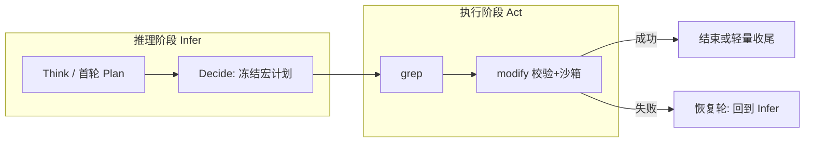

# 性能优化总纲：推理与执行分离

> **主线目标**：简单任务（典型 **grep → modify**）在**推理阶段一次性定案**，**执行阶段只跑工具、不再为选下一步重复调用大模型**。  
> 本文档为**性能优化文档体系的入口**；工具层（ES/grep/modify 沙箱）优化见文末「关联文档」，不替代本条主线。

---

## 0. 文档体系（阅读顺序）

| 层级 | 文档 | 职责 |
|------|------|------|
| **总纲（本文）** | `需求文档_下一轮性能优化_推理执行分离总结与响应形态.md` | 目标、推理/执行定义、宏路径需求、落地对照、排期 |
| **间隙拆解** | `ReAct_观察结束到下一轮思考_间隙说明.md` | grep 工具结束后 → 下一轮 decide 之间逐步耗时（S1–S21） |
| **路由与意图** | `意图识别与grep-modify路由机制.md` | 何时走 grep/modify、参数从哪来 |
| **增量总结** | `需求文档_增量总结_每步合并Observation与SSE推送.md` | 运行总览 SSE / revision（宏路径上应降级） |
| **Agent 全景** | `需求文档_agent执行流程现状与优化需求_20260324.md` | 协议、SSE、§6.6 计划 UI（P2，不挡 3s） |
| **工具层（并行）** | `需求文档_grep全字段检索与负责人筛选优化.md` | ES/embed/rerank、`GREP_*` |
| | `需求文档_modify耗时分析与优化_20260330.md` | 沙箱/ORM、`MODIFY_*` |

**不在本阶段展开**：§5「FC + XML 协议演进」——与推理/执行分离正交，单列 P2。

---

## 1. 总体目标（量化口径）

| 指标 | 现状（参考） | 目标 |
|------|----------------|------|
| **简单任务端到端** | 约 **7～10s**（grep+modify；含 think、grep、observe、decide、modify 预览） | **P50 ≤ 3s** |
| **宏执行段（grep 结束 → modify 沙箱就绪）** | 常 **3～6s**（含完整 observe + 第二轮 decide） | **P50 ≤ 1.5s**（无 observe/decide LLM） |
| **grep 检索子系统** | 约 **1.2～2.5s**（embed+ES，已优化） | 维持或略降；**不单独承担 3s 承诺** |

### 1.1 何谓「简单任务」

- 用户意图清晰，工具链可预测：**grep → modify**（或单工具）。
- 无需多轮探索、无复杂分支（批量、多实体、歧义消解另设指标）。

### 1.2 端到端计时口径（实现阶段写死）

从 **`/api/agent/react` 请求进入** 到 **modify 沙箱预览首包就绪**（或 `observation` 携带 `confirmation_required`）：

| 计入 | 不计入 |
|------|--------|
| 首轮 think/decide（若无法省） | 用户点击「确认落库」之后 |
| grep / modify 工具执行 | 纯前端渲染 |
| 宏路径上允许的本地 stub / 模板 observe | 后台增量总结线程（若不阻塞主循环） |

**基准用例（建议固定）**：

1. 「登录的手机收不到验证码」→ 将**当前聚焦 bug** 状态改为 `reopened`（或 `closed`）。
2. 记录：`[PERF][react]`、`[GREP-PERF]`、`[MODIFY-PERF]`、`request_id` 一致。

**观测**：`PERF_LOG=1`；可选 `observability/agent_trace/run_<request_id>.jsonl`。

---

## 2. 核心概念：推理 vs 执行



| 阶段 | 允许 | 禁止（宏路径默认） |
|------|------|-------------------|
| **推理** | 调用 LLM 产出计划、工具名、参数意图；FC / XML / `task_plan` | 执行工具、写库 |
| **执行** | schema/路径/沙箱校验；顺序调用 grep、modify；本地 `summary_nl`、模板 observe | **完整 observe_prompt LLM**；**为选下一步再 decide** |

**与现有 `task_plan` 的区别**：当前首轮可解析 `<task_plan>` 并逐步执行，但 **grep 成功后仍会 observe + 下一轮 decide**——属于「有计划的分步 ReAct」，**不是**推理/执行分离。宏路径要在 grep 与 modify 之间**切断**这两次 LLM。

---

## 3. 需求一：推理与执行分离（P0 核心）

### 3.1 问题陈述

工具结果已出后，主循环仍常走：**observe LLM → XML 解析 →（可选）增量总结 → todo_end → 下一轮 decide**。  
对已在推理阶段确定 **grep + modify** 的场景，这是**重复认知**，与 ≤3s 目标冲突。详见 `ReAct_观察结束到下一轮思考_间隙说明.md`。

### 3.2 目标行为

1. **推理阶段（一次性）**  
   - 产出可机械校验的 **宏计划** `frozen_macro`（至少含 `grep` 与 `modify` 的参数意图或占位符规则）。  
   - 触发条件（实现二选一或组合）：  
     - 规则：用户句命中「改状态/负责人/字段」+ 界面 `ui_context.record_id`；  
     - 模型：首轮 FC 返回 `macro_plan` 结构且校验通过。

2. **执行阶段**  
   - 顺序执行：`grep` →（合并 navigation 进 context）→ `modify`（可 `skip_preview` 白名单字段走快路径）。  
   - **仅做**：校验、配额、工具执行、错误归一。  
   - **默认不做**：grep 后完整 observe；modify 前第二轮 decide。

3. **一轮闭环**  
   `frozen_macro` 内工具序列执行完毕 / 任一步失败 / 升级复杂任务 → 才结束宏模式。

4. **恢复轮**  
   grep 空结果、modify 沙箱失败、宏计划校验失败 → 清除 `frozen_macro`，回退**逐步 ReAct**，上限 N 次，对用户可见说明。

### 3.3 状态机（实现落点）

**文件**：`agents/react_simplified.py`（统一流 `_run_stream_raw` / 工具执行后分支）。

建议上下文字段（名称可微调，语义固定）：

| 字段 | 类型 | 说明 |
|------|------|------|
| `frozen_macro` | `dict \| None` | `{ "steps": [{"tool","params_template"}], "round_id", "source": "rule\|fc" }` |
| `macro_round_id` | `str` | 与 `request_id` 关联，防止跨请求污染 |
| `macro_phase` | `enum` | `idle \| executing \| done \| fallback` |
| `grep_snapshot` | `dict` | 执行 grep 后写入，供 modify 用，禁止 observe 臆造列表 |

**grep 后分支伪代码**：

```
if frozen_macro and next_step == "modify":
    skip_observe_llm = True
    skip_decide_llm = True
    emit template observation + summary_nl only
    proceed to modify with grep_snapshot
else:
    existing observe → decide path
```

**环境变量（建议）**：

| 变量 | 默认 | 说明 |
|------|------|------|
| `REACT_MACRO_AUTO` | `1` | 未设 `REACT_MACRO_GREP_MODIFY` 时，首轮 task_plan≥2 步自动启用宏路径 |
| `REACT_MACRO_GREP_MODIFY` | （未设） | `1` 强制开；`0` 强制关（覆盖 AUTO） |
| `REACT_MACRO_SKIP_GREP_OBSERVE` | `1` | 宏路径跳过 grep observe LLM |
| `REACT_MACRO_SKIP_INTER_DECIDE` | `1` | grep 与 modify 之间跳过 decide |
| `REACT_OBSERVE_FAST_STUB` | `1` | 已有；modify 预览场景跳过 observe |

### 3.4 失败与降级

| 场景 | 行为 |
|------|------|
| grep 失败或 0 命中且 modify 依赖命中 | 恢复轮；可缩小 keywords 或提示用户 |
| modify 预览/应用失败 | 恢复轮；携带 `grep_snapshot` |
| 宏计划不完整 / 校验失败 | 不执行半套；`macro_phase=fallback`，打点 `macro_fallback_reason` |

### 3.5 验收标准

1. 基准用例 P50 端到端 ≤ **3s**（§1.2 口径）。  
2. 宏路径命中时，日志中 **无** `[PERF][observe] stream_observe_ms` 大段（或 `observe_skipped=macro`）。  
3. grep 与 modify 之间 **无** `fc_decide_roundtrip_ms`（或 `decide_skipped=macro`）。  
4. 失败可回退逐步路径，无静默错误。

---

## 4. 需求二：间隙内耗时削减（P0 配套，支撑 §3）

在宏路径未全开前，先削减 **grep 结束后 → 下一轮思考** 的串行 LLM（与 §3 目标一致，可分期交付）。

| 环节 | 文档锚点 | 节省方向 | 状态 |
|------|----------|----------|------|
| **增量总结** | 间隙 S14 | 统一流默认 **后台合并**，不阻塞主循环 | **已落地**（`background=True`；`REACT_INCREMENTAL_SUMMARY_BLOCK_LOOP=0`） |
| **grep observe** | 间隙 S4 | 宏路径 **跳过**；或 `REACT_OBSERVE_MAX_TOKENS` 降低 | **未落地**（grep 仍完整 observe） |
| **inter-decide** | 间隙 S21 | 宏路径 **跳过** | **未落地** |
| **UI 总结 LLM** | 间隙 S4c/S8 | grep 用 `summary_nl` 分块，不二次 LLM | **部分** |
| **project_plan_lookup** | `[PERF][react] unified_gather_*` | Redis/DB 缓存、并行 gather | **部分**（见日志） |

**目标**：简单任务上总结相关链路再省 **~2s**（与 §3 一并验收，或计入宏路径后自动满足）。

详见：`ReAct_观察结束到下一轮思考_间隙说明.md` §4–§5。

---

## 5. 需求三：协议演进（P2，暂不挡 3s）

FC + XML 并存、宏计划 schema、`response_format` 供应商矩阵——**占位**，不在推理/执行分离 P0 实现。

待补 checklist 见原 §5.3（FC 多 tool、流式交错、前端 SSE 映射）。

---

## 6. 非功能需求

- **可观测**：`macro_path_hit`、`macro_fallback_*`、`[PERF][round-bridge]`、`[GREP-PERF] phase1_parallel_wall`。  
- **安全**：宏执行不绕过沙箱、路径校验、`modify` 白名单。  
- **回滚**：`REACT_MACRO_GREP_MODIFY=0` 恢复逐步 observe + decide。

---

## 7. 落地对照表（代码快照 2026-05）

| 能力 | 状态 | 位置 / 配置 |
|------|------|-------------|
| 推理/执行分离（`frozen_macro`） | **已做** | `agents/react_macro.py` + `react_simplified.py`；`REACT_MACRO_GREP_MODIFY=1` |
| grep 后跳过 observe（宏） | **已做（统一流）** | 统一流本无 grep observe LLM；`REACT_MACRO_SKIP_GREP_OBSERVE=1` |
| grep→modify 跳过 inter-decide | **已做** | grep 成功后 `_macro_pending_decision` → 下轮跳过 decide LLM |
| 增量总结不阻塞主循环 | **已做** | `_merge_running_summary_incremental_silent(..., background=True)` |
| modify observe fast stub | **已做** | `REACT_OBSERVE_FAST_STUB=1` |
| 首轮 `task_plan` 解析 | **已做** | `REACT_UNIFIED_FIRST_ROUND_TASK_PLAN`（≠ 宏执行分离） |
| grep ES + plan_tree 并行 | **已做** | `grep_tool.py` gather；`GREP_PARALLEL_ES_PLAN_TREE` |
| embed/rerank 默认通义 | **已做** | `GREP_EMBEDDING_BACKEND=dashscope`，`GREP_RERANK_BACKEND=dashscope` |
| grep ≤8 跳过 rerank | **已做** | `GREP_RERANK_SKIP_IF_LE=8` |
| modify 沙箱/ORM 优化 | **已做** | `MODIFY_*`，见 modify 耗时文档 |
| Agent trace / Prometheus 文本 | **已做** | `utils/observability.py`，`observability/` |

---

## 8. 实施路线图

### P0（推理/执行分离 — 必须）

1. 定义 `frozen_macro` schema + 规则触发（ui_context + 改字段句式）。  
2. 实现宏执行分支：grep 后 template observe；直接 modify（带 `grep_snapshot`）。  
3. `REACT_MACRO_GREP_MODIFY=1` 灰度 + 基准用例 + `PERF_LOG` 对比表。  
4. 更新间隙说明文档验收勾选项。

### P1（间隙清扫 — 可与 P0 交错）

1. grep 短 observe 或宏路径零 LLM observe。  
2. `REACT_INCREMENTAL_SUMMARY_RULE_FAST` 覆盖 grep 单步（若未覆盖）。  
3. `unified_gather` / `project_plan_lookup` 压到 <200ms P50。

### P2（体验与协议）

1. FC + XML 宏计划字段（§5）。  
2. Agent SSE 协议 v1、计划 UI 轻量化（agent 文档 §6.6）。  
3. grep 索引/embedding 持续优化（grep 专文，不替代 P0）。

---

## 9. 修订记录

| 日期 | 说明 |
|------|------|
| 2026-05-14 | 初稿：推理/执行分离 + 总结 2s + FC 占位 |
| 2026-05-26 | **重整**：本文升格为性能优化总纲；补充文档体系、推理/执行定义、状态机、落地对照表、路线图；与代码现状对齐；§5 降为 P2 |
