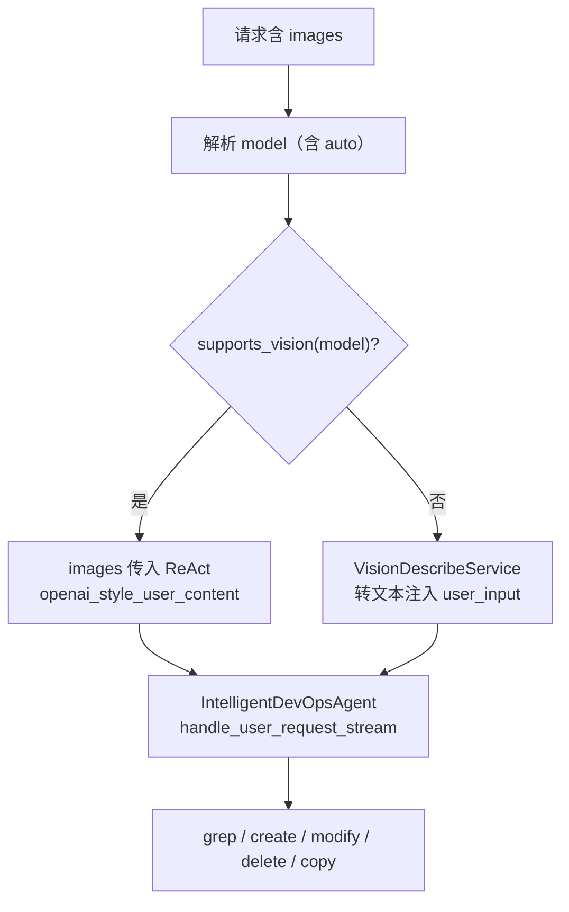

# 需求文档 - 图片识别与实体增删改查（TestCase / Bug / BadCase）

## 1. 概述

### 1.1 背景

用户希望在对话中上传截图、原型图、报错图等，由系统自动理解画面内容，并完成对 **测试用例（TestCase）**、**缺陷（Bug）**、**坏例（BadCase）** 及关联 **卡片（Card）** 的增删改查。项目已具备：

- 前端图片上传与随请求发送；
- 双路径图片理解（多模态直传 vs 视觉描述转文本）；
- ReAct 工具链 `grep` / `create` / `modify` / `delete` / `copy`。

尚未形成端到端产品能力：**按实体类型稳定路由**、**从图片到落库的可重复话术**、**视觉模型与业务模型配置解耦**、**Chat 模式与 Agent 模式行为一致**。

### 1.2 目标

1. **识图**：准确提取 UI 结构、可见文字、报错栈、状态信息等，输出可喂给业务模型的结构化描述。
2. **意图到实体**：根据用户话术识别目标实体（testcase / bug / badcase / card）与操作（增删改查）。
3. **工具闭环**：识图结果 + 用户指令 → ReAct 调用对应工具 → 沙箱 diff → 确认写入项目。
4. **场景覆盖**（优先级见 §6）：
   - 原型图 → 创建/补充 TestCase
   - 报错截图 → 创建 Bug 或 BadCase
   - 列表/详情截图 → grep 定位 + modify
   - 纯读图（OCR）→ 仅返回识别结果，不触发工具链（除非用户明确要求落库）

### 1.3 与旧文档关系

- 初版多模态方案：[`需求文档_多模态图片识别与测试用例生成.md`](./需求文档_多模态图片识别与测试用例生成.md)（偏 MVP 与 UI 规范）。
- 本文档：**在现状代码基础上**，定义「识图 + 实体 CRUD」的完成标准、流程与改造清单。
- 实体歧义与 modify 路由：[`意图识别与grep-modify路由机制.md`](./意图识别与grep-modify路由机制.md)。

---

## 2. 现状能力盘点

### 2.1 前端（已完成度较高）

**文件**：`electron-vue3/src/components/SimpleChatPanel.vue`

| 能力 | 状态 |
|------|------|
| 输入区左侧上传按钮、拖拽、粘贴 | ✅ |
| `pendingImages` / 内联编辑 `inlinePendingImages` | ✅ |
| 发送携带 `images: [{ data, filename }]`（Agent / Chat） | ✅ |
| 用户消息展示缩略图 | ✅ |
| 模型选择与 `project_id` 等上下文 | ✅ |

**请求体（Agent 模式示例）**

```json
{
  "user_input": "根据这张图生成测试用例",
  "model": "qwen3.6-plus",
  "images": [{ "data": "data:image/png;base64,...", "filename": "ui.png" }],
  "project_id": 123,
  "plan_id": null,
  "card_id": null,
  "stream": true
}
```

### 2.2 后端图片处理双路径



| 模块 | 路径 | 职责 |
|------|------|------|
| Agent 路由 | `routers/agent.py` | 图片意图分类、vision 分支、描述注入、SSE 状态 |
| Chat 路由 | `routers/chat.py` | 有图时**仅** `describe_prototype_for_testcase`，再 `parse_intent` |
| 视觉描述 | `agents/vision_describe.py` | `describe_image` / `describe_prototype_for_testcase` |
| 多模态拼装 | `llm/multimodal_content.py` | `openai_style_user_content` |
| ReAct 附图 | `agents/react_simplified.py` | `_react_stream_images`、轮次预算 `REACT_VISION_IMAGE_ATTACH_ROUNDS` |

### 2.3 图片意图分类（Agent）

**位置**：`routers/agent.py` → `_classify_image_intent(text)`

| 返回值 | 触发条件（摘要） | 后续行为 |
|--------|------------------|----------|
| `react` | 含「创建 bug」「放到卡片」「modify」等工具链关键词 | 进 ReAct，可用 create/modify 等 |
| `prototype` | 含「原型」「测试用例」「用例生成」等 | 非 vision 时用原型结构化描述 prompt |
| `ocr` | 含「识别文字」「图上写了什么」或泛化「这张图」 | 非 vision：描述后若**无** CRUD 意图则 `bye` 早退；vision 模型仍进 ReAct |

**辅助函数**：`_user_followup_needs_react_after_image` — 避免 OCR 误早退（用户其实想建 bug/用例）。

### 2.4 视觉描述服务（缺口明显）

**文件**：`agents/vision_describe.py`

| 项 | 现状 | 问题 |
|----|------|------|
| 调用方式 | DashScope OpenAI 兼容 `chat.completions` + `image_url` | ✅ |
| 模型 ID | `_call_vision_api` **写死** `model="qwen3.5-plus"` | 未使用 `self.vision_model`；与注册表 `qwen3.6-plus` 脱节 |
| 场景 | `describe_image`、`describe_prototype_for_testcase` | 无「报错截图→Bug 字段」「BadCase 现象」专用 prompt |
| 配置 | 无 `VISION_MODEL` 环境变量 | 运维无法单独调视觉模型 |

### 2.5 实体 CRUD 工具链（已具备，需与识图联动）

| 工具 | 文件 | 支持 target | 与图片关系 |
|------|------|-------------|------------|
| `grep` | `agents/tools/grep_tool.py` | bug / badcase / testcase / card / plan / all | 识图后由模型根据描述搜索 |
| `create` | `agents/tools/create_tool.py` | bug / badcase / testcase / card / plan | **创建**主入口 |
| `modify` | `agents/tools/modify_tool.py` | 源表 + card 校正 | 需结合意图守卫，见 modify 文档 |
| `delete` | `agents/tools/delete_tool.py` | 各实体 | 识图「删除这个」需先 grep 定位 |
| `copy` | `agents/tools/copy_tool.py` | 复制用例/缺陷等 | 可选 |

**ReAct 主循环**：`agents/react_simplified.py` + `agents/intelligent_devops_agent.py` — 模型在 observe 阶段产出 tool call，经沙箱 diff 后 `confirm` 落库。

**意图守卫（实体类型）**：`agents/intent_guards.py` — 话术含「缺陷」「测试用例」「坏例」「卡片」等时影响 modify/grep 的 target。

### 2.6 Chat 模式局限

`routers/chat.py` 有图时：

- 统一调用 `describe_prototype_for_testcase`（偏 TestCase）；
- 再走 `llm.parse_intent` 分发 redis/mysql/script/bug_management 等。

**缺口**：Chat 路径未复用 Agent 的 `_classify_image_intent`；报错图、BadCase 图在 Chat 模式下体验不一致。

---

## 3. 目标用户场景与话术

### 3.1 场景矩阵

| 场景 ID | 用户输入示例 | 图片内容 | 目标实体 | 主要工具 | 优先级 |
|---------|--------------|----------|----------|----------|--------|
| S1 | 根据这张原型图生成测试用例 | UI 原型 | testcase | create (+ 可选 grep) | P0 |
| S2 | 把截图里的报错登记为 bug | 报错栈/弹窗 | bug | create | P0 |
| S3 | 这是坏例现象，帮我建一条 badcase | 异常结果截图 | badcase | create | P0 |
| S4 | 按图上的步骤修改用例 12 的预期结果 | 步骤截图 | testcase | grep + modify | P1 |
| S5 | 删除图里圈出的那条缺陷 | 列表截图 | bug | grep + delete | P1 |
| S6 | 读出这张图上的文字 | 任意 | — | 仅描述 / bye | P1 |
| S7 | 复制这张详情页对应的用例 | 详情截图 | testcase | grep + copy | P2 |

### 3.2 推荐话术模板（产品/提示词）

为降低模型误判，可在 Skill 或系统提示中固化：

```
[创建] 根据附件图创建{testcase|bug|badcase}，项目已选，标题/步骤请从图中提取。
[修改] 先在当前项目 grep {testcase|bug|badcase}，再结合图片描述 modify 字段 …
[删除] 根据图中显示的编号/标题 grep 后 delete，需 confirm。
```

---

## 4. 目标流程设计

### 4.1 统一管道（Agent 为主，Chat 对齐）

```
用户: 文本 + images[]
    │
    ▼
① resolve_request_model（见模型路由文档）
    │
    ▼
② classify_image_intent(text) → ocr | prototype | react
    │
    ├─ vision 业务模型 ──► ③a 多模态直传 ReAct（images 参数）
    │
    └─ 非 vision ──────► ③b VisionDescribeService(scene_prompt)
                              │
                              ▼
                        enriched user_input
                              │
                              ▼
④ ReAct：THINK → grep? → create/modify/delete → diff → confirm
    │
    ▼
⑤ 前端：工具结果、diff 卡片、刷新列表/详情
```

### 4.2 视觉描述场景扩展（`VisionDescribeService`）

建议新增方法（或统一 `describe(image, scene)`）：

| scene | 方法名（建议） | 输出侧重 |
|-------|----------------|----------|
| `prototype` | 已有 `describe_prototype_for_testcase` | 页面类型、控件、流程 |
| `ocr` | 已有 `describe_image` | 全文、表格、标签 |
| `bug` | `describe_screenshot_for_bug` | 现象、复现步骤、环境、错误码/栈 |
| `badcase` | `describe_screenshot_for_badcase` | 预期/实际、数据样本、边界条件 |
| `ui_match` | `describe_for_modify_hint` | 与某条已有用例/缺陷的对齐线索（标题片段、ID） |

**意图 → scene 映射（建议）**

```python
def intent_to_vision_scene(image_intent: str, user_text: str) -> str:
    if image_intent == "prototype":
        return "prototype"
    if user_text_implies_bug_entity_type(user_text):
        return "bug"
    if "坏例" in user_text or "badcase" in user_text.lower():
        return "badcase"
    if image_intent == "ocr":
        return "ocr"
    return "prototype"  # 默认偏结构化 UI，利于 create testcase
```

### 4.3 实体 CRUD 与识图字段映射

| 实体 | create 常用字段（从图提取） | modify 常见触发 |
|------|---------------------------|-----------------|
| testcase | title, steps, expected_result, precondition, type | 步骤/预期与图不一致 |
| bug | title, steps_to_reproduce, severity, description | 补充截图中的栈信息 |
| badcase | title, description, reproduction_steps | 现象描述对齐 |
| card | title, description（看板层） | 与源表字段区分，见 modify 文档 |

**注意**：Card 与 Bug/BadCase/TestCase 源表 ID 可能撞号，modify 必须以 [`意图识别与grep-modify路由机制.md`](./意图识别与grep-modify路由机制.md) 为准，不能仅凭截图中的数字 ID 盲改。

### 4.4 多模态直传时的工具提示

当 `vision=true` 且图片直入 ReAct 时，系统提示词应明确要求：

1. 先根据画面理解再决定是否 `grep`；
2. 创建类意图优先 `create` 且 `target` 与话术一致；
3. 不得编造图中不存在的 ID；
4. 信息不足时向用户追问，而非空 create。

---

## 5. 与模型路由的协作

| 决策点 | 建议 |
|--------|------|
| 业务模型 | 用户 **Auto** 或具体 id；prototype/react+CRUD → `quality_first`；ocr/summary → `cost_first`（见路由文档 §4.5） |
| 视觉描述模型 | `VISION_MODEL` 或 `pick_best_vision`；ocr 降本可用 `pick_cheapest_vision` |
| Auto + 有图 | 优先 vision 直传；无 vision 候选 → 描述服务降级（路由文档 §4.4 脚注） |
| 路由耗时 | 选模在内存完成，**P99 低于 2ms**，不增加识图前等待 |

详见 [`需求文档_模型路由深化设计.md`](./需求文档_模型路由深化设计.md) §4.5（成本）、§4.8（调度性能）、§4.14（失败升档）、§4.15（简单问题降档）。

---

## 6. 实施计划与验收标准

### 6.1 改造清单

| 优先级 | 任务 | 文件 | 验收标准 |
|--------|------|------|----------|
| P0 | `VisionDescribeService` 使用 `self.vision_model` / `VISION_MODEL` | `vision_describe.py`, `config.py` | 改 env 后 API 请求 model 字段变化 |
| P0 | 新增 `describe_screenshot_for_bug` / `badcase` prompt | `vision_describe.py`, `locale_prompts.py` | S2/S3 话术端到端 create 成功 |
| P0 | Agent 非 vision 分支按 scene 选描述方法 | `routers/agent.py` | 选 deepseek+图 → 描述含 bug 字段结构 |
| P0 | 扩展 `_classify_image_intent`：badcase/bug 关键词 → `react` | `routers/agent.py` | 「登记坏例」不走 ocr bye |
| P1 | Chat 路由对齐 Agent 意图分类与 scene | `routers/chat.py` | Chat 模式 S2 可创建 bug |
| P1 | Skill：`image_create_testcase` / `image_create_bug` 等 | `agents/skills/`（若有） | 匹配率提升、少轮 THINK |
| P1 | 前端：识图后展示「将创建 testcase」等意图提示（可选） | `SimpleChatPanel.vue` | 用户可感知实体类型 |
| P2 | 历史消息持久化图片 URL（若消息表支持） | 后端消息模型 | 刷新后会话可看图 |
| P2 | 单张 ≤4MB、最多 5 张的后端校验与错误码 | `routers/agent.py` | 超大图返回 400 明确提示 |

### 6.2 端到端验收（建议测试用例）

**S1 原型 → TestCase**

1. 选择项目 P，上传原型图，输入「根据图生成测试用例」。
2. 期望：THINK 中出现识图/多模态提示 → `create` target=testcase → diff 确认 → 项目内可见新用例，步骤与图一致。

**S2 报错 → Bug**

1. 上传报错截图，输入「登记为 bug，优先级 P2」。
2. 期望：`create` target=bug，描述含栈/现象，severity 符合话术。

**S3 现象 → BadCase**

1. 上传结果对比图，输入「建 badcase」。
2. 期望：`create` target=badcase，字段含预期/实际描述。

**S4 修改**

1. 已有用例 ID=12，上传步骤截图，输入「按图更新预期结果」。
2. 期望：`grep` testcase → `modify` expected_result → diff。

**S6 纯 OCR**

1. 输入「读出图上的文字」，不带创建/修改关键词。
2. 非 vision 模型：流式输出描述后 `bye`；vision 模型：可选择仅回复不调用工具。

### 6.3 非功能需求

| 项目 | 要求 |
|------|------|
| 图片大小 | 单张 ≤ 4MB（前端压缩 + 后端校验） |
| 图片数量 | 单次 ≤ 5 张（与现网 `images[:5]` 一致） |
| 视觉超时 | 30s，失败时 SSE/JSON 明确错误，不静默丢图 |
| 隐私 | 图片不落库（仅当次请求）；日志不打印 base64 |
| 轮次预算 | 遵守 `REACT_VISION_IMAGE_ATTACH_ROUNDS`，避免每轮 observe 重复大图 |

---

## 7. 风险与对策

| 风险 | 对策 |
|------|------|
| 图中 ID 与库内 ID 不一致导致误 modify | 强制先 grep；modify_tool 内 card/源表校正 |
| 视觉描述与多模态直传重复、token 翻倍 | vision 模型不走 VisionDescribe；仅非 vision 走描述 |
| 模型不支持图仍发送 images | `supports_vision` + factory 校验 |
| create 字段幻觉 | 沙箱 diff 必审；关键字段标「待用户确认」 |
| Chat 与 Agent 行为分裂 | P1 统一 `classify_image_intent` + scene |

---

## 8. 相关文档与代码索引

| 文档 | 说明 |
|------|------|
| [需求文档_模型路由深化设计.md](./需求文档_模型路由深化设计.md) | Auto、vision 模型、VISION_MODEL 解耦 |
| [需求文档_多模态图片识别与测试用例生成.md](./需求文档_多模态图片识别与测试用例生成.md) | UI 与双模型初案 |
| [意图识别与grep-modify路由机制.md](./意图识别与grep-modify路由机制.md) | 实体歧义、modify target |

| 代码路径 | 说明 |
|----------|------|
| `routers/agent.py` | 图片意图、vision 分支、ReAct 入口 |
| `routers/chat.py` | Chat 有图预处理 |
| `agents/vision_describe.py` | 视觉 API |
| `agents/tools/create_tool.py` | 创建实体 |
| `agents/tools/grep_tool.py` | 搜索定位 |
| `agents/tools/modify_tool.py` | 修改 |
| `agents/tools/delete_tool.py` | 删除 |
| `agents/react_simplified.py` | 多模态附图预算 |
| `electron-vue3/src/components/SimpleChatPanel.vue` | 上传与发送 |

---

## 9. 优先级总表

| 项目 | 优先级 | 预估 |
|------|--------|------|
| 修复 vision_model 写死 + VISION_MODEL 配置 | P0 | 0.5d |
| bug/badcase 视觉 prompt + Agent scene 路由 | P0 | 1d |
| S1–S3 端到端验收与回归 | P0 | 1d |
| Chat 路径对齐 | P1 | 0.5d |
| grep+modify/delete 识图场景 | P1 | 1d |
| Skill / 前端意图提示 | P1–P2 | 1d |

**依赖**：项目上下文 `project_id`、create/modify 沙箱、用户登录态已就绪；与模型路由 P0（`model_router` / `VISION_MODEL`）可并行开发。
