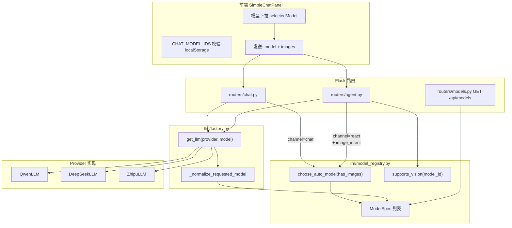
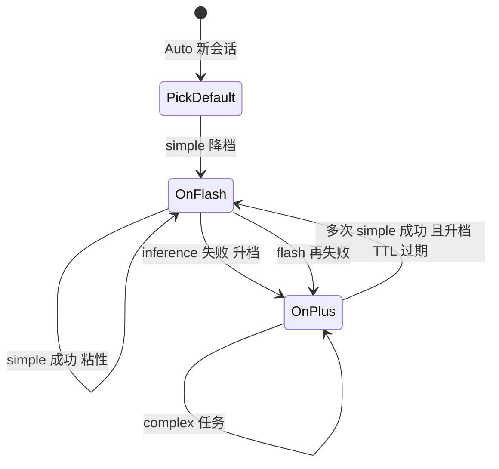

# 需求文档 - 模型路由深化设计

## 1. 概述

### 1.1 背景

BadCase Doctor 的对话与 ReAct Agent 已支持用户在面板选择业务模型（Qwen / DeepSeek / GLM 等），并支持 `auto` 由服务端解析为实际可调用模型。当前路由能力以「**注册表 + Auto 按是否有图**」为主，尚未覆盖任务类型、意图场景、成本/延迟、专用视觉模型等更细粒度策略。

用户选择 `auto` 且带图时，日志中可见类似：

```text
[AGENT-LLM] 本请求绑定 LLM: class=QwenLLM model_attr='qwen3.6-plus' ...
```

说明 **Auto 解析与 `get_llm` 绑定** 已生效；深化目标是在不破坏现有透传的前提下，把路由从「单点规则」升级为「可配置、可观测、可扩展」的策略层。

### 1.2 目标

1. **单一真相来源**：模型能力（provider、vision、价格、优先级、上下文长度）集中在注册表，前后端与 Auto 共用。
2. **分层路由**：请求进入后依次解析「用户显式选择 → Auto 策略（含 channel / image_intent / 延迟偏好）→ 场景兜底 → factory 实例化」。
3. **三维场景感知**（相对现网 `has_images` 单维的补足）：
   - **channel**：请求来自哪条业务管道（react / chat / summary / vision_describe），决定是否需要工具链、是否前置视觉描述。
   - **image_intent**：有图时用户要什么（ocr / prototype / react），决定 vision 直传 vs 离线描述、是否允许早退、业务模型可否选 flash。
   - **延迟偏好**：同等能力下优先 flash 还是 plus/pro，避免 Auto 一律选高 priority 重型模型。
4. **可运维**：通过环境变量开关模型、调价、调试日志；可选暴露 `/api/models` 驱动前端下拉（仅**具体 model id + auto**），消除硬编码漂移。
5. **少配置、多调度**：内部 `pick_*`（见 §4.6）不向用户暴露；用户默认 **Auto**，由 channel / image_intent / **成本策略** / 注册表在服务端解析。
6. **成本可控**：Auto 在能力满足前提下按百万 token 单价择优，避免无图场景被高 priority 重型模型「压过」更便宜的 flash；双模型路径（B+V）分别计成本语义。
7. **调度本身极快**：选模仅在进程内内存完成，**禁止**在热路径上为路由发起 HTTP/DB；目标 **P99 低于 2ms**（候选少于 20 个），不拉长首条 SSE / 首 token。
8. **失败感知升档**：上一请求在 **Auto** 下若判定为**模型推理类失败**，同会话**下一次** Auto 自动选用更高档模型（`quality_first` + 排除已失败 id），用户仍选 Auto、无需改设置。
9. **简单问题降档**：**Auto** 且判定为**简单任务**时，优先**成本低、速度快**的 flash/最便宜档，在「刚好能答对」的前提下提高吞吐量；与升档共用会话状态，**升档优先于降档**。

### 1.3 路由维度定义（核心概念）

| 维度 | 取值 | 谁产生 | 作用 |
|------|------|--------|------|
| **channel** | `react` / `chat` / `summary` / `vision_describe` | 路由入口（非用户输入） | 区分 ReAct 工具链、轻量 Chat、摘要、纯视觉描述；同一 `has_images` 在不同 channel 下候选集不同 |
| **image_intent** | `ocr` / `prototype` / `react` / `null` | `agent.py` 内 `_classify_image_intent`（仅 agent 有图时）；chat 待对齐 | 区分读字、原型→用例、需 CRUD 的复合意图；影响是否 `bye`、描述 prompt、是否必须 vision 业务模型 |
| **prefer_low_latency** | bool | **仅服务端推断**（summary、ocr 等）或 env；**无**前端开关 | 提升 flash 权重、降低 thinking 模型 |
| **cost_policy** | `quality_first` / `balanced` / `cost_first` | **仅服务端**按 channel+intent 映射（见 §4.5） | 决定 priority 与价格的排序权重；用户不选「便宜/贵」 |
| **task_complexity** | `simple` / `standard` / `complex` | **仅服务端**规则推断（§4.15）；**无**前端开关 | `simple` → 降档 flash/cheapest；`complex` → 禁止降档 |

**现网不足（相对上述维度）**

- `choose_auto_model(has_images)` **仅一维**，channel / image_intent / 成本策略对候选与排序**无影响**。
- `image_intent` 仅在 `agent.py` 图片分支使用，**未回传**到选模逻辑；chat / summary 路径**无** intent。
- 无 `latency_tier`，flash 与 plus 只能靠 priority 间接区分；**无图时 deepseek-v4-pro 高 priority 常压过更便宜的 qwen3.6-flash**（成本未参与决策）。
- 路由与选模**未定义耗时预算**；若 P2 项目配置走 DB 且无缓存，可能拖慢首包。

### 1.4 非目标（本期不做）

- 多厂商负载均衡与自动 failover（仅登记 provider，不做跨云切换）。
- 按用户/项目级别的**配额计费**与账单（pricing 字段仅展示；项目**默认模型**配置在本期扩展范围内，见 §4.6）。
- 替换现有 ReAct 主循环与工具协议。
- 在前端下拉或请求体中暴露 `vision-best`、`cheapest`、`fastest` 等逻辑名（用户只选 **Auto** 或注册表中的**真实 model id**）。

### 1.5 设计原则：少让用户选，由调度承担复杂度

| 用户侧（保持简单） | 服务端（承担复杂度） |
|--------------------|----------------------|
| 模型下拉：`Auto` + 若干具体模型（如 Qwen-3.6-Plus） | `choose_auto_model(channel, image_intent, …)` |
| 不传 `vision-best` / `cheapest` | 内部 `pick_best_vision()` / `pick_cheapest_enabled()` |
| 不传「快速模式」开关 | summary / ocr 自动 `prefer_low_latency` + `cost_first` |
| 项目成员不配置 LLM（默认 Auto） | 管理员可选配项目 `default_*`；**成本策略仍由服务端推断** |
| 失败后仍选 Auto | 服务端记住「推理失败」并**下次自动换更强模型**，不弹配置项 |
| 简单一句闲聊仍选 Auto | 服务端**自动用 flash/便宜模型**，够用且吞吐高 |

**升档 vs 降档（同一 Auto，优先级）**

```text
显式 model_id  >  失败升档(§4.14)  >  简单降档(§4.15)  >  矩阵默认(§4.4)
```

---

## 2. 现状架构

### 2.1 组件关系



### 2.2 注册表（`llm/model_registry.py`）

| 字段 | 含义 | 路由用途 |
|------|------|----------|
| `id` | 模型 ID，与 DashScope/DeepSeek 控制台一致 | 请求体 `model`、日志、`llm_model` 落库 |
| `provider` | qwen / deepseek / zhipu | `get_llm` 选实现类 |
| `enabled` | 是否启用 | 下拉可见、透传合法、Auto 候选 |
| `vision` | 是否支持多模态 image_url | 有图时 Auto 候选；Agent 是否直传图 |
| `priority` | 整数，越大越优先 | `choose_auto_model` 主排序键 |
| `pricing` | `input_per_million` + `output_per_million`（可 env 覆盖） | **成本因子**主数据；见 §4.5 `_cost_total(m)` |
| `context_length` | 可选 | 后续长上下文路由预留 |
| `latency_tier`（拟新增） | `flash` / `balanced` / `quality` | 与 `prefer_low_latency`、Auto 排序联动 |

**环境变量约定（已实现）**

- `MODEL_ENABLE__<MODEL_ID_UPPER>=0|1`：控制是否出现在注册表启用集合。
- `MODEL_PRICE__<ID>__IN_PER_MILLION` / `OUT_PER_MILLION` / `CURRENCY`：调价无需改代码。

**当前已登记示例（节选，百万 token 单价为示意）**

| id | vision | priority | in+out 约 (CNY) | 说明 |
|----|--------|----------|-----------------|------|
| qwen3.6-plus | true | 62 | 需 env 补齐 | 有图 quality_first 时优选 |
| qwen3.6-flash | false | 58 | 低 | 无图 cost_first / summary 优选 |
| qwen3.5-plus | true | 60 | 中 | 视觉描述 fallback |
| deepseek-v4-pro | false | 68 | 高 | **高 priority 但贵**；balanced 下不应仅因 priority 碾压 flash |
| glm-5 | false | 35 | 中 | factory 映射 qwen 承载 |

### 2.3 Auto 选模（`choose_auto_model`）

```python
# 逻辑摘要
if has_images:
    candidates = [m for m in enabled if m.vision]
else:
    candidates = enabled
# 排序: (-priority, 总价, id)
```

**特点**

- 有图：只在 `vision=true` 模型中选，避免 `invalid_model` 或静默丢图。
- 无图：全部启用模型参与；`priority` 高者胜 → **易选到贵模型**（deepseek-v4-pro），成本仅作次排序键时不足以拉平。
- 价格缺失（`None`）视为 `+inf`，排在后面。
- **目标**：引入 `cost_policy` 后，summary/ocr 等走 `cost_first`；react 工具链走 `quality_first`，仅在同级能力内比 cost。

**缺口（对照 §1.3 三维）**

| 维度 | 现网 | 问题 |
|------|------|------|
| channel | react/chat 共用同一 `choose_auto_model` | Chat 有图必前置描述，却仍可能 Auto 到非 vision 业务模型；summary 无 channel 概念 |
| image_intent | 仅 agent 图片分支使用，**不参与选模** | prototype 与 ocr 应用不同 vision/flash 策略，现网一律按 `has_images` 选 plus |
| 延迟偏好 | 无 | 纯 OCR、摘要等场景无法优先 flash；无图时 deepseek-v4-pro 高 priority 常压过 qwen3.6-flash |
| 其它 | `chat.py` / `agent.py` 重复 `_resolve_auto_model`；thinking 模型未按 channel 排除 | 维护成本高、行为难预测 |

### 2.4 请求解析入口（channel 映射）

| 入口 | channel | model 解析 | image_intent | 备注 |
|------|---------|------------|--------------|------|
| ReAct SSE | `react` | `_resolve_auto_model(raw, has_images=bool(images))` | `_classify_image_intent`（有图） | vision 时直传图；非 vision 先描述再 ReAct |
| Chat 流 | `chat` | 同上 | **未实现**（有图固定 prototype 描述） | 与 agent 策略未对齐 |
| 摘要 | `summary` | `get_llm(model=...)`，常无 auto | — | 宜固定 flash/plus 策略，避免 ReAct 级重型模型 |
| VisionDescribe | `vision_describe` | 写死 `qwen3.5-plus`（未走注册表） | 由调用方 scene 决定 | 应走 `VISION_MODEL` + 注册表 |

### 2.5 image_intent 与模型选择（现状 vs 目标）

**现状**：intent 只决定「描述 prompt / 是否 bye」，**不改变** `model_name`。

| image_intent | 现网后续（与 model 无关） | 目标选模影响 |
|--------------|---------------------------|--------------|
| `ocr` | 非 vision：描述后可 `bye`；vision：仍进 ReAct | `prefer_low_latency=true` 时业务模型可 flash；描述走 `VISION_MODEL` |
| `prototype` | 非 vision：`describe_prototype_for_testcase` | 业务模型宜 vision 或 plus；描述用 prototype scene |
| `react` | 工具链（create/modify 等） | 有图优先 vision 业务模型；非 vision 必须 `vision_model_id` + 文本注入 |

### 2.6 延迟偏好（现状 vs 目标）

| 场景 | 现网 Auto 倾向 | 目标 |
|------|----------------|------|
| react + 无图 + 长工具链 | 高 priority（如 deepseek-v4-pro） | `balanced`：qwen3.6-plus 或 deepseek-pro 可配置 |
| react + 无图 + 用户要「快点」 | 无入口 | `prefer_low_latency` → qwen3.6-flash |
| react + 有图 + ocr | qwen3.6-plus（vision） | 可选：仅 `VISION_MODEL` 识图 + flash 汇总，少开 thinking |
| chat + 有图 | 同 react 的 auto | channel=chat：业务模型可非 vision（描述已前置） |
| summary | 调用方传 model 或默认 | channel=summary：默认 flash，禁止 thinking 模型 |

### 2.7 Factory（`llm/factory.py`）

1. `_normalize_requested_model`：非 `auto` 且不在注册表 → 忽略并回退默认。
2. 按 `model` 字符串推断 `provider`（含 `glm` → `qwen` 的特殊映射）。
3. 实例化 `QwenLLM` / `DeepSeekLLM` / `ZhipuLLM`。

**日志对齐**：`[AGENT-LLM] model_attr='...'` 来自 Agent 缓存的 `QwenLLM.model`，应与 `model_name`（resolved）一致；若用户选 `auto`，应为 `choose_auto_model` 结果而非 `qwen3.5-plus` 旧默认——若仍见 3.5，检查是否未传 `images` 或注册表 priority/启用状态。

### 2.8 前端（`SimpleChatPanel.vue`）

- 下拉选项与 `CHAT_MODEL_IDS` **硬编码**，需与 `model_registry` 手动同步（已含 `qwen3.6-flash` / `qwen3.6-plus`）。
- `localStorage.selectedChatModel` 持久化；非法旧值回退 `auto`。
- 发送 Agent：`{ model, images, user_input, project_id, ... }`。

---

## 3. 与「图片路径」的交叉路由（现状）

模型路由与图片处理耦合在 `routers/agent.py`；**image_intent 与 channel 应在选模之前或同时确定**，再决定 vision 直传还是描述注入。

| 条件 | 行为 |
|------|------|
| `supports_vision(model_name)` | 图片作为 `images` 传入 ReAct → `openai_style_user_content` 多模态 |
| 非 vision | `VisionDescribeService` 转文本注入 `user_input`，再进 ReAct |
| `_classify_image_intent` | `ocr` / `prototype` / `react`（见图片 CRUD 文档） |

**深化方向**

1. 业务模型与视觉描述模型解耦（`VISION_MODEL` / `vision_describe` channel）。
2. **先** `resolve_request_model(ctx)` **再** 走图片分支，避免「选模不知 intent、处理不知 channel」分裂。

---

## 4. 目标架构：ModelRouter

### 4.1 建议新增模块

```
llm/
├── model_registry.py      # 保持：能力登记
├── model_router.py        # 新增：统一 resolve_request_model()
└── routing_policy.py      # 新增：可插拔策略（可选）
```

### 4.2 前端契约（请求体 `model` 字段）

| 允许值 | 说明 |
|--------|------|
| `auto` | **推荐默认**；服务端按 §4.4 矩阵与 §4.6 内部函数解析为具体 id |
| 注册表中的 **具体 `model_id`** | 用户明确指定某一已启用模型（如 `qwen3.6-plus`） |
| **禁止** | `vision-best`、`cheapest`、`fastest`、`balanced` 等逻辑名 — 即使用户篡改请求体，`resolve_request_model` 也应视为**非法**并回退 `auto` 或项目默认，`route_reason=reject_logical_alias` |

`GET /api/models` 仅返回 `enabled` 的 `ModelSpec`（id + label + vision），**不**返回逻辑别名项。下拉与 `CHAT_MODEL_IDS` 仅含 `auto` + 上述 id 列表。

### 4.3 统一解析 API（建议签名）

```python
@dataclass
class RouteContext:
    raw_model: str | None          # 仅 auto 或具体 model_id（见 §4.2）
    has_images: bool
    channel: Literal["react", "chat", "summary", "vision_describe"]
    image_intent: str | None       # ocr | prototype | react | None
    prefer_low_latency: bool = False  # 由路由层根据 channel/intent 写入，非前端字段
    project_id: int | None = None
    session_id: str | None = None   # 同会话升档/降档粘性作用域
    user_input: str = ""            # §4.15 简单/复杂判定（长度、关键词）
    has_pending_diff: bool = False  # 有 diff 续办则倾向 complex，禁止降档

@dataclass
class RouteResult:
    business_model_id: str         # 交给 get_llm
    vision_model_id: str | None    # 仅非 vision 业务模型且有图时使用
    route_reason: str              # 可观测：auto_escalate_after_inference_failure / ...
    used_auto: bool
    escalated_from: str | None = None  # 若本次为升档，记录上一失败的 model_id
    task_complexity: str | None = None  # simple | standard | complex，可观测

def resolve_request_model(ctx: RouteContext) -> RouteResult: ...
```

**解析顺序（建议）**

1. 组装 `RouteContext`：`channel`、`image_intent` 由入口写入；`prefer_low_latency` 由**调度层**根据 channel/intent 或 env 计算（忽略请求体中的同名段，若存在）。
2. **校验 `raw_model`**（§4.2）：逻辑别名 → 拒绝并视为 `auto` 或 400；仅接受 `auto` 或 `is_supported_model` 的具体 id。
3. **项目默认**（§4.9，带 LRU）：仅当 `raw_model` 为 `auto`/空时读管理员配置的具体 id（**不**每次打 DB）。
4. 用户显式具体 `model_id` → `business_model_id=显式`，`route_reason=user_explicit`；有图且 B 非 vision 时 `vision_model_id` = 项目 vision 默认或 `pick_best_vision()`（§4.7）。
5. **`raw_model == auto`** 时先读 **失败升档状态**（§4.14）：若命中推理/视觉失败 → **升档**，跳过后续降档与矩阵。
6. 否则评估 **任务复杂度**（§4.15）：若 `task_complexity=simple` 且无升档态 → **降档** `cost_first` + `pick_cheapest`/`pick_fastest`（`route_reason=auto_downgrade_simple_task`）。
7. 否则推断 `cost_policy`（§4.5）+ **决策矩阵（§4.4）**；矩阵内 §4.7 `pick_*`（§4.8：**内存、无 I/O**）。
8. 兜底 `Config.DASHSCOPE_MODEL`；有图且无 vision 候选 → **描述服务降级**（§4.4 脚注、§8.2 ST-12）。
9. 请求结束：**失败**写升档（§4.14）；**成功且 simple+便宜模型**可写「降档粘性」状态（§4.15.3，可选）；复杂任务成功**不**强制升档。

### 4.4 决策矩阵（channel × intent × 延迟 × 成本策略）

说明：`B`=业务模型，`V`=视觉描述（B 非 vision 且有图时）。`cost_policy` 由 §4.5 自动映射，**用户不可配**。

| channel | has_images | image_intent | prefer_low_latency | cost_policy | B（Auto） | V | route_reason 示例 |
|---------|------------|--------------|-------------------|-------------|-----------|---|-------------------|
| react | 否 | — | 否 | balanced | `pick_balanced()`：能力够前提下 **priority 与 cost 加权** | — | `auto_react_balanced` |
| react | 否 | — | 是 | cost_first | `pick_cheapest_enabled()` 或 flash | — | `auto_react_low_cost` |
| react | 是 | react / prototype | 否 | quality_first | `pick_best_vision()`（priority 主导，cost 决胜） | 同左或 V 单独 | `auto_react_vision_quality` |
| react | 是 | react / prototype | 是 | balanced | vision 内 flash 优先，否则 `pick_best_vision` | 同上 | `auto_react_vision_fast` |
| react | 是 | ocr | 是 | cost_first | `pick_cheapest_enabled()` / flash | `pick_cheapest_vision()` 或 env | `auto_react_ocr_low_cost` |
| react | 是 | ocr | 否 | balanced | 识图 `quality_first`，汇总 B 可 `cost_first` | 同上 | `auto_react_ocr` |
| chat | 是 | prototype | — | balanced | B 可非 vision + `pick_cheapest`；V `quality_first` | `pick_best_vision()` | `auto_chat_describe_first` |
| chat | 否 | — | 是 | cost_first | flash / cheapest | — | `auto_chat_low_cost` |
| summary | — | — | true | cost_first | `pick_cheapest` / flash；可设 `AUTO_MAX_COST` 上限 | — | `auto_summary_low_cost` |
| vision_describe | 是 | * | — | quality_first（默认识图准确） | — | env `VISION_MODEL` 或 `pick_best_vision` | `vision_describe_only` |

**双模型成本**：一次请求若走「V 描述 + B 文本」，路由层在日志/metrics 中分别记录 `vision_model_id` 与 `business_model_id` 的 `_cost_total`，便于统计识图+推理合计；**不在路由阶段调用 LLM**，故无额外 API 成本。

矩阵实现可落为 `routing_policy.pick(ctx)`，内部调用扩展后的 `choose_auto_model(**filters)`。

**脚注：无 vision 候选时的降级（有图）**

当 `require_vision=true` 但所有 `vision=true` 模型均被 `MODEL_ENABLE__*=0` 禁用时：

- `business_model_id`：在**已启用非 vision** 模型中按矩阵调用 `pick_cheapest_enabled()` 或 flash 档。
- `vision_model_id`：`pick_best_vision()` 或 env `VISION_MODEL`（运维固定视觉模型，非用户可选）。
- `route_reason`：`fallback_describe_no_vision_candidate`；ReAct **不得** `_stream_images` 直传。
- 若 `VISION_MODEL` 亦不可用 → 明确错误，禁止静默丢图。

### 4.5 成本因素（Cost-aware）

#### 4.5.1 成本口径

```python
def _cost_total(m: ModelSpec) -> float:
    p = m.pricing
    if p.input_per_million is None or p.output_per_million is None:
        return float("inf")  # 未配置价格 → 不参与 cost_first，仅 quality 路径按 priority
    return float(p.input_per_million) + float(p.output_per_million)
```

- 单位：百万 token 合计（CNY/USD 由 `pricing.currency` 展示，比较时同币种即可）。
- 运维通过 `MODEL_PRICE__<ID>__*` 写入，与 `MODEL_ENABLE__*` 一样无需改代码。

#### 4.5.2 cost_policy 映射（服务端自动）

| channel | image_intent | prefer_low_latency | → cost_policy |
|---------|--------------|-------------------|---------------|
| summary | * | * | cost_first |
| react / chat | ocr | true | cost_first |
| react | react / prototype | * | quality_first |
| react | 无图 | false | balanced |
| react | 无图 | true | cost_first |
| vision_describe | * | * | quality_first |

项目级可扩展 `project.cost_policy_override`（管理员，可选 P2）；缺省用上表。

#### 4.5.3 排序键（在候选集内，O(n) 一次遍历）

| cost_policy | 排序键（稳定、可测） | 含义 |
|-------------|----------------------|------|
| cost_first | `(cost_total, -priority, id)` | **越便宜越优先**；同价再比 priority |
| quality_first | `(-priority, cost_total, id)` | 能力/效果优先；同档再比 cost |
| balanced | `(-score, id)` | `score = priority - AUTO_COST_WEIGHT * cost_total`（env 默认 0.3～1.0 可调） |

`AUTO_MAX_COST_PER_MILLION`：过滤 `cost_total` 超过上限的模型（summary/ocr 默认建议配置），避免 Auto 点到天价模型。

#### 4.5.4 与 priority 的边界

- **禁止**「只看 cost」损害工具链：react + prototype + create/modify 场景固定 `quality_first`，避免 cheapest 非 vision 导致多轮失败反而更贵。
- **鼓励**「该省则省」：summary、纯 ocr、无图闲聊 → `cost_first` 或 flash。
- 管理员项目 `default_business_model` 为具体 id 时**不绕过** allowlist，但可指向低价私有化模型。

### 4.6 `choose_auto_model` 扩展签名（建议）

```python
def choose_auto_model(
    *,
    has_images: bool,
    channel: str = "react",
    image_intent: str | None = None,
    prefer_low_latency: bool = False,
    cost_policy: str = "balanced",  # quality_first | balanced | cost_first
    require_vision: bool | None = None,
    exclude_model_ids: frozenset[str] | None = None,  # 升档时排除已失败 id
) -> Optional[str]:
    ...
```

过滤与排序（**仅内存列表**，见 §4.8）：

1. **候选过滤**：`enabled`；`vision` 按 channel/intent；`cost_total <= AUTO_MAX_COST`（若配置）；summary 排除 thinking。
2. **channel**：`chat`+有图允许 B 非 vision；`prefer_low_latency` 收窄 flash 候选。
3. **排序**：按 §4.5.3 `cost_policy` 选键；`pick_*` 为薄封装。

### 4.7 服务端内部选模函数（非用户可见）

**定位**：文档中的 `vision-best`、`cheapest` 等指**代码内的调度语义**，不是 API/前端枚举值。升级模型（如 plus 换代）时只改这些函数或注册表 priority，**无需**用户改选或前端发版。

| 内部函数 | 语义（实现等价于原「别名」） | 调用方 |
|----------|------------------------------|--------|
| `pick_best_vision(ctx)` | `quality_first` 在 vision 候选上排序 | 有图、识图准确优先 |
| `pick_cheapest_vision(ctx)` | `cost_first` 在 vision 候选上排序 | ocr + 降本 |
| `pick_cheapest_enabled(ctx)` | `cost_first` 全表 | summary、无图省成本 |
| `pick_fastest_enabled(ctx)` | flash 子集 + `cost_first` 或最低 cost | 低延迟 |
| `pick_balanced_enabled(ctx)` | `balanced` 评分 | react 无图默认 |

**模块**：`llm/model_scheduler.py`，**仅** `model_router` / `choose_auto_model` 调用；函数内**禁止 I/O**。

```python
def pick_best_vision(*, channel: str) -> str | None:
    candidates = _CACHED_VISION_ENABLED  # 启动时或 reload 预筛，见 §4.8
    if not candidates:
        return os.getenv("VISION_MODEL") or None
    return min(candidates, key=lambda x: (-x.priority, _cost_total(x), x.id)).id
```

**运维覆盖（可选，非用户配置）**：

| 变量 | 说明 |
|------|------|
| `VISION_MODEL` | 非空则 `pick_best_vision` 直接返回该 id（跳过动态排序） |
| `SCHEDULER_CHEAPEST_MODEL` | 非空则全局「最便宜」固定为该 id（summary 等） |

日志示例：`route_reason=scheduler_pick_best_vision` → `resolved_model=qwen3.6-plus`（**不**出现 `raw_model=vision-best`）。

### 4.14 失败判定与 Auto 升档（Failure-aware Escalation）

**原则**：用户保持 **Auto**；仅当系统判定「上次失败主要来自**模型推理能力**不足」时，**下一次**同会话请求自动换用**质量更好**的模型。非推理类失败（参数、权限、工具、用户取消）**不升档**，避免误烧成本。

#### 4.14.1 失败归因（FailureAttribution）

| 归因码 | 含义 | 典型信号 | 是否触发 Auto 升档 |
|--------|------|----------|-------------------|
| `inference_failure` | **模型推理侧**能力不足或调用异常 | 空/截断/胡言乱语被门控驳回；`invalid_model`；context length exceeded；上游 5xx/超时（LLM API）；多模态/思考链异常；连续 parse 失败且证据指向模型输出 | **是** |
| `vision_failure` | 视觉描述/OCR 模型失败 | `VisionDescribeService` 异常、识图为空 | **是**（升档 V；若 B 也为 vision 则一并升档） |
| `network_auth` | 密钥、配额、网络 | 401/403、账户欠费、DNS | **否**（换模型无效） |
| `tool_or_logic` | 工具/grep/modify/沙箱/业务校验 | 缺 target_id、diff 拒绝、DB 约束 | **否** |
| `user_input` | 输入非法、取消 | 空输入、用户中止 | **否** |
| `unknown` | 无法判断 | 默认 | **否**（可配置 `AUTO_ESCALATE_ON_UNKNOWN=0`） |

**判定实现（建议 `llm/failure_attribution.py`）**

- ReAct / Chat 在 **SSE `err` / `bye` 带 error**、或捕获 `QwenLLM` / compatible API 异常时调用 `classify_failure(exc, context) -> FailureAttribution`。
- 结合结构化字段：`http_status`、`error_code`（如 DashScope `InvalidParameter`）、`model_id` 当时绑定、`empty_output`、`context_length_exceeded` 等（与现有 metrics / 日志对齐）。
- **启发式**：错误消息含 `invalid_model`、`model not found`、`context length`、`maximum context` → `inference_failure`；含 `Unauthorized`、`insufficient_quota` → `network_auth`。

#### 4.14.2 升档作用域与状态

| 项 | 约定 |
|----|------|
| 作用域键 | `user_id` + `project_id` + `session_id`（`agent_session_id` / `react_request_id` 父会话 id，**非**单轮 request 子 id） |
| 生效条件 | 失败请求当时 `used_auto=True`（`raw_model=auto` 解析结果） |
| 存储 | Redis 或内存 TTL Map；键 `auto_escalation:{user}:{project}:{session}` |
| 内容 | `{ "attribution": "inference_failure", "failed_model_id": "qwen3.6-flash", "failed_vision_model_id": null, "escalation_step": 1, "ts": ... }` |
| TTL | 默认 30 分钟无新失败后清除；`AUTO_ESCALATION_TTL_SEC` 可配 |
| 上限 | `AUTO_ESCALATION_MAX_STEPS`（默认 2）：连续推理失败最多升 2 档，之后仍用当前最高可用档，并打日志 `escalation_cap_reached` |

**用户显式选具体 model**：当次失败**不写入**升档状态（用户已表态）；若下一条仍选 Auto，则仍可按会话内**上一次 Auto 失败**升档。

#### 4.14.3 下一次调度策略（仅 `raw_model=auto`）

读到升档状态且 `attribution in (inference_failure, vision_failure)` 时，**覆盖** §4.5 的 cost_policy / 矩阵默认：

```python
def apply_auto_escalation(ctx: RouteContext, state: EscalationState) -> RouteOverrides:
    exclude = {state.failed_model_id, state.failed_vision_model_id} - {None}
    return RouteOverrides(
        cost_policy="quality_first",
        exclude_model_ids=exclude,
        prefer_low_latency=False,
        pick_fn=pick_next_higher_priority,  # 在 vision/全表中选 priority 高于 failed 的下一档
    )
```

| 场景 | B（业务） | V（视觉） |
|------|-----------|-----------|
| 上次 B=flash 失败，归因 inference | `pick_next_after(failed_id, vision=按 intent)` 或全表 quality_first | 若需 V 且上次 V 失败则 `pick_next_after` vision |
| 上次仅 V 失败 | B 仍按矩阵 | 升档 `pick_best_vision` 且 exclude 失败 V |
| 已无更高档 | 保持注册表最高 priority 可用模型 | `route_reason=escalation_cap_reached` |

`pick_next_higher_priority(candidates, failed_id)`：在候选集中过滤 `id != failed`，取 `priority > failed.priority` 的最小 priority 者；若无则取全局 `pick_best_vision` / 最高 priority。

**日志示例**

```text
route_reason=auto_escalate_after_inference_failure escalated_from=qwen3.6-flash resolved=qwen3.6-plus
```

前端仍显示用户选择 **Auto**；可选运维 hint `REACT_SSE_AUTO_MODEL_HINT=1` 展示「已自动切换更强模型」。

#### 4.14.4 写入时机（不在路由热路径）

| 时机 | 位置 |
|------|------|
| ReAct 流结束 | `routers/agent.py`：`err` / 异常 `finally`；`classify_failure` + `record_auto_escalation_if_needed(used_auto, model_id, session_id)` |
| Chat 流 | `routers/chat.py` 同理 |
| 成功则清除 | 可选：连续 1 次成功后 `clear_escalation(session)`，避免永久锁在贵模型 |

路由**读取**升档：Redis `GET` 一次，纳入 P99 预算；miss 时几乎无额外开销。读超时则**忽略升档**，走普通矩阵。

#### 4.14.5 与成本策略的关系

- 升档**仅影响下一次**，且仅在 Auto 下；属于「失败后的质量补救」，优先于 `cost_first` 与 **简单降档**。
- 达到 `AUTO_ESCALATION_MAX_STEPS` 后不再升，避免单会话无限涨价；用户可手动改选具体 plus 模型。
- 升档态存在期间（TTL 内）**禁止降档**，避免 flash 再次失败。

### 4.15 简单问题判定与 Auto 降档（Simple-task Downgrade）

**原则**：用户仍选 **Auto**。系统判定「**简单问题**」时，选用**成本最低、延迟最低**且注册表认为**能力足够**的模型（通常 `qwen3.6-flash` 等），在**刚好能处理**的前提下最大化吞吐、降低账单。复杂问题或工具链任务**禁止降档**。

#### 4.15.1 任务复杂度（TaskComplexity）

| 档位 | 含义 | 典型条件（规则组合，**不调 LLM**） |
|------|------|-----------------------------------|
| `simple` | 短问答、摘要、纯 OCR、轻量 Chat | 见下表「simple 信号」；且**无** complex 信号 |
| `complex` | 需 ReAct 工具链、多模态 CRUD、长上下文 | 含 create/modify/delete/grep、原型图生成用例、多图、超长输入、`pending_diff` 等 |
| `standard` | 其余 | 走 §4.4 矩阵 / `balanced` |

**simple 信号（满足多数即可，可配置阈值）**

| 信号 | 说明 |
|------|------|
| `channel=summary` | 摘要天然省成本 |
| `channel=chat` 且无图 | 轻量对话 |
| `channel=react` 但无图 + 短文本 | `len(user_input) <= SIMPLE_TASK_MAX_CHARS`（默认 200～500） |
| 无工具链关键词 | 不含创建/修改/删除/缺陷/用例/grep/modify 等（与 `_user_followup_needs_react_after_image` 同类词表取反） |
| `image_intent=ocr` 且非 CRUD 延伸 | 仅读图识字 |
| 无 `pending_diff_context`、无多轮 modify 上下文 | 非「改单」续聊 |

**complex 信号（任一命中 → 不得降档）**

| 信号 | 说明 |
|------|------|
| `image_intent in (react, prototype)` 且话术含 CRUD | 建 bug/用例/改字段 |
| 有图 + 原型/测试用例 | 需 quality vision |
| `len(user_input) > SIMPLE_TASK_MAX_CHARS` 或估算 token 超阈 | 长问题 |
| `pending_diff_context` 非空 | diff 续办 |
| 显式复杂意图守卫命中 | 可复用 `intent_guards` 中 testcase/bug/plan 等 |

**实现**：`infer_task_complexity(ctx) -> simple | standard | complex`（`llm/task_complexity.py`，纯规则，**微秒级**）。

#### 4.15.2 降档调度（仅 `raw_model=auto` 且无 §4.14 升档态）

```python
def apply_auto_downgrade(ctx: RouteContext) -> RouteOverrides | None:
    if infer_task_complexity(ctx) != "simple":
        return None
    return RouteOverrides(
        cost_policy="cost_first",
        prefer_low_latency=True,
        pick_fn=pick_cheapest_enabled,  # 或 pick_fastest_enabled；flash 且吞吐友好
        min_capability_tier="text_chat",  # 排除 thinking-only、非聊天模型
    )
```

| 项 | 说明 |
|----|------|
| 选型 | 在 `enabled` 且 `cost_total` 最小（或 flash 子集最小）的模型中选；通常 `qwen3.6-flash` |
| 能力底线 | 降档模型须满足 channel 最低能力（如无图文本；ocr 时 V 仍可用便宜 vision 或 `pick_cheapest_vision`） |
| route_reason | `auto_downgrade_simple_task` |
| 吞吐 | 便宜+快模型通常 TTFT/并发更优，适合高频简单问答 |

**与矩阵关系**：降档**覆盖** channel 默认的 `balanced`/`quality_first`，但**不覆盖** §4.14 升档。

#### 4.15.3 降档粘性（可选，提高吞吐）

同会话内若**连续 N 次**（默认 2）`simple` 任务在 flash 上**成功完成**（无 inference_failure），可写入 `auto_downgrade_sticky:{session}`：

- 后续 `standard` 但较短的消息可**延续** `cost_first` 一档，避免每条都重新判；
- 一旦出现 **complex** 信号或 **升档** → 清除 sticky；
- TTL 与升档相同量级（如 30 分钟）。

成功升档后：清除 sticky + 升档态；用户在 plus 上连续成功且问题变 simple 时，可再次逐步降档（避免永久锁贵模型）。

#### 4.15.4 与升档的协同（闭环）



| 事件 | 行为 |
|------|------|
| simple + Auto | 优先 flash / cheapest |
| simple + 成功 | 可选加强降档粘性 |
| complex + Auto | 矩阵 / quality_first，**不降档** |
| inference 失败 + Auto | **升档**，取消降档 |
| plus 上 simple 成功 | 不升档；过期后可再降档省成本 |

#### 4.15.5 配置

| 变量 | 默认 | 说明 |
|------|------|------|
| `AUTO_DOWNGRADE_SIMPLE_ENABLED` | `1` | 是否启用简单问题降档 |
| `SIMPLE_TASK_MAX_CHARS` | `400` | 超过则倾向 standard/complex |
| `AUTO_DOWNGRADE_STICKY_SUCCESS` | `2` | 连续成功几次后开启粘性 |
| `SIMPLE_DOWNGRADE_MODEL` | 空 | 非空则简单任务固定该 id（运维） |

### 4.8 调度热路径性能（路由本身不能慢）

选模发生在 **每次对话/ReAct 请求入口**，若耗时过长会直接拉长「首条 SSE / 首 token」感知。原则：**路由是常数级小计算，不是第二次 LLM 调用**。

| 约束 | 要求 |
|------|------|
| **禁止** | 路由热路径上的 HTTP（调价 API、模型发现）、同步 DB 查询（项目配置须 LRU 缓存） |
| **允许** | 遍历内存注册表（约十余条）、O(n) sort、读 env、读进程内预计算快照 |
| **目标耗时** | `resolve_request_model` 单次 **P50 低于 0.5ms，P99 低于 2ms**（开发机单进程粗测） |
| **告警** | `route_resolve_ms` 超过 `ROUTE_SCHEDULER_WARN_MS`（默认 5ms）打 warning |

#### 4.8.1 预计算缓存（启动 / `registry_reload` 时）

```python
# 示例：避免每次 pick 都 list_models + 过滤
_CACHED_ENABLED: tuple[ModelSpec, ...]
_CACHED_VISION_ENABLED: tuple[ModelSpec, ...]
_CACHED_CHEAPEST_ID: str | None          # cost_first 快照，enabled 变化时失效
_CACHED_BEST_VISION_ID: str | None       # quality_first 快照
```

- `VISION_MODEL` / `SCHEDULER_CHEAPEST_MODEL` 非空时 **O(1)** 返回，不做排序。
- `pick_cheapest_enabled` 在注册表变更前可直接返回 `_CACHED_CHEAPEST_ID`。
- 项目 `project_llm_config`（P2）：`functools.lru_cache(maxsize=512)` 按 `project_id`，TTL 可选 60s；**禁止**每次请求查库。
- **失败升档 / 降档粘性**（§4.14 / §4.15）：Redis `GET` 至多 1～2 次；`infer_task_complexity` 仅规则 **O(1)**。写入在请求结束异步完成，**不计入** resolve P99。

#### 4.8.2 与「能力缓存」§4.9 的关系

注册表很小，遍历 `supports_vision` 已足够快；预计算是**为了避免重复 sort**，不是替代业务 LLM。§4.9 的 lru_cache 为可选微优化。

#### 4.8.3 可观测

- 日志字段：`route_resolve_ms`（仅 debug 或超阈值）。
- 指标（可选）：`model_route_duration_seconds` histogram。

### 4.9 项目粒度默认模型（管理员，非成员）

`RouteContext.project_id` 用于读取**项目级**路由偏好（**管理员**在项目设置中配置，普通成员仍只选 Auto/具体模型）。满足「项目 A 必须用私有化部署模型」等需求，且**不**增加成员侧配置项。

**配置存储（建议，P2）**

| 方案 | 说明 |
|------|------|
| DB 表 `project_llm_config` | `project_id`, `default_business_model`, `default_vision_model`, `allowed_model_ids`(JSON), `provider_lock`, `updated_at` |
| 项目 settings JSON | 复用现有项目配置字段，键 `llm.default_model` / `llm.vision_model` |
| 环境变量兜底 | `PROJECT_<ID>_DEFAULT_MODEL`（仅 dev/单租户） |

**字段语义**

| 字段 | 作用 |
|------|------|
| `default_business_model` | **具体 model_id**；成员选 `auto` 时作为 B（须在注册表 `enabled`） |
| `default_vision_model` | **具体 model_id**（可选）；空则走 `pick_best_vision()`，**禁止**存逻辑名 |
| `allowed_model_ids` | 非空时，成员下拉与 Auto 候选**仅展示/仅选用**列表内 id（私有化场景） |
| `provider_lock` | 可选；仅影响服务端 Auto/调度，不改变前端契约 |

**与解析顺序的优先级**

1. 成员显式**具体** `model_id` — **最高**；不在 `allowed_model_ids` → 400 或回退项目默认。
2. 成员 `auto` + 项目 `default_*`（具体 id）。
3. 全局决策矩阵 + §4.7 内部调度函数（内存 pick）。
4. `Config.DASHSCOPE_MODEL`。

**示例**

- 项目 A：管理员设 `default_business_model=corp-llm-v1`，`allowed_model_ids=[corp-llm-v1,corp-llm-v1-flash]` → 成员下拉只见 corp 系列 + Auto；选 Auto 由服务端落在 corp。
- 项目 B：未配置 → 成员 Auto 走全局 `pick_best_vision` / 矩阵。

**API**：`GET/PATCH /api/projects/:id/llm-config`（**管理员**）；对话请求只读。

### 4.10 模型能力查询与缓存（可选微优化）

`supports_vision` 等对 &lt;20 条注册表遍历成本可忽略；与 §4.8 预计算合并实现即可。

| 项 | 建议 |
|----|------|
| 必要性 | **低**；QPS 极高或远程注册表时再加强 |
| 做法 | `_ENABLED_BY_ID: dict` + `registry_reload()` 递增 `registry_generation` |
| 测试 | generation 变更后 pick 快照失效（ST-20） |

**优先级 P3**，不阻塞 P0/P1。

### 4.11 Auto 策略增强（分阶段）

| 阶段 | 能力 | 配置 |
|------|------|------|
| P0 | 抽取公共 `_resolve_auto_model` 到 `model_router.py` | — |
| P1 | 实现 §4.4 矩阵 + `cost_policy` + `choose_auto_model` | `AUTO_COST_WEIGHT`、`AUTO_MAX_COST_PER_MILLION` |
| P1 | `model_scheduler` 预计算 + `route_resolve_ms` 告警 | §4.8；单测 ST-20（P99 低于 2ms） |
| P1 | agent 选模前传入 `image_intent`；chat 对齐 intent 分类 | `routers/agent.py`, `routers/chat.py` |
| P2 | 有图且用户选非 vision： `RouteResult.vision_model_id` | `VISION_MODEL` |
| P2 | 注册表 `latency_tier` 或约定 id 后缀 `-flash` | `model_registry.py` |
| P3 | 按 metrics 动态 `priority_eff`（历史 P95 延迟） | Prometheus / 日志聚合 |
| P2 | 内部调度函数 `pick_*` | `model_scheduler.py` | 改 priority 后 Auto 结果随之变化，前端无感 |
| P2 | 项目 `default_*`（具体 id）+ allowlist | DB 或 project settings | 项目 A 成员 Auto 不落到公网模型 |
| P3 | 能力索引缓存 | `model_registry.py` | 可选 |

### 4.12 前端与 API 对齐

| 项 | 现状 | 目标 |
|----|------|------|
| 模型下拉 | 硬编码 option | `GET /api/models` → 仅 `auto` + 各 `id/label`（**无** vision-best/cheapest） |
| 请求体 `model` | 同下拉 | 非法逻辑名由后端拒绝（§4.2） |
| 校验集合 | `CHAT_MODEL_IDS` | `auto` + API 返回的 id 列表 |
| Auto 解析展示 | `REACT_SSE_AUTO_MODEL_HINT`（运维） | 可选：调试时展示「Auto → qwen3.6-plus」，**不**增加用户配置项 |

### 4.13 可观测性

- 结构化日志：`raw_model`、`resolved_model`、`channel`、`has_images`、`image_intent`、`cost_policy`、`vision_model_id`、`route_reason`、`escalated_from`、`failure_attribution`（写入时）、`route_resolve_ms`（超阈值必打）。
- 指标（可选）：`model_route_total{model,channel,auto}`，与现有 `MetricsRecorder` 对齐。
- 调试：保留 `REACT_SSE_AUTO_MODEL_HINT=1` 在 think 流输出解析结果。

---

## 5. 配置清单（建议新增环境变量）

| 变量 | 默认 | 说明 |
|------|------|------|
| `VISION_MODEL` | `qwen3.6-plus` | `VisionDescribeService` / 离线描述专用，与业务模型解耦 |
| `AUTO_PREFER_PROVIDER` | 空 | 限制 Auto 仅在指定 provider 内选 |
| `AUTO_MAX_COST_PER_MILLION` | 空 | 超过该百万 token 合价的模型不进入 Auto 候选（summary 建议设） |
| `AUTO_COST_WEIGHT` | `0.5` | `balanced` 策略中 cost 惩罚权重（越大越省钱） |
| `ROUTE_SCHEDULER_WARN_MS` | `5` | `resolve_request_model` 超过此毫秒打 warning |
| `REACT_SSE_AUTO_MODEL_HINT` | `0` | 是否向 SSE 推送 Auto 解析结果 |
| `ROUTE_PREFER_LOW_LATENCY` | `0` | 全局倾向 flash / cost_first 映射 |
| `AUTO_SUMMARY_MODEL` | 空 | summary channel 固定模型，空则走矩阵 flash 分支 |
| `SCHEDULER_CHEAPEST_MODEL` | 空 | 非空则 `pick_cheapest_enabled` 固定返回该 id（运维） |
| `AUTO_ESCALATION_ENABLED` | `1` | 是否启用 Auto 推理失败升档 |
| `AUTO_ESCALATION_TTL_SEC` | `1800` | 升档状态 TTL（秒） |
| `AUTO_ESCALATION_MAX_STEPS` | `2` | 单会话连续升档上限 |
| `AUTO_ESCALATE_ON_UNKNOWN` | `0` | 归因 unknown 时是否升档 |
| `AUTO_DOWNGRADE_SIMPLE_ENABLED` | `1` | 是否启用简单问题降档 |
| `SIMPLE_TASK_MAX_CHARS` | `400` | 简单任务最大字符数（启发式） |
| `AUTO_DOWNGRADE_STICKY_SUCCESS` | `2` | 降档粘性所需连续成功次数 |
| `SIMPLE_DOWNGRADE_MODEL` | 空 | 非空则简单任务固定降档模型 id |

现有变量继续生效：`VISION_MODEL`（覆盖 `pick_best_vision` 动态结果）。`MODEL_ENABLE__*`、`MODEL_PRICE__*`、`DASHSCOPE_MODEL`、`QWEN_THINKING_DISABLE_MODELS`。

---

## 6. 实施计划

| 优先级 | 任务 | 涉及文件 | 验收 |
|--------|------|----------|------|
| P0 | 抽取 `resolve_request_model`，删除 chat/agent 重复 `_resolve_auto_model` | `llm/model_router.py`, `routers/chat.py`, `routers/agent.py` | 同输入解析结果一致 |
| P0 | `VisionDescribeService` 使用 `VISION_MODEL` env | `agents/vision_describe.py`, `config.py` | 改 env 后描述 API model 字段变化 |
| P1 | 前端下拉接 `/api/models` | `SimpleChatPanel.vue` | 注册表禁用后下拉自动消失 |
| P1 | 决策矩阵 + `choose_auto_model(channel, image_intent, prefer_low_latency)` | `model_registry.py`, `model_router.py` | 矩阵各行日志 `route_reason` 与预期模型一致 |
| P1 | chat 入口传入 `channel=chat`；summary 传入 `channel=summary` | `routers/chat.py`, `routers/summary.py` | 同 has_images 下 chat 与 react 可选不同 B |
| P2 | `RouteResult.vision_model_id` 与非 vision 业务模型组合 | `routers/agent.py` | 选 deepseek + 图 → 先描述再 ReAct |
| P2 | 文档化 priority/价格调参表 | 本文档附录 | 运维可按表调 Auto |
| P2 | 内部 `pick_*` + 单测 | `model_scheduler.py`, `tests/test_model_router.py` | §8 ST-01～ST-08 通过 |
| P2 | 项目默认模型读配置（带 LRU 缓存） | `model_router.py` + 项目 API | ST-14/15；路由 P99 仍低于 2ms |
| P2 | 失败归因 + Auto 升档读写 | `failure_attribution.py`, `agent.py` | ST-22～ST-25 |
| P2 | 简单问题降档 + `infer_task_complexity` | `task_complexity.py`, `model_router.py` | ST-26～ST-28 |

---

## 7. 测试要点（手工 / 集成）

与 §8 单元测试互补：本节保留联调场景；**自动化验收以 §8 为准**。

### 7.1 基础

- 显式 `qwen3.6-flash` 无图 → `get_llm` 绑定 flash；有图且非 vision → 描述 + ReAct。
- 非法 `gpt-4` → 回退 + factory 日志。

### 7.2 channel / intent / 延迟

- 见 §8 用例 UT-07～UT-11、UT-20～UT-22。

### 7.3 调度与项目

- `pick_best_vision` 在禁用高 priority vision 后仍返回下一可用 vision（ST-04）。
- 请求体传 `cheapest` 被拒绝或回退 auto（ST-09）。
- 项目 allowlist 限制成员显式选模（ST-16）。
- Auto + 上次 flash 推理失败 → 下次解析为 plus（ST-22）。
- Auto +「今天天气怎么样」类短句 → flash（ST-26）；「根据图创建 bug」→ 不降档（ST-27）。

---

## 8. 单元测试计划

**文件**：`tests/test_model_router.py`、`tests/test_model_scheduler.py`（新建）；测 **内部调度函数** 与 `resolve_request_model`，不测「客户端传别名」。

**原则**：不发起真实 LLM HTTP；注册表用 fixture 注入小列表或 mock `list_models` / `_REGISTRY`。

### 8.1 夹具（Fixtures）

```python
# 示例：最小注册表
MODELS = [
    ModelSpec(id="qwen3.6-plus", vision=True, priority=62, enabled=True, pricing=ModelPricing(1, 2)),
    ModelSpec(id="qwen3.5-plus", vision=True, priority=60, enabled=True, pricing=ModelPricing(2, 4)),
    ModelSpec(id="qwen3.6-flash", vision=False, priority=58, enabled=True, pricing=ModelPricing(0.5, 0.5)),
    ModelSpec(id="deepseek-v4-pro", vision=False, priority=68, enabled=True, pricing=ModelPricing(3, 6)),
]
```

通过 `monkeypatch` 替换 `list_models` / `get_model` / `_enabled`。

### 8.2 用例表

**A. 内部调度函数**（`test_model_scheduler.py`）

| ID | 描述 | 输入（摘要） | 期望 |
|----|------|--------------|------|
| **ST-01** | pick_best_vision | 注册表含 3.6-plus / 3.5-plus | 返回 `qwen3.6-plus` |
| **ST-02** | pick_cheapest_enabled | deepseek 总价 &gt; flash | 返回 `qwen3.6-flash`（**非** deepseek-v4-pro） |
| **ST-02b** | cost_first 无图 auto | react 无图 + cost_first | B=flash，即使 deepseek priority 更高 |
| **ST-03** | pick_fastest_enabled | prefer_low_latency 语义 | 返回 flash id |
| **ST-04** | pick_best_vision 次优 | 禁用 `qwen3.6-plus` | 返回 `qwen3.5-plus` |
| **ST-05** | VISION_MODEL 覆盖 | env `VISION_MODEL=corp-vl-1` | `pick_best_vision` → `corp-vl-1` |
| **ST-06** | 无 vision 候选 | 全部 vision 禁用 | `pick_best_vision` → None 或仅 env |

**B. 路由层**（`test_model_router.py`）

| ID | 描述 | 输入（摘要） | 期望 |
|----|------|--------------|------|
| **ST-07** | auto react 无图 | `raw_model=auto`, channel=react | B 由矩阵/调度解析；`used_auto=True` |
| **ST-08** | auto react 有图 prototype | has_images, intent=prototype | B=`pick_best_vision` 或 vision；`supports_vision(B)` 或 V 非空 |
| **ST-09** | **拒绝前端逻辑名** | `raw_model=cheapest` 或 `vision-best` | `route_reason=reject_logical_alias`；按 `auto` 或 400 处理，**不**把字符串当作 model id |
| **ST-10** | auto chat 有图 | channel=chat | B 可非 vision；`vision_model_id=pick_best_vision()` |
| **ST-11** | auto summary | channel=summary | B 为 flash 或 `AUTO_SUMMARY_MODEL` |
| **ST-12** | **无 vision 降级** | `auto`, has_images；vision 全禁用 | B=非 vision；`vision_model_id` 来自 env/`pick_best_vision` 失败路径；`fallback_describe` |
| **ST-13** | 显式非 vision + 有图 | `raw_model=deepseek-v4-pro`, has_images | B=deepseek；V 非空 |
| **ST-14** | 项目 default（具体 id） | `auto`, project default=`corp-llm-v1` | B=`corp-llm-v1` |
| **ST-15** | 项目 allowlist | 显式公网模型，allowlist 仅 corp | 回退或 400 |
| **ST-16** | user_explicit 优先项目 default | 显式 flash + 项目 default plus | B=flash |
| **ST-17** | prefer_low_latency 服务端推断 | channel=summary 或 intent=ocr | ctx.prefer_low_latency=True，B 倾向 flash（**非**请求体传入） |
| **ST-18** | AUTO_MAX_COST 过滤 | 设上限排除 deepseek | Auto 不得选中超价模型 |
| **ST-19** | balanced 加权 | `AUTO_COST_WEIGHT` 很大 | 同 priority 档选更便宜者 |
| **ST-20** | 路由耗时 | 连续 1000 次 `resolve_request_model` | P99 低于 2ms（同进程，无 DB mock） |
| **ST-21** | 能力缓存（P3） | reload registry | `_CACHED_CHEAPEST_ID` 更新 |
| **ST-22** | Auto 升档 | 会话内已存 flash+`inference_failure`；本次 `auto` | B=`qwen3.6-plus`，`escalated_from=flash`，`quality_first` |
| **ST-23** | 不升档：工具失败 | 上次 `tool_or_logic` | 本次仍 `cost_first` / 矩阵默认 |
| **ST-24** | 不升档：显式模型失败 | 上次用户选 `deepseek-v4-pro` 失败 | 不写升档；下次 `auto` 仍按矩阵 |
| **ST-25** | 升档封顶 | 已升 2 次后再失败 | 保持最高可用档，`escalation_cap_reached` |
| **ST-26** | 简单降档 | `auto`，短文本无图无工具词，channel=chat | B=`qwen3.6-flash`，`route_reason` 含 `downgrade_simple` |
| **ST-27** | 复杂不降档 | `auto`，「创建 bug」+ 图，intent=react | B 非 flash  alone；`quality_first` 或 vision |
| **ST-28** | 升档优先于降档 | 同时有升档态 + simple | 走升档，B=plus，**不** flash |
| **ST-29** | 降档粘性 | 连续 2 次 simple 成功 on flash | 第 3 条较短 standard 仍可用 flash |

### 8.3 断言示例（ST-09、ST-12、ST-22、ST-26）

```python
def test_auto_escalate_after_inference_failure():
    store.put(session_key, EscalationState(
        attribution="inference_failure",
        failed_model_id="qwen3.6-flash",
    ))
    ctx = RouteContext(raw_model="auto", channel="react", session_id="s1")
    result = resolve_request_model(ctx)
    assert result.business_model_id == "qwen3.6-plus"
    assert result.escalated_from == "qwen3.6-flash"
    assert "auto_escalate" in result.route_reason


def test_auto_downgrade_simple_task():
    ctx = RouteContext(
        raw_model="auto",
        channel="chat",
        user_input="什么是 BadCase？",
        has_images=False,
    )
    result = resolve_request_model(ctx)
    assert result.business_model_id == "qwen3.6-flash"
    assert "downgrade_simple" in result.route_reason
```

```python
def test_reject_logical_alias_from_client():
    ctx = RouteContext(raw_model="vision-best", has_images=True, channel="react")
    result = resolve_request_model(ctx)
    assert result.used_auto or result.route_reason.startswith("reject_logical_alias")
    assert result.business_model_id != "vision-best"


def test_auto_with_images_all_vision_disabled(monkeypatch):
    ctx = RouteContext(raw_model="auto", has_images=True, channel="react", image_intent="prototype")
    result = resolve_request_model(ctx)
    assert not supports_vision(result.business_model_id)
    assert result.vision_model_id or os.getenv("VISION_MODEL")  # 或明确 error
    assert "fallback_describe" in result.route_reason
```

### 8.5 运行方式

```bash
pytest tests/test_model_router.py -q
```

CI：与现有 `tests/` 一并跑；mock 环境变量隔离，不依赖 `DASHSCOPE_API_KEY`。

---

## 9. 相关文档

- 图片意图与实体 CRUD：[`需求文档_图片识别与实体增删改查.md`](./需求文档_图片识别与实体增删改查.md)
- 多模态初版需求：[`需求文档_多模态图片识别与测试用例生成.md`](./需求文档_多模态图片识别与测试用例生成.md)
- 实体/modify 路由：[`意图识别与grep-modify路由机制.md`](./意图识别与grep-modify路由机制.md)
- Agent 执行流：[`需求文档_agent执行流程现状与优化需求_20260324.md`](./需求文档_agent执行流程现状与优化需求_20260324.md)

---

## 10. 附录：关键代码索引

| 路径 | 职责 |
|------|------|
| `llm/model_registry.py` | 注册表、`choose_auto_model`、`supports_vision`、能力索引（可选） |
| `llm/model_scheduler.py`（拟） | `pick_best_vision`、`pick_next_higher_priority` |
| `llm/model_router.py`（拟） | `RouteContext`、`resolve_request_model`、升档读取 |
| `llm/failure_attribution.py`（拟） | `classify_failure`、`record_auto_escalation` |
| `llm/task_complexity.py`（拟） | `infer_task_complexity`（规则，无 LLM） |
| `llm/factory.py` | `get_llm`、provider 推断 |
| `services/project_llm_config.py`（拟） | 项目默认模型 CRUD |
| `routers/agent.py` | ReAct 请求、`model_supports_images`、图片分支 |
| `routers/chat.py` | Chat 流、有图先 VisionDescribe |
| `routers/models.py` | 模型列表 API |
| `electron-vue3/src/components/SimpleChatPanel.vue` | 模型下拉、`CHAT_MODEL_IDS`、请求体 |
| `agents/react_simplified.py` | `_react_vision_images_for_llm`、多模态轮次预算 |
| `tests/test_model_scheduler.py`（拟） | §8 ST-01～ST-06 |
| `tests/test_model_router.py`（拟） | §8 ST-07～ST-29 |
