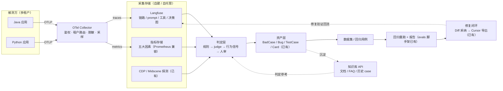
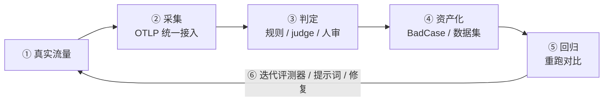
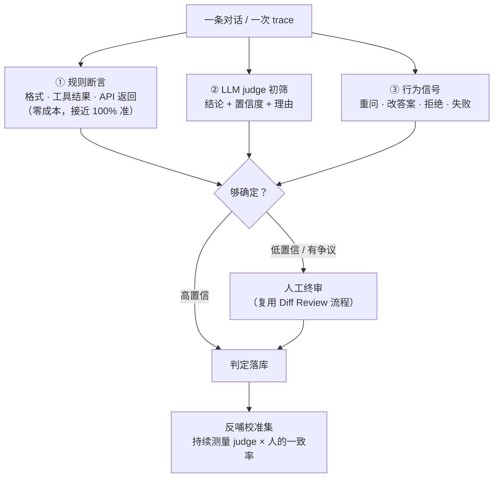

# 需求文档：评测平台架构设计（数据飞轮）

**状态**：设计草案  
**优先级**：高  
**创建日期**：2026-09-22

---

## 1. 定位

不是再造一个评测工具，而是让一条数据飞轮转起来：

**真实流量 → 采集 → 判定 → 资产化 → 回归 → 反哺评测器 → 回到流量**

差异化（已有、别人没有）：

- 人审裁决工作流（Diff Review）
- 修复闭环（Diff 采纳 → 导出 Cursor / 本地终端）
- 从「被测方真实流量」挖 case（多租户推送），而非自造测试集

---

## 2. 总链路

---

## 3. 数据飞轮

---

## 4. 判定层设计

判定原则：

- **确定性优先**：能用规则断言的（格式、工具执行结果、API 返回）绝不交给 judge
- **judge 是筛子不是法官**：输出「结论 + 置信度 + 理由」，低置信度回人工；上量前先人工标 50-100 条测一致率
- **judge 可追溯**：judge 所用模型、提示词版本随判定结果落库，否则历史判定不可解释
- **可执行验证优先**：能重跑 / 执行验证的（工具调用、SQL、测试）用执行结果判定，不读文本猜

---

## 5. 知识库 API 集成的三个触点

| 触点 | 用途 | 说明 |
|------|------|------|
| **判定参考** | reference-based judging | judge 判定时从知识库拉企业文档 / FAQ 作为参考答案（ground truth） |
| **RAG 检索评测** | 评被测系统的检索层 | 被测方是 RAG 时评命中率 / 忠实度（指标口径参考 Ragas） |
| **自有 case 库** | 相似 case 检索 | 判新 case 时检索历史案例：去重、少样本辅助 judge、校准集来源；沉淀越多判定越准（飞轮加速度） |

---

## 6. 现状映射（已有 vs 缺 vs 抄）

| 平台层 | 已有 | 缺 | 直接抄 |
|--------|------|-----|--------|
| 接入 | Go 代理、CDP、对话录入 | 多语言 SDK、OTLP 接入 | OTel Agent（Java）/ opentelemetry-instrument（Python） |
| 采集 | LangSmith（云端）、CdpTestRun、checkpointer | 本地统一 trace 存储、指标 SDK（需求文档已有待实现） | Langfuse 自托管 + OTel Collector |
| 判定 | 五大因素文档、Diff Review 人审 | 规则断言、judge、校准机制 | DeepEval / autoevals 打分器 |
| 资产 | BadCase / Bug / TestCase / Card、报告 | 数据集化、回归用例生成 | Langfuse datasets、promptfoo 断言模式 |
| 回归 | evals/langsmith 脚手架 | CI 集成、重跑对比 | promptfoo CI 模式 |
| 修复 | Diff 采纳 → 导出（差异化优势） | — | — |

---

## 7. 里程碑（最小飞轮优先）

| 阶段 | 内容 | 验收 |
|------|------|------|
| **阶段一 · 采集点亮** | 自部署 Langfuse + OTel Collector；打通一门语言 SDK 上报；BadCase 详情加「采集参数 / UI节点」子 tab | trace 能从被测方推上来并挂到 BadCase 上展示 |
| **阶段二 · 判定可信** | 规则断言 + judge 打分器接入；人工裁决流程打通；人工标 50-100 条测 judge 一致率 | judge 一致率达到阈值，低置信度回人工闭环成立 |
| **阶段三 · 回归闭环** | 采纳 case 数据集化；回归重跑 + 对比报告；CI 集成 | 修复后回归可自动跑出报告 |

---

## 8. 约束与原则

- 接入协议统一 **OTLP**，不为单一语言造私有协议
- 多租户：每租户独立 key、数据隔离；指标 label 基数可控（禁止高基数 ID 直接做 label）
- 轨迹采集含 prompt / 输出（BadCase 回溯需要），但提供按租户的脱敏 / 截断开关；指标侧不落原文
- 评测器（judge）本身可追溯、可版本化
